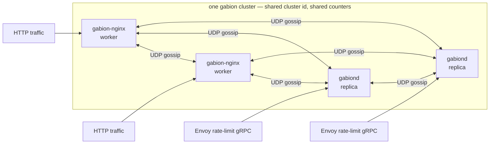

  

# Gabion

**A distributed rate limiter for nginx and Envoy.** Every cluster
member keeps per-origin counters in a CRDT, exchanges them over a UDP
gossip protocol, and admits or rejects each request against the
cluster-wide aggregate. Counts are eventually consistent; the
admission path is local, lock-free, and allocation-free.

A node is one corner of the cluster, not the cluster. Each process
serves its own ingress (HTTP through nginx, gRPC through `gabiond`)
*and* gossips with every other process about what it just admitted.
The same library sits under both adapters; an nginx worker and a
`gabiond` replica are interchangeable peers as long as they share a
cluster id.

## Contents

- [When to use gabion](#when-to-use-gabion)
- [How it works](#how-it-works)
- [Choose your adapter](#choose-your-adapter)
- [Glossary](#glossary)
- [Running across a cluster](#running-across-a-cluster)
- [Fail-open invariant](#fail-open-invariant)
- [Repository layout](#repository-layout)
- [Further reading](#further-reading)
- [Contributing](#contributing)
- [License](#license)

## When to use gabion

Two nginx workers, never mind two replicas, already see different
slices of incoming traffic. Enforce a per-tenant limit on each of
them independently and the tenant gets `workers × limit` — every time.
Gabion earns its keep the moment a single number has to hold across
more than one admission point.

If you run a single nginx box and only need that box's view of the
world, nginx core's `limit_req` is simpler and you should use it.

If you run Envoy with the rate-limit filter, gabion gives you a
drop-in `envoy.service.ratelimit.v3` server that shares state via
gossip instead of through a central Redis (or equivalent) backend.
Failure of any one replica costs the cluster a little freshness, not
its ability to enforce.

If you run nginx and Envoy in front of the same upstream, gabion is
the only thing in this space that lets both stacks share one counter
store.

## How it works

Admission sits on every request's hot path, so the work it does must
be cheap and bounded. Each cluster member matches the request against
its rule table, then, for each matched rule, reads the cluster-wide
aggregate for the rule's live buckets — atomic loads against a
shared-memory zone (nginx) or `DashMap` reads (`gabiond`), one per
live bucket — and decides. No syscalls. No allocations. If the
aggregate plus this request's hits would cross the rule's limit, the
request is rejected; otherwise it is allowed and the hit is recorded
into a local queue.

The recorded hits drive everything else asynchronously. A background
gossip task on each member folds them into a CRDT, exchanges dirty
rows with peers over UDP every ~100 ms, applies inbound deltas back
into the local aggregate, and expires bucket rows as time advances.
The wire codec is self-describing and loss-tolerant: a dropped UDP
frame just costs one tick of staleness, never a missed update.

Two adaptive aspects of the gossip protocol are worth naming together,
because operators who only learn one half tend to misjudge how the
cluster behaves under load:

- **Adaptive fanout** — the per-tick peer count grows with the size
  of the dirty set, so a burst converges in O(log N) rounds without
  paying a wide-fanout cost on quiet ticks.
- **Adaptive emit rate** — the gossip cadence adapts to per-rule
  pressure. Hot rules can fire a synthetic tick between heartbeats so
  each rule's contribution to cluster-wide unreplicated error stays
  inside a per-rule error budget; cold rules ride the heartbeat.

The full protocol — the dirty rings, the peer frontier, the math
behind the budget, and the operator knobs — lives in
[`crates/gabion/README.md`](crates/gabion/README.md#how-gossip-works).
The CRDT data structures themselves live in
[`crates/gabion/CRDT.md`](crates/gabion/CRDT.md).

## Choose your adapter

| You're running…                       | Component                                           | Configuration surface                                       |
|---------------------------------------|-----------------------------------------------------|-------------------------------------------------------------|
| nginx (in-process, dynamic module)    | [**gabion-nginx**](crates/nginx/README.md)          | `load_module ngx_http_gabion_module.so` + `gabion_*` directives in `nginx.conf` |
| Envoy (out-of-process, gRPC sidecar)  | [**gabiond**](crates/server/README.md)              | `envoy.service.ratelimit.v3` server, YAML config            |
| Both, with shared counters            | Run both adapters side by side                      | Point them at the same cluster id (see [Running across a cluster](#running-across-a-cluster)) |

Each adapter README is a self-contained operator guide — directives or
YAML schema, runbook entries, logging shape. The sections below cover
only the vocabulary and behaviour that apply to both.

## Glossary

Shared vocabulary across the adapter READMEs. A few entries are tagged
where they apply to only one surface; the rest are universal.

**Rate, window, and bucket** are easy to conflate; gabion treats them
as three knobs on one shape. A *rate* is a sustained allowance written
`Nr/<unit>` (e.g. `100r/s`). A *window* is the time horizon the rate
is enforced over — by default the rate's own period, but you can
widen it to multiply the limit. A *bucket* is the granularity inside
the window: equal to the window for fixed-window enforcement, or
smaller for sliding-window enforcement. Each adapter accepts the same
shape through its own surface (an nginx directive or a YAML field);
see [`crates/nginx/README.md`](crates/nginx/README.md) and
[`crates/server/README.md`](crates/server/README.md) for the syntax.

| Term            | Definition                                                                                                                                |
|-----------------|-------------------------------------------------------------------------------------------------------------------------------------------|
| **rule**        | One rate-limit policy (e.g. `per_ip`, `per_tenant`).                                                                                      |
| **zone**        | The shared-memory area where counters live (nginx only).                                                                                  |
| **descriptor**  | A `key=value` pair like `tenant=acme` that names what the rule is counting.                                                               |
| **binding**     | The recipe for building a descriptor from request data — e.g. `tenant:$arg_tenant` (nginx) or an Envoy descriptor action (`gabiond`).     |
| **predicate**   | An `except_if=$var` condition that exempts a request from a rule when the variable is truthy (nginx only).                                |
| **rate**        | Sustained allowance, written `Nr/<unit>`. The rate's period is the default window unless overridden by `window=`.                         |
| **window**      | The time horizon the rate is enforced over. Defaults to the rate's period; set `window=` to widen it (the resolved limit scales up).      |
| **bucket**      | The granularity inside the window. Defaults to the window (one fixed-window bucket); set `bucket=` for sliding-window enforcement.        |
| **cardinality** | How many distinct counters a rule can hold; bounded to keep memory steady when descriptor keys are unbounded user input.                  |
| **fail-open**   | Gabion never rejects on its own internal errors; only on a measured limit overflow. See [Fail-open invariant](#fail-open-invariant).      |
| **gossip**      | The UDP background exchange that keeps counters in sync across nodes.                                                                     |
| **cluster**     | The set of gabion processes (nginx workers and/or `gabiond` replicas) that share counters via gossip.                                     |

## Running across a cluster

Beyond a single node, gabion's value is shared counters. Three pieces
of plumbing make a cluster, the same three regardless of adapter:

1. **Bind a gossip socket.** UDP is intentional — gabion's wire codec
   is self-describing and loss-tolerant, so a dropped frame costs one
   tick of staleness rather than a correctness hole. Each process
   binds one socket and uses it both to send and to receive.

2. **Pick a cluster id.** Every gabion process that should share
   counters declares the same non-zero u128. Frames from peers with a
   mismatched cluster id are dropped on the floor — the cheap
   firewall against accidental cross-cluster contamination, including
   the obvious staging-bleeds-into-production case.

3. **Tell peers how to find each other.** The simplest production
   path is Kubernetes EndpointSlice discovery: declare which
   namespaces and service names to watch, and gabion picks up peer
   pods as they come and go. No static peer list to maintain, no
   restart when the topology changes.

The directive names differ between adapters (`gabion_gossip_*` in
nginx, the `gossip:` / `discovery:` blocks in `gabiond` YAML), but
the shape is identical. See
[`crates/nginx/README.md#running-across-a-cluster`](crates/nginx/README.md#running-across-a-cluster)
or
[`crates/server/README.md#running-across-a-cluster`](crates/server/README.md#running-across-a-cluster)
for syntax.

Tuning the gossip cadence is rarely necessary — defaults converge in
well under a second at production scale. The operator-knob reference
and measured convergence curves live in
[`crates/gabion/README.md`](crates/gabion/README.md#operator-knobs).

## Fail-open invariant

A rate limiter that rejects valid traffic because of its own bug or
saturation is worse than one that briefly under-counts. Gabion takes
that position seriously: failing closed is a self-inflicted outage,
failing open is a metric you can graph.

The rule, then: the only path that can return a rejection (`429` on
nginx, `OVER_LIMIT` on `gabiond`) is a successful, decisive
determination that a request crossed a configured limit. Every other
condition — a variable missing, a predicate unresolved, a template
allocation failure, the local queue full, the shared-memory accessor
unavailable, anything unanticipated — allows the request through. The
request counter only increments when an allow is recorded into the
local queue; rejects, declines, cardinality skips, and queue-drops
never push.

The one deliberate exception is the **descriptor byte budget**
(`max_descriptor_bytes`), which returns `400 Bad Request` (nginx) or
`OVER_LIMIT` (`gabiond`) because the request itself is pathological —
client-supplied input that has already blown a documented cap. Every
*internal* gabion limit (matched-rules cap, rule-table lookup miss,
SHM queue full) declines rather than rejects.

Bypasses do not happen silently. Each path that allows because of an
internal condition emits a structured log line naming the condition,
so an operator watching their logs sees the under-counting; the
`/snapshot` admin endpoint on `gabiond` exposes the same counts for
periodic scraping. Adapter READMEs list the specific log lines and
the runbook entries they map to.

## Repository layout

The workspace lives under `crates/`:

| Crate                                              | Role                                                                                          |
|----------------------------------------------------|-----------------------------------------------------------------------------------------------|
| [`gabion`](crates/gabion/README.md)                | The library. Pure Rust, no transport bindings. CRDT, gossip runtime, wire codec, rule machinery, discovery, defaults. |
| [`gabion-server`](crates/server/README.md)         | The `gabiond` binary. Tonic gRPC service speaking `envoy.service.ratelimit.v3`, plus a small admin HTTP endpoint. |
| [`gabion-nginx`](crates/nginx/README.md)           | The nginx dynamic module. Builds with `cargo build -p gabion-nginx --features ngx-module --release`. |
| `gabion-loader`                                    | Load generator. Drives the gRPC service (or an HTTP endpoint sitting in front of nginx) with a configurable tenant / hit-rate mix. |
| [`gossip-bench`](crates/gossip-bench/README.md)    | Gossip propagation simulator. Runs scenario JSON specs through the deterministic sim transport and emits result JSON; a Python harness produces the convergence plots. |

Deployment manifests, the nginx docker-compose harness, Kubernetes
smoke tests, and the cross-version nginx / OpenResty build matrices
live under [`deploy/`](deploy).

## Further reading

- [`crates/gabion/README.md`](crates/gabion/README.md) — the gossip protocol explainer, operator-knob reference, and benchmark results.
- [`crates/gabion/CRDT.md`](crates/gabion/CRDT.md) — design of the counter store, end to end.
- [`crates/nginx/README.md`](crates/nginx/README.md) — operator guide for the nginx module.
- [`crates/server/README.md`](crates/server/README.md) — operator guide for `gabiond`.
- [`crates/gossip-bench/README.md`](crates/gossip-bench/README.md) — how to re-run the benchmark suite locally.
- [`deploy/nginx/README.md`](deploy/nginx/README.md) — building the module against different nginx / OpenResty base images.

## Contributing

PRs welcome; run `make test` before sending.

## License

MIT. See [`LICENSE`](LICENSE).
