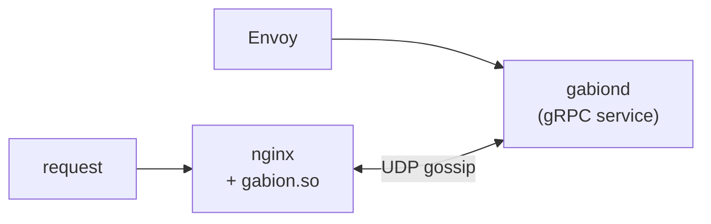

  

# Gabion

**A distributed rate limiter for nginx and Envoy.** Cluster members
maintain per-origin counters in a CRDT, exchange them over a UDP gossip
protocol, and admit or reject each request against the cluster-wide
aggregate. Counts are eventually consistent; admission is local and
allocation-free.

Both stacks load the same library — same CRDT, same wire codec, same
rules. An nginx pod and an Envoy sidecar can share counters inside one
cluster as long as they agree on the gossip cluster identifier.

## Contents

- [When to use gabion](#when-to-use-gabion)
- [How it works](#how-it-works)
- [Choose your adapter](#choose-your-adapter)
- [Glossary](#glossary)
- [Running across a cluster](#running-across-a-cluster)
- [Fail-open invariant](#fail-open-invariant)
- [Repository layout](#repository-layout)
- [Further reading](#further-reading)
- [Contributing](#contributing)
- [License](#license)

## When to use gabion

Gabion earns its keep when two or more nginx workers (let alone
replicas) must enforce one shared limit. If you run a single nginx box
and don't need cluster-wide enforcement, nginx core's `limit_req` is
simpler and you should use it.

If you run Envoy with the rate-limit filter, gabion gives you a drop-in
`envoy.service.ratelimit.v3` server that shares state via gossip rather
than a central Redis (or equivalent) backend.

If you run a mix of nginx and Envoy in front of the same upstream,
gabion is the only thing in this space that lets both stacks share one
counter store.

## How it works

Each cluster member runs the same admission hot path:

1. Match the incoming request against the configured rules.
2. Read the cluster-wide aggregate for each matched rule. One atomic
   load (nginx, from a shared-memory zone) or one `DashMap` lookup
   (gabiond). No syscalls. No allocations.
3. If the aggregate plus this request's hits would cross the limit,
   reject. Otherwise allow and record the hit locally.

A background gossip task on each member folds recorded hits into a
CRDT (`CellStore`) and exchanges dirty rows with peers every ~100 ms.
Inbound deltas update the local aggregate. Bucket ages roll forward as
time advances. The wire codec is self-describing and loss-tolerant —
a dropped UDP frame just means counters re-converge on the next tick.

The library knows nothing about YAML, gRPC, or nginx. Adapters bridge
their own config to library types and own their own transport. See
[`crates/gabion/CRDT.md`](crates/gabion/CRDT.md) for the data
structures and [`CLAUDE.md`](CLAUDE.md) for the deeper architecture.

### Gossip in one paragraph

Each node runs an anti-entropy loop that exchanges dirty CRDT rows with
peers on a heartbeat (`tick_interval`, default 100 ms). Under a burst,
fanout adapts: a single tick can contact up to `log₂(dirty)` peers
where `dirty` is the count of locally-dirty cells, so convergence stays
O(log N) regardless of burst size. Between heartbeats, a per-rule error
budget (`target_err_bps`, default 1 % of the rule's limit) lets hot
rules fire a *synthetic* gossip tick before the next heartbeat would
have run, bounding the cluster-wide unreplicated error per rule to
`N × ε_R`; cold rules ride the proactive heartbeat. See
[`crates/gabion/README.md`](crates/gabion/README.md) for the full
gossip explainer, the operator-knob reference, and benchmark results.

## Choose your adapter

| You're running…                           | Use this                                              |
|-------------------------------------------|-------------------------------------------------------|
| nginx (in-process, dynamic module)        | [**gabion-nginx**](crates/nginx/README.md) — `load_module ngx_http_gabion_module.so` and configure with `gabion_*` directives. |
| Envoy (out-of-process, gRPC sidecar)      | [**gabiond**](crates/server/README.md) — a `envoy.service.ratelimit.v3` server with YAML config. |
| Both, with shared counters                | Run both; point them at the same `gabion_gossip_cluster` ID. |

Each adapter README is a self-contained operator guide. The sections
below cover only the vocabulary and behaviour shared between them.

## Glossary

Gabion-specific vocabulary used across both adapter READMEs:

| Term            | Definition                                                                                                                                |
|-----------------|-------------------------------------------------------------------------------------------------------------------------------------------|
| **rule**        | One rate-limit policy (e.g. `per_ip`, `per_tenant`).                                                                                      |
| **zone**        | The shared-memory area where counters live (nginx only).                                                                                  |
| **descriptor**  | A `key=value` pair like `tenant=acme` that names what the rule is counting.                                                               |
| **binding**     | The recipe for building a descriptor from request data — e.g. `tenant:$arg_tenant` (nginx) or an Envoy descriptor action (gabiond).       |
| **predicate**   | An `except_if=$var` condition that exempts a request from a rule when the variable is truthy (nginx adapter).                             |
| **rate**        | Sustained allowance, written `Nr/<unit>` (e.g. `100r/s`, `10r/5m`). The rate's period IS the default window unless overridden by `window=`. |
| **window**      | The time horizon the rate is enforced over. Defaults to the rate's period; set `window=` to widen it (the resolved limit scales up).      |
| **bucket**      | The granularity inside the window. Defaults to the window (one fixed-window bucket); set `bucket=` for sliding-window-style enforcement.  |
| **cardinality** | How many distinct counters a rule can hold; bounded to prevent memory blow-ups when descriptor keys are unbounded user input.             |
| **fail-open**   | Gabion never rejects on its own internal errors; only on a measured limit overflow. See [Fail-open invariant](#fail-open-invariant).      |
| **gossip**      | The UDP background exchange that keeps counters in sync across nodes.                                                                     |
| **cluster**     | The set of gabion processes (nginx workers and/or `gabiond` instances) that share counters via gossip.                                    |

## Running across a cluster

Beyond a single node, gabion's value is shared counters. Three pieces
of plumbing make a cluster — the same three regardless of adapter:

1. **Bind a gossip socket** so peers can talk to each other. UDP is
   intentional — gabion's wire codec is self-describing and
   loss-tolerant; one dropped frame just means counters re-converge on
   the next tick.

2. **Pick a cluster identifier.** Every gabion process that should
   share counters declares the same non-zero u128. Frames from peers
   with a mismatched cluster ID are dropped on the floor — the cheap
   firewall against accidental cross-cluster contamination.

3. **Tell peers how to find each other.** The simplest production path
   is Kubernetes EndpointSlice discovery: declare which namespaces and
   service names to watch, and gabion picks up peer pods as they come
   and go. No static peer list to maintain.

The directive names differ between adapters (`gabion_gossip_*` in nginx,
the `gossip:` / `discovery:` blocks in gabiond YAML), but the shape is
identical. See [`crates/nginx/README.md#running-across-a-cluster`](crates/nginx/README.md#running-across-a-cluster)
or [`crates/server/README.md#running-across-a-cluster`](crates/server/README.md#running-across-a-cluster)
for adapter-specific syntax.

Tuning the gossip cadence is rarely necessary — defaults converge in
well under a second at production scale. See
[`crates/gabion/README.md`](crates/gabion/README.md) for the operator
knobs and measured convergence curves;
[`crates/gossip-bench/README.md`](crates/gossip-bench/README.md)
documents how to re-run the benchmark suite locally.

## Fail-open invariant

The only path that can return a rejection (`429` on nginx, `OVER_LIMIT`
on gabiond) is a successful, decisive determination that a request
crossed a configured limit. Every other condition — variable missing,
predicate unresolved, template allocation failure, queue full,
shared-memory accessor unavailable, anything unanticipated — allows the
request through. The request counter only increments when an allow is
recorded into the queue; rejects, declines, cardinality skips, and
queue-drops never push.

The single deliberate exception is the **descriptor byte budget**
(`max_descriptor_bytes`), which returns `400 Bad Request` (nginx) /
`OVER_LIMIT` (gabiond) because the request itself is pathological —
client-supplied input over budget. All gabion-internal limits (matched
rules cap, rule-table lookup miss, …) decline rather than reject.

The rationale: a buggy or saturated limiter that rejects real traffic
is far more harmful than briefly under-counting. Operators see the
bypass through metrics and structured warnings; they never see it as
phantom 429s.

## Repository layout

The workspace lives under `crates/`:

| Crate                                              | Role                                                                                          |
|----------------------------------------------------|-----------------------------------------------------------------------------------------------|
| `gabion`                                           | The library. Pure Rust, no transport bindings. CRDT, gossip runtime, wire codec, rule machinery, discovery, defaults. |
| [`gabion-server`](crates/server/README.md)         | The `gabiond` binary. Tonic gRPC service speaking `envoy.service.ratelimit.v3`, plus a small admin HTTP endpoint. |
| [`gabion-nginx`](crates/nginx/README.md)           | The NGINX dynamic module. Builds with `cargo build -p gabion-nginx --features ngx-module --release`. |
| `gabion-loader`                                    | Load generator. Drives the gRPC service (or an HTTP endpoint sitting in front of nginx) with a configurable tenant / hit-rate mix. |
| [`gossip-bench`](crates/gossip-bench/README.md)    | Gossip propagation simulator. Runs scenario JSON specs through the sim transport and emits result JSON; Python harness produces convergence plots. |

Deployment manifests, the NGINX docker-compose harness, Kubernetes
smoke tests, and the cross-version nginx/OpenResty build matrices live
under [`deploy/`](deploy).

## Further reading

- [`crates/gabion/README.md`](crates/gabion/README.md) — the gossip explainer, operator-knob reference, and benchmark results.
- [`crates/gabion/CRDT.md`](crates/gabion/CRDT.md) — design of the counter store, end-to-end.
- [`crates/nginx/README.md`](crates/nginx/README.md) — operator guide for the nginx module.
- [`crates/server/README.md`](crates/server/README.md) — operator guide for `gabiond`.
- [`crates/gossip-bench/README.md`](crates/gossip-bench/README.md) — how to re-run the benchmark suite locally.
- [`deploy/nginx/README.md`](deploy/nginx/README.md) — building the module against different nginx / OpenResty base images.

## Contributing

Contributor conventions, hot-path constraints (no allocation, no copy,
no `panic`), unsafe / Miri policy, and the sanctioned `cargo nextest` /
`cargo +nightly fmt` toolchain live in [`CLAUDE.md`](CLAUDE.md). Read
it before sending a PR that touches admission, the CRDT, gossip, or
any SHM boundary.

Day-to-day: `make test` runs fmt, clippy, the workspace nextest suite,
the safety integration tests, and hygiene. `make ci` adds Miri (Stacked
Borrows) and the nginx smoke tests.

## License

MIT. See [`LICENSE`](LICENSE).
