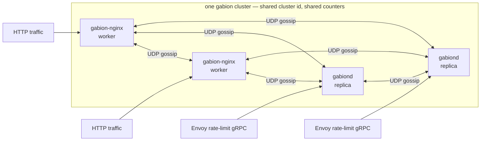

  

# Gabion

Gabion is a distributed rate limiter for nginx and Envoy. Every member
of a cluster keeps per-origin counters in a CRDT and exchanges them
with its peers over a UDP gossip protocol, so that each incoming
request can be admitted or rejected against the cluster-wide aggregate
rather than whatever fraction of traffic happens to land on the
current node. Counts are eventually consistent across the cluster,
while the admission decision itself is taken locally without locks or
heap allocations.

A single node is only one corner of the cluster; it serves its own
ingress (HTTP through nginx, gRPC through `gabiond`) while gossiping
with every other process about what it has just admitted. The same
library sits underneath both adapters, so an nginx worker and a
`gabiond` replica are interchangeable peers as long as they share a
cluster id.

## Contents

- [When to use gabion](#when-to-use-gabion)
- [How it works](#how-it-works)
- [Choose your adapter](#choose-your-adapter)
- [Glossary](#glossary)
- [Running across a cluster](#running-across-a-cluster)
- [Fail-open invariant](#fail-open-invariant)
- [Repository layout](#repository-layout)
- [Further reading](#further-reading)
- [Contributing](#contributing)
- [License](#license)

## When to use gabion

A single nginx process distributes incoming connections across several
worker processes, and a deployment of any size distributes them again
across several replicas. Each of those admission points sees only its
own slice of traffic, so a per-tenant limit enforced independently on
each of them gives the tenant `workers × replicas × limit` of
headroom, which is rarely what the limit was intended to express.
Gabion earns its keep at the moment a single number has to hold across
more than one admission point.

If you run a single nginx box and only need that box's own view of the
world, nginx core's `limit_req` is simpler and you should use it
instead. If you run Envoy with the rate-limit filter, gabion offers a
drop-in `envoy.service.ratelimit.v3` server that shares state through
gossip rather than through a central Redis (or equivalent) backend, so
that the failure of any one replica costs the cluster a little
freshness rather than its ability to enforce at all. If you run nginx
and Envoy in front of the same upstream, gabion is the only component
we are aware of that lets both stacks share a single counter store.

## How it works

Admission sits on every request's hot path, so the work it does has
to be both cheap and bounded. Each cluster member matches the request
against its rule table and then, for each matched rule, reads the
cluster-wide aggregate for that rule's live buckets — through atomic
loads against a shared-memory zone in the case of nginx, or through
`DashMap` reads in the case of `gabiond`, in either case one read per
live bucket. The decision is taken without issuing any system calls
or allocating on the heap. If the aggregate plus the hits attributed
to the current request would cross the rule's configured limit the
request is rejected; otherwise it is allowed through and the hit is
recorded into a local queue.

Everything else happens asynchronously, driven by those recorded hits.
A background gossip task on each member folds them into a CRDT,
exchanges dirty rows with peers over UDP roughly every 500 ms, applies
inbound deltas back into the local aggregate, and expires bucket rows
as time advances. The wire codec is self-describing and tolerant of
loss, so a dropped UDP frame costs the cluster one tick of staleness
rather than a missed update.

Two adaptive aspects of the gossip protocol are worth naming together,
because operators who only learn one half tend to misjudge how the
cluster behaves under load:

- **Adaptive fanout** — the per-tick peer count grows with the size
  of the dirty set, so that a burst converges in O(log N) rounds
  without paying a wide-fanout cost on quiet ticks.
- **Adaptive emit rate** — the gossip cadence itself adapts to
  per-rule pressure. A hot rule can fire a synthetic tick between
  heartbeats so that each rule's contribution to cluster-wide
  unreplicated error stays inside a per-rule error budget, while a
  cold rule simply rides the heartbeat.

The full protocol, including the dirty rings, the peer frontier, the
math behind the budget, and the operator knobs that control them, is
documented in
[`crates/gabion/README.md`](crates/gabion/README.md#how-gossip-works).
The CRDT data structures themselves are described in
[`crates/gabion/CRDT.md`](crates/gabion/CRDT.md).

## Choose your adapter

| You're running…                       | Component                                           | Configuration surface                                       |
|---------------------------------------|-----------------------------------------------------|-------------------------------------------------------------|
| nginx (in-process, dynamic module)    | [**gabion-nginx**](crates/nginx/README.md)          | `load_module ngx_http_gabion_module.so` + `gabion_*` directives in `nginx.conf` |
| Envoy (out-of-process, gRPC sidecar)  | [**gabiond**](crates/server/README.md)              | `envoy.service.ratelimit.v3` server, YAML config            |
| Both, with shared counters            | Run both adapters side by side                      | Point them at the same cluster id (see [Running across a cluster](#running-across-a-cluster)) |

Each adapter's README is a self-contained operator guide covering its
directives or YAML schema, its runbook entries, and the shape of its
logging. The sections below only cover the vocabulary and behaviour
that apply to both.

## Glossary

The vocabulary is shared across the adapter READMEs. A few entries are
tagged where they apply to only one surface; the rest are universal.

Rate, window, and bucket are easy to conflate, so it is worth being
explicit that gabion treats them as three separate knobs on one shape.
A *rate* is a sustained allowance written `Nr/<unit>`, such as
`100r/s`. A *window* is the time horizon over which that rate is
enforced; by default it is the rate's own period, but it can be
widened to multiply the limit. A *bucket* is the granularity inside
the window: equal to the window for fixed-window enforcement, or
smaller than the window for sliding-window enforcement. Each adapter
accepts the same shape through its own surface — an nginx directive
or a YAML field — and the precise syntax is documented in
[`crates/nginx/README.md`](crates/nginx/README.md) and
[`crates/server/README.md`](crates/server/README.md).

| Term            | Definition                                                                                                                                |
|-----------------|-------------------------------------------------------------------------------------------------------------------------------------------|
| **rule**        | One rate-limit policy (e.g. `per_ip`, `per_tenant`).                                                                                      |
| **zone**        | The shared-memory area where counters live (nginx only).                                                                                  |
| **descriptor**  | A `key=value` pair like `tenant=acme` that names what the rule is counting.                                                               |
| **binding**     | The recipe for building a descriptor from request data — e.g. `tenant:$arg_tenant` (nginx) or an Envoy descriptor action (`gabiond`).     |
| **predicate**   | An `except_if=$var` condition that exempts a request from a rule when the variable is truthy (nginx only).                                |
| **rate**        | Sustained allowance, written `Nr/<unit>`. The rate's period is the default window unless overridden by `window=`.                         |
| **window**      | The time horizon the rate is enforced over. Defaults to the rate's period; set `window=` to widen it (the resolved limit scales up).      |
| **bucket**      | The granularity inside the window. Defaults to the window (one fixed-window bucket); set `bucket=` for sliding-window enforcement.        |
| **cardinality** | How many distinct counters a rule can hold; bounded to keep memory steady when descriptor keys are unbounded user input.                  |
| **fail-open**   | Gabion never rejects on its own internal errors; only on a measured limit overflow. See [Fail-open invariant](#fail-open-invariant).      |
| **gossip**      | The UDP background exchange that keeps counters in sync across nodes.                                                                     |
| **cluster**     | The set of gabion processes (nginx workers and/or `gabiond` replicas) that share counters via gossip.                                     |

## Running across a cluster

Beyond a single node, gabion's value lies in counters being shared,
and three pieces of plumbing turn a set of processes into a cluster
regardless of which adapter they are running:

1. **Bind a gossip socket.** The choice of UDP is deliberate: gabion's
   wire codec is self-describing and tolerant of loss, so that a
   dropped frame costs one tick of staleness rather than opening a
   correctness hole. Each process binds a single socket and uses it
   both to send and to receive.

2. **Pick a cluster id.** Every gabion process that should share
   counters declares the same non-zero u128. Frames from peers with a
   mismatched cluster id are dropped on the floor, which provides a
   cheap firewall against accidental cross-cluster contamination —
   most obviously, the case where staging traffic bleeds into a
   production counter store.

3. **Tell peers how to find each other.** The simplest production
   path is Kubernetes EndpointSlice discovery: declare which
   namespaces and service names to watch, and gabion picks up peer
   pods as they come and go without any static peer list to maintain
   or any restart to perform when the topology changes.

The directive names differ between adapters (`gabion_gossip_*` for
nginx, the `gossip:` and `discovery:` blocks in `gabiond` YAML), but
the shape is identical. The precise syntax for each is documented in
[`crates/nginx/README.md#running-across-a-cluster`](crates/nginx/README.md#running-across-a-cluster)
and
[`crates/server/README.md#running-across-a-cluster`](crates/server/README.md#running-across-a-cluster).

Tuning the gossip cadence is rarely necessary, since the defaults
converge in well under a second at production scale. The
operator-knob reference and measured convergence curves are in
[`crates/gabion/README.md`](crates/gabion/README.md#operator-knobs).

## Fail-open invariant

A rate limiter that rejects valid traffic because of its own bug or
its own saturation is, in practice, worse than one that briefly
under-counts during the same kinds of failure. Gabion takes that
position seriously, on the grounds that failing closed manifests as a
self-inflicted outage whereas failing open manifests as a metric an
operator can graph and respond to at their own tempo.

The invariant that follows is that the only path which can return a
rejection (`429` on nginx, `OVER_LIMIT` on `gabiond`) is a successful
and decisive determination that a request has crossed a configured
limit. Every other condition — whether it is a variable missing, a
predicate that cannot be resolved, a template allocation failure, the
local queue being full, the shared-memory accessor being unavailable,
or anything else unanticipated — allows the request through. The
request counter only increments when an allow is recorded into the
local queue, so that rejects, declines, cardinality skips, and queue
drops never push.

The one deliberate exception is the descriptor byte budget
(`max_descriptor_bytes`), which returns `400 Bad Request` on nginx or
`OVER_LIMIT` on `gabiond` because the request itself is pathological:
client-supplied input has already blown a documented cap. Every
*internal* gabion limit, including the matched-rules cap, a missed
rule-table lookup, or a full SHM queue, declines rather than rejects.

These bypasses do not happen silently. Each path that allows because
of an internal condition emits a structured log line naming the
condition, so that an operator watching their logs sees the
under-counting as it happens; the `/snapshot` admin endpoint on
`gabiond` exposes the same counts for periodic scraping. Each
adapter's README lists the specific log lines and the runbook entries
they map to.

## Repository layout

The workspace lives under `crates/`:

| Crate                                              | Role                                                                                          |
|----------------------------------------------------|-----------------------------------------------------------------------------------------------|
| [`gabion`](crates/gabion/README.md)                | The library. Pure Rust, no transport bindings. CRDT, gossip runtime, wire codec, rule machinery, discovery, defaults. |
| [`gabion-server`](crates/server/README.md)         | The `gabiond` binary. Tonic gRPC service speaking `envoy.service.ratelimit.v3`, plus a small admin HTTP endpoint. |
| [`gabion-nginx`](crates/nginx/README.md)           | The nginx dynamic module. Builds with `cargo build -p gabion-nginx --features ngx-module --release`. |
| `gabion-loader`                                    | Load generator. Drives the gRPC service (or an HTTP endpoint sitting in front of nginx) with a configurable tenant / hit-rate mix. |
| [`gossip-bench`](crates/gossip-bench/README.md)    | Gossip propagation simulator. Runs scenario JSON specs through the deterministic sim transport and emits result JSON; a Python harness produces the convergence plots. |

Deployment manifests, the nginx docker-compose harness, Kubernetes
smoke tests, and the cross-version nginx / OpenResty build matrices
live under [`deploy/`](deploy).

## Further reading

- [`crates/gabion/README.md`](crates/gabion/README.md) — the gossip protocol explainer, operator-knob reference, and benchmark results.
- [`crates/gabion/CRDT.md`](crates/gabion/CRDT.md) — design of the counter store, end to end.
- [`crates/nginx/README.md`](crates/nginx/README.md) — operator guide for the nginx module.
- [`crates/server/README.md`](crates/server/README.md) — operator guide for `gabiond`.
- [`crates/gossip-bench/README.md`](crates/gossip-bench/README.md) — how to re-run the benchmark suite locally.
- [`deploy/nginx/README.md`](deploy/nginx/README.md) — building the module against different nginx / OpenResty base images.

## Contributing

Pull requests are welcome; please run `make test` before sending one.

## License

MIT. See [`LICENSE`](LICENSE).
