# The `crdt` module

A guide to `crates/gabion/src/crdt/*` for somebody who has never opened
this code before. This is the deep-dive companion to
[`README.md`](README.md), which describes how the gossip runtime sits
on top of the structures documented here.

This document explains the per-origin counter CRDT that powers Gabion's distributed rate limiting. It is organised so you can read it end-to-end and build up a complete mental model: it starts with the problem, sketches the module map, walks through each piece bottom-up, traces how writes and reads flow through the structures, and ends with a single end-to-end example, an invariants reference, and a glossary.

---

## Table of contents

1. [The problem the module solves](#1-the-problem-the-module-solves)
2. [Module map](#2-module-map)
3. [Conventions used throughout](#3-conventions-used-throughout)
4. [Foundations](#4-foundations)
   - 4.1 [`hash` — deterministic mixers](#41-hash--deterministic-mixers)
   - 4.2 [`dictionary` — identity interning](#42-dictionary--identity-interning)
   - 4.3 [`index` — the Robin Hood hash table](#43-index--the-robin-hood-hash-table)
   - 4.4 [`dirty_ring` — the bounded change log](#44-dirty_ring--the-bounded-change-log)
5. [The cell store](#5-the-cell-store)
   - 5.1 [Structure-of-arrays column layout](#51-structure-of-arrays-column-layout)
   - 5.2 [Slot lifecycle: freelist + generation tagging](#52-slot-lifecycle-freelist--generation-tagging)
   - 5.3 [Handles](#53-handles)
   - 5.4 [The `Count` trait — width-parametric counters](#54-the-count-trait--width-parametric-counters)
6. [I/O containers](#6-io-containers)
7. [Data flow](#7-data-flow)
   - 7.1 [Write: `ingest_local`](#71-write-ingest_local)
   - 7.2 [Write: `merge_remote`](#72-write-merge_remote)
   - 7.3 [The shared `upsert` core](#73-the-shared-upsert-core)
   - 7.4 [Read: `find`, `resolve`, `get`, `count_of`](#74-read-find-resolve-get-count_of)
8. [Gossip and convergence](#8-gossip-and-convergence)
   - 8.1 [The two dirty rings](#81-the-two-dirty-rings)
   - 8.2 [The repair cursor — the third lane](#82-the-repair-cursor--the-third-lane)
   - 8.3 [`fill_gossip_frame` and per-frame dedup](#83-fill_gossip_frame-and-per-frame-dedup)
   - 8.4 [`peer_frontier` — per-peer × per-origin cursors](#84-peer_frontier--per-peer--per-origin-cursors)
9. [Expiry](#9-expiry)
10. [End-to-end traced example](#10-end-to-end-traced-example)
11. [Invariants reference](#11-invariants-reference)
12. [Cross-module map](#12-cross-module-map)
13. [Glossary](#13-glossary)

---

## 1. The problem the module solves

A node receives a stream of **hits** — events that should increment a counter. Which counter to increment depends on five fields:

- a **rule** (e.g. "100 requests / minute per API key"),
- an application **key** (e.g. the hashed API key),
- a time **bucket** (which one-minute slice we are in right now),
- the **origin** node that observed the hit, and
- that origin's **incarnation** (a small integer bumped each restart, so successive lifetimes of one node are distinguishable).

A rate-limit decision wants the global sum across all origins for the current bucket. Each node owns its origin column locally, learns the others by gossip, and never decrements — counts only rise. That monotonicity is what makes the structure safely mergeable: **max-merge per origin, sum across origins.** That is the CRDT.

The `crdt` module is responsible for:

1. **Storing** these counters compactly and at bounded capacity (no allocation after construction).
2. **Observing** local hits and **merging** observations heard from peers.
3. **Emitting deltas** when a stored count rises, so the rate-limit aggregator can react.
4. **Marking dirty** any cell that just changed, so the gossip layer knows what to send next.
5. **Repairing** silently by rotating over the active set, so anti-entropy still converges when dirty tracking overflows.
6. **Expiring** cells whose bucket has aged out of the live window.

Everything in the module is single-threaded and bounded; the file's module comment is explicit that *"Nothing in this module allocates after construction"* (`crates/gabion/src/crdt.rs:29`). All capacities are picked at `CellStore::new` time and never grow.

---

## 2. Module map

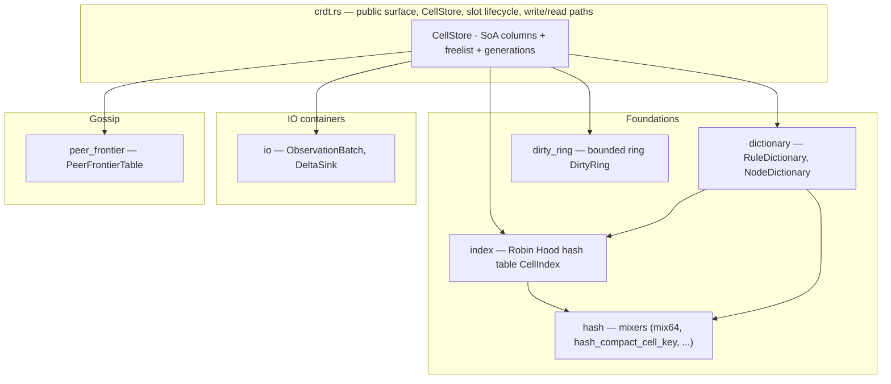

| Submodule | One-line purpose |
|---|---|
| `crdt.rs` (top) | The `CellStore` itself: SoA columns, slot lifecycle, write/read paths, expiry, gossip-frame composition. |
| `crdt/hash.rs` | Tiny deterministic mixers that turn structured CRDT identifiers into `u64` hashes. |
| `crdt/dictionary.rs` | Two interning dictionaries — `RuleDictionary` and `NodeDictionary` — that turn 128-bit identities into 16-bit slots with refcounted lifetimes. |
| `crdt/index.rs` | A power-of-two Robin Hood open-addressing hash table with backshift deletion. Maps a compact cell identity to its row in the `CellStore`. |
| `crdt/dirty_ring.rs` | A fixed-capacity ring buffer of "this cell just changed" entries, drained each gossip tick. |
| `crdt/io.rs` | Two structure-of-arrays IO containers, `ObservationBatch` (input) and `DeltaSink` (output). |
| `crdt/peer_frontier.rs` | Per-peer × per-origin send/ack cursors used by the outbound gossip path to skip already-acked cells. |

---

## 3. Conventions used throughout

A handful of terms recur across every section; pinning them down here saves repetition.

- **Cell.** One logical counter slot inside the store, identified by `(rule, key, bucket, origin, incarnation)`.
- **Slot.** An index in `0..capacity` into the SoA columns. A cell occupies one slot for its lifetime.
- **Origin.** The node that originally produced an update. Updates can be re-broadcast ("forwarded") by other peers, but the origin tag never changes.
- **Incarnation.** A small integer bumped each time a node restarts. `(NodeId, Incarnation)` distinguishes successive instances of one node so replayed sequence numbers from a dead instance cannot contaminate a live one.
- **Origin sequence.** A per-origin monotonically increasing `u64` minted at every write to one of that origin's cells. The same number rides on dirty-ring entries and gossip frames; it is a logical clock for the origin's writes.
- **Anti-entropy.** A background sync where each node periodically re-sends a slice of state to its peers so updates lost in transit eventually get re-delivered. In this CRDT it has two lanes: a *dirty* lane (recent changes, sent eagerly) and a *repair* lane (a rotating sweep of every live cell, sent slowly).
- **Stamp / dirty.** The act of writing a record into the dirty ring after mutating a cell.
- **Saturating arithmetic.** Operations that clamp at the type's max instead of overflowing. The whole module uses saturating adds so a hot counter can never wrap to zero.
- **Allocation-free hot path.** Every backing slice is sized once in `CellStore::new` and never reallocated. The phrase "no allocation after construction" appears as a hard rule (`crdt.rs:29`).

If a term is unfamiliar later, the full [glossary](#13-glossary) is at the bottom.

---

## 4. Foundations

These four submodules are the load-bearing primitives. They have no dependencies on the cell store itself, so it is easiest to understand them first; the cell store then composes them.

### 4.1 `hash` — deterministic mixers

File: `crates/gabion/src/crdt/hash.rs`.

`hash.rs` is roughly forty lines of pure arithmetic. Its job is to turn structured CRDT identifiers — a 128-bit rule fingerprint, a `(node_id, incarnation)` pair, or a five-field `CompactCellKey` — into a 64-bit hash that the Robin Hood index and the dictionaries can use as a probe position.

#### The shared finalizer: `mix64`

```rust
#[inline(always)]
pub(super) fn mix64(mut h: u64) -> u64 {
    h ^= h >> 33;
    h = h.wrapping_mul(0xff51_afd7_ed55_8ccd);
    h ^= h >> 33;
    h = h.wrapping_mul(0xc4ce_b9fe_1a85_ec53);
    h ^= h >> 33;
    h
}
```

This is Austin Appleby's `fmix64` finalizer from MurmurHash3 (`hash.rs:5-13`). The constants are not chosen here; they are the published values that achieve full bit-avalanche — flipping any one input bit flips, on average, half the output bits. Three rounds of shift-multiply-xor are enough to produce a well-mixed `u64` from a `u64`.

`wrapping_mul` means "ignore overflow," which gives us the `Z/2^64` group operation that any open-addressing hash table is naturally built on. `#[inline(always)]` is load-bearing: the function is called twice per CRDT lookup, and inlining lets LLVM fold its constants into each call site.

#### `hash_compact_cell_key` — the main entry point

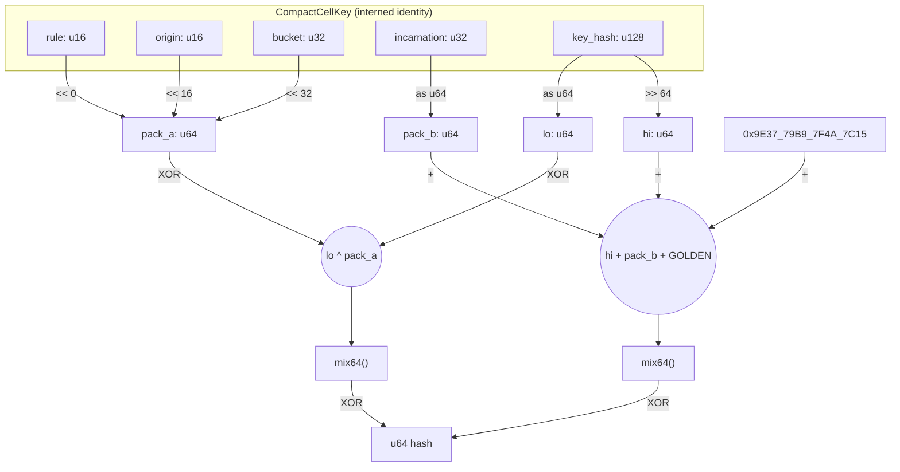

The algorithm packs `rule | origin | bucket` into one `u64` (16 + 16 + 32 = 64 bits, no overlap), splits the 128-bit `key_hash` into low and high halves, and runs two independent `mix64` lanes that are XOR-folded at the end. The `0x9E3779B97F4A7C15` constant — `2^64 / golden_ratio`, also known as SplitMix64's increment — prevents the all-zero input from collapsing to zero and breaks symmetry between the two lanes.

#### Invariants — what callers rely on

1. **Determinism across peers (load-bearing).** The CRDT only converges if every node agrees on the bucket assignment for a given cell. The function uses no runtime seed; the output depends only on the input bytes. *Do not introduce per-process randomness here.*
2. **Total function.** Every `CompactCellKey` produces a `u64`. No panic, no `Option`, no error.
3. **Allocation- and syscall-free.** Pure arithmetic on stack integers.
4. **All five `CompactCellKey` fields participate.** If a sixth field is added, this function must be updated, or distinct cells will collide.
5. **The hash is a probe hint, not an identity.** Hash collisions are inevitable in a 2^64 universe. The `CellIndex` returns candidate slots whose stored hash matches, and the caller — `CellStore::lookup_index` (`crdt.rs:494-498`) — confirms a hit by re-comparing all five identity columns.

#### Why a small custom mixer, not SipHash

`std::collections::HashMap` defaults to SipHash with a per-process random seed because it must resist hash-DoS over adversarial byte inputs. None of that applies here: the inputs are already-hashed 128-bit keys plus 16/32-bit dictionary slots, there is no DoS surface inside this function, and a random seed would *break* the CRDT by making peers disagree on bucket assignments. A general-purpose hasher like xxhash3 would still pay setup overhead; two `fmix64` calls plus a handful of XORs compile down to roughly a dozen instructions.

Two sibling helpers — `hash_fingerprint(u128)` and `hash_node_identity(NodeId, Incarnation)` (`hash.rs:25-36`) — follow the same recipe with different large odd constants, so the rule and node dictionaries see uncorrelated distributions even if two values happen to share a bit pattern.

---

### 4.2 `dictionary` — identity interning

File: `crates/gabion/src/crdt/dictionary.rs`.

Every cell carries a `RuleSlot` (`u16`) and a `NodeSlot` (`u16`) instead of a full 128-bit rule fingerprint and a full `(NodeId, Incarnation)` pair. The two dictionaries are what turn the long identities into those small handles.

**Why intern at all?**

1. **Compact rows.** A `u16` slot in every cell instead of 128 bits of fingerprint plus 160 bits of node identity — the module-level comment notes this drops the per-row identity cost from 52 bytes to 28 (`crdt.rs:7-9`).
2. **Fast equality on small ints.** Cell-to-cell comparisons become `u16 == u16` rather than 128-bit compares.
3. **No per-cell allocation.** All descriptor storage lives inside pre-allocated boxed slices.
4. **Stable local mapping.** For the lifetime of a single dictionary, a given fingerprint (or node identity) maps to one slot, and that slot is not reused for a different value while its refcount is non-zero.

One subtlety: slots are **not** globally stable across peers. Peer A might assign `RuleSlot = 3` to a fingerprint that peer B assigned `RuleSlot = 7`. Wire formats key on fingerprints and `(NodeId, Incarnation)`, never on slots. Slots are a purely local optimisation.

#### Shared layout

Both dictionaries share the same five fields plus capacity:

| Field         | Type             | Role                                                                                         |
| ------------- | ---------------- | -------------------------------------------------------------------------------------------- |
| `descriptors` | `Box<[Desc]>`    | One slot per index. Holds the canonical record. Default at free slots.                       |
| `refcounts`   | `Box<[u32]>`     | Parallel array. Zero means "free". Non-zero means "in use by N cells".                       |
| `index`       | `CellIndex`      | `hash(value) → slot`, with a closure to confirm equality on hits.                            |
| `free_next`   | `Box<[u16]>`     | Intrusive singly linked list of free slots. `free_next[i]` is the next free slot after `i`.  |
| `free_head`   | `u16`            | Head of the free list. `EMPTY_DICT_SLOT` (`u16::MAX`) when full.                             |
| `len`         | `u16`            | Number of live (non-zero-refcount) slots.                                                    |
| `capacity`    | `u16`            | Total slots allocated; set once at construction.                                             |

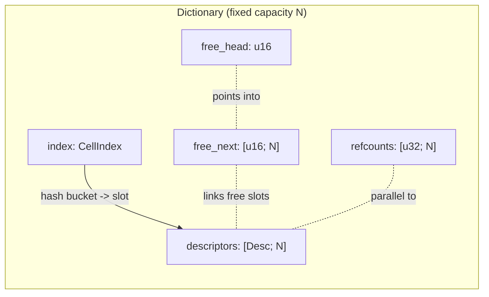

`EMPTY_DICT_SLOT = u16::MAX` (`dictionary.rs:7`) is doing double duty: it marks "no such slot" *and* "end of free list." The constructors assert `capacity < u16::MAX` (`dictionary.rs:59-61`, `:177-179`) precisely so real slot values can never collide with that sentinel.

Right after `with_capacity(8)` every slot is free, chained `0 → 1 → … → 7 → END`:


Allocating peels off the head; freeing pushes onto the head. The intrusive list lives inside the same `free_next` slice that was sized once at construction.

#### `RuleDictionary`

```rust
pub struct RuleDescriptor {
    pub fingerprint: u128,
    pub window_millis: u32,
    pub bucket_millis: u32,
    pub limit: u64,
    pub flags: u32,
    pub local_rule_id: u32, // u32::MAX => wire-only
}
```

`fingerprint` is the canonical 128-bit identity and the key the hash index hashes. The remaining fields describe the rate-limit rule itself.

`local_rule_id` carries a useful sentinel: `u32::MAX` (the `Default` value, `dictionary.rs:32`) means the rule is **known on the wire only**. Cells under such rules are tracked, replicated, and expired normally, but `applies_locally()` (`dictionary.rs:38`) returns `false` so the local aggregator skips them. This is the case where a peer is gossiping a rule the local node doesn't enforce.

**Read path.** `descriptor(slot)` bounds-checks and verifies `refcount > 0` before returning. A free slot returns `None` even though the backing array still holds a default value at that index. `find(fingerprint)` hashes via `hash_fingerprint`, asks `CellIndex` for candidate slots, and confirms a match with `fingerprint == fingerprint`.

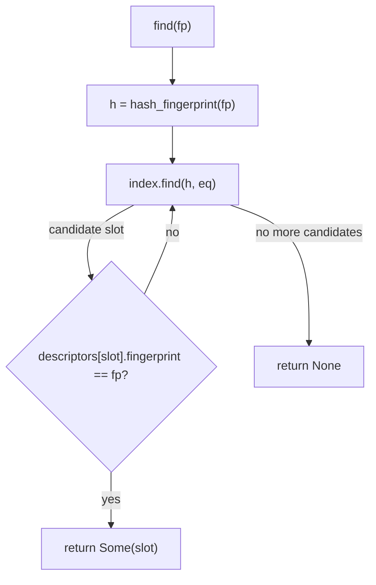

**Write path — `intern`.** `intern(descriptor) -> Option<RuleSlot>` (`dictionary.rs:113`) is the only way to create a rule slot:

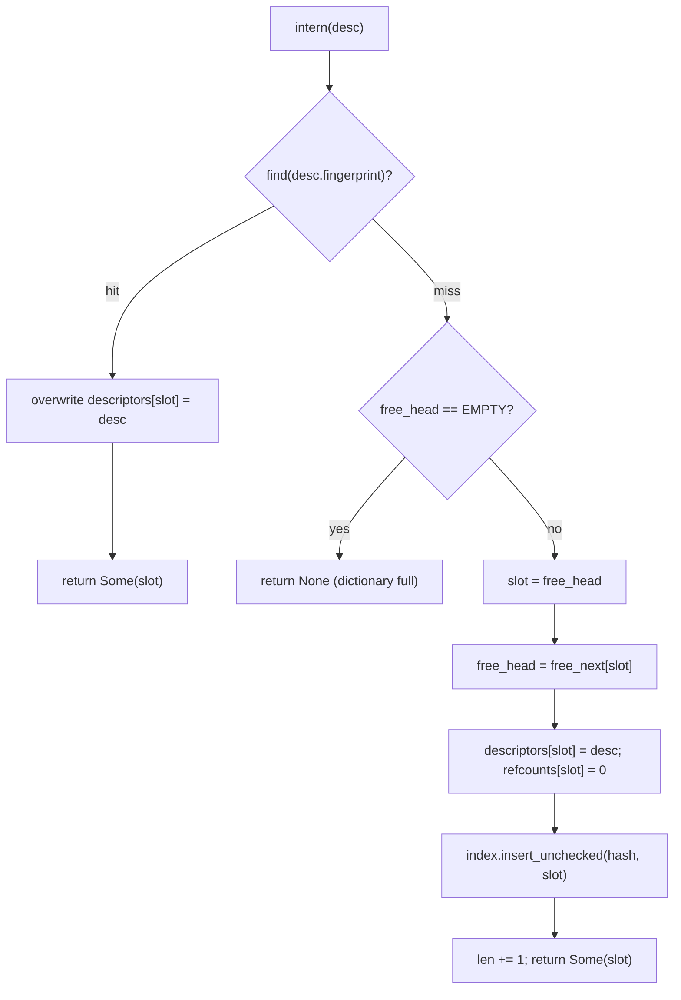

Two facts to internalise:

- **`intern` overwrites the descriptor on a hit.** That is how mutable metadata like `local_rule_id` updates land. For example, when a rule that first arrived on the wire (wire-only, `local_rule_id = u32::MAX`) is later registered locally, a re-intern with a real `local_rule_id` patches the descriptor in place. The slot is unchanged.
- **`intern` does not touch refcounts.** A freshly interned slot starts at `refcount = 0`. The caller (the `CellStore`) is responsible for `inc_ref`/`dec_ref` as cells reference and release the slot.

**Refcounting.** `inc_ref` saturates at `u32::MAX`; `dec_ref` is a no-op at zero. When `dec_ref` drives the count to zero, four things happen in sequence (`dictionary.rs:132-150`):

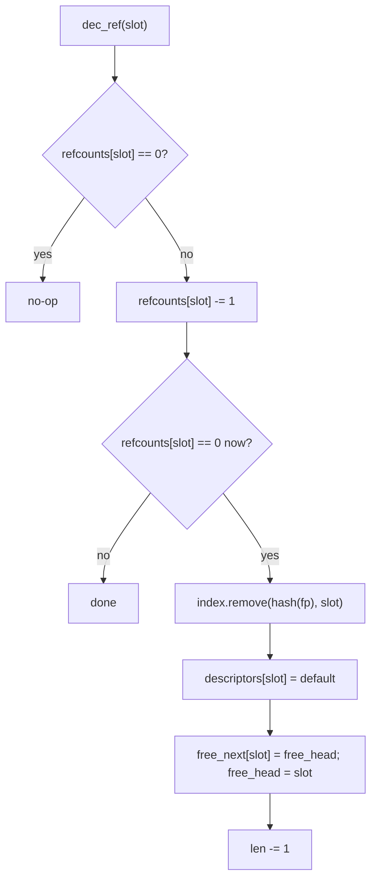

The descriptor reset is critical: it clears the fingerprint so a `find` during recycling cannot resolve to the now-free slot.

#### `NodeDictionary`

Structurally a twin: same five fields, same free list, same hash-index lookup. The differences are deliberate and worth stating explicitly.

```rust
pub struct NodeDescriptor {
    pub node_id: NodeId,
    pub incarnation: Incarnation,
}
```

The interned key is the **pair** `(node_id, incarnation)`, not just the node id. **This is load-bearing.** When a node restarts (or otherwise increments its incarnation), the new `(node_id, incarnation)` is a *different* key from the old one. `intern` allocates a fresh slot; old cells produced by the previous incarnation stay pinned to the old slot until released. The two incarnations cannot alias inside the CRDT — exactly what you want, because otherwise replayed sequence numbers from the dead incarnation could clobber state from the live one.

Three asymmetries with the rule version:

1. **`intern` does not overwrite the descriptor on a hit.** There is nothing to overwrite — the descriptor *is* the key.
2. **`dec_ref` returns `bool`.** `true` means this call dropped the refcount to zero and freed the slot. The caller uses that return to decide whether to also tear down per-origin auxiliary state (the per-origin sequence allocator, the per-peer frontier rows).
3. **Different incarnations get different slots.** A node that bumps its incarnation never shares a `NodeSlot` with its previous identity.

#### Capacity sizing — `pow2_index_capacity_for`

```rust
pub(super) fn pow2_index_capacity_for(capacity: u32) -> u32 {
    let base = capacity.max(1).next_power_of_two();
    base.saturating_mul(2).max(2)
}
```

Three guarantees: power of two (the hash index uses bitmasking, not modulo), `~50%` target load factor (the index is roughly twice the descriptor array's size), and safe bounds (`.max(1)` keeps `next_power_of_two` defined; `.saturating_mul(2)` guards `u32` overflow at the absurd end; `.max(2)` floors the result at two buckets). Worked example: `capacity = 100` → `next_power_of_two(100) = 128` → `128 * 2 = 256` index buckets → `100 / 256 ≈ 39%` load at full occupancy.

#### Dictionary invariants

1. **Stable mapping during a slot's lifetime.** Once a value is interned to a slot, that slot is stable until `refcount` drops to zero.
2. **No duplicates.** At any time at most one live slot holds a given key.
3. **Bounded size.** `len <= capacity <= u16::MAX - 1`.
4. **No allocation after construction.** Every backing slice is sized once in `with_capacity`.
5. **`intern` never mutates refcounts.**
6. **A freed slot is unreachable via `find` before it is recycled** — `dec_ref` removes the index entry and resets the descriptor *before* pushing the slot onto the free list.
7. **`RuleDictionary::intern` overwrites the descriptor on a hit; `NodeDictionary::intern` does not.**
8. **Different incarnations get different `NodeSlot`s.**
9. **`EMPTY_DICT_SLOT = u16::MAX`** is both "no slot" and "end of free list"; the capacity assertion makes the dual use safe.
10. **`inc_ref` saturates; `dec_ref` is a floor** — refcounts can neither overflow nor underflow.

---

### 4.3 `index` — the Robin Hood hash table

File: `crates/gabion/src/crdt/index.rs`.

The slot tables are accessed by index, but cells are looked up by `CompactCellKey`. That mapping lives in `CellIndex` — a power-of-two open-addressed hash table that uses **Robin Hood probing** for inserts and **backshift deletion** for removes. No tombstones.

#### The minimum vocabulary

- **Open addressing.** Collisions are resolved by walking forward in the same flat array rather than by chaining. Everything stays contiguous.
- **Probe sequence.** The walk a key follows looking for its home. Here it is *linear*: `slot = (slot + 1) & mask`.
- **Power-of-two masking.** If capacity is a power of two, `x mod capacity == x & (capacity - 1)`. A single bitwise AND replaces a division.
- **Ideal slot.** `(hash as u32) & mask` — the bucket the key wants.
- **Probe distance / displacement.** How far an entry sits from its ideal slot, measured along the probe sequence. An entry living at its ideal slot has distance 0. The function is `slot.wrapping_sub(ideal) & mask` (`index.rs:50-53`); the `wrapping_sub` plus mask handles wrap-around correctly.
- **Load factor.** `len / capacity`. This index keeps load factor strictly below 1 (it is fixed-capacity).
- **Robin Hood hashing.** On insert, when you find a bucket whose occupant has a *smaller* probe distance than the entry you are carrying, swap — leave yours, continue walking with theirs. "Rob from the rich (entries that walked far) to give to the poor (entries that barely walked at all)." Probe distances stay tightly bunched around their mean.
- **Tombstone.** A "deleted-but-don't-skip-me" marker used by simpler open-addressing tables. They accumulate forever under churn and inflate average probe distance. `CellIndex` does not use tombstones.
- **Backshift deletion.** When you remove an entry, walk forward and pull each subsequent displaced entry back by one slot — but only while those entries have probe distance > 0 (otherwise they would no longer be findable). The table ends up exactly as it would have been if the removed entry had never been inserted.

#### Why Robin Hood + backshift?

Three properties matter here, and this combination wins on all of them.

- **Bounded displacement under churn.** Plain linear probing concentrates clusters: a few keys hashing near each other build a long run, and every subsequent insertion into that cluster has to walk to the end of it. Robin Hood actively equalises displacement; any entry that has walked further than the incumbent steals the slot. Worst-case probe distance is not a fixed constant — Robin Hood bounds the *variance* — but in practice maximum probe distance stays small and slow-growing.
- **No tombstone bloat.** A CRDT for rate-limit counters churns continuously: old buckets expire and free their cells; new ones arrive. A tombstoned table would either degrade over time or require periodic rebuilds. Backshift deletion restores the table to a freshly-inserted shape after every removal.
- **Simple cache behaviour.** Two flat parallel arrays of `u32` and `u64`. Every probe step is a one-line index into contiguous memory. The probe sequence `slot = (slot + 1) & mask` is sequential reads — ideal for CPU prefetchers.

There is one more deep property worth flagging: **the Robin Hood early-exit on probe-distance** is what makes deletion-by-backshift correct in the first place. If `find` encounters a bucket whose occupant has a smaller probe distance than the searcher has walked, the key being searched for cannot be in the table — because if it were, it would have stolen this bucket from the current occupant during its own insert. That same fact is what guarantees, during `remove`'s backshift, that no other key relies on the now-empty slot being non-empty.

#### Data layout

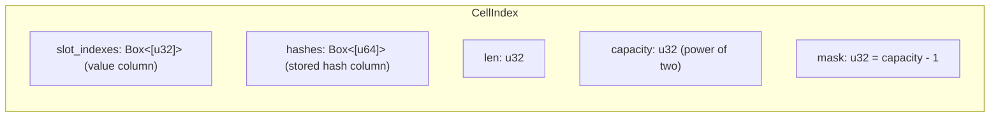

Two parallel arrays of length `capacity` form the buckets:

| Column         | Width | Purpose                                                                                                                     |
|----------------|-------|-----------------------------------------------------------------------------------------------------------------------------|
| `slot_indexes` | `u32` | The row index in the outer `CellStore`. **Also encodes occupancy.**                                                         |
| `hashes`       | `u64` | The full hash of the key stored here. Used for ideal-slot math and as a fast pre-filter before the caller's equality check. |

A bucket is empty iff `slot_indexes[i] == EMPTY_INDEX_SLOT`, defined as `u32::MAX` at `index.rs:3`. **Only `slot_indexes` is authoritative for occupancy.** The `hashes` column is data, not state — it is zeroed on construction and zeroed by backshift when it vacates a bucket, but the value `0` is a perfectly legal stored hash, not a tombstone.

Capacity is **fixed at construction** (`with_capacity`, `index.rs:24-37`) and **must be a power of two greater than zero**; both conditions are asserted. There is **no resize.** The `CellStore` picks the index's capacity via `pow2_index_capacity_for(cell_capacity)`, which gives the index headroom. Insert asserts `self.len < self.capacity` (`index.rs:88`); the index always reserves at least one empty bucket. That is the *termination guarantee* for the probe loops: as long as one bucket is empty, every walk eventually hits it and stops.

#### Lookup — `find`

`find(hash, eq)` searches for an entry whose stored hash equals `hash` *and* for which the caller-supplied closure `eq(stored_slot)` returns true. The split between hash equality (done by the index) and key equality (done by the caller's closure) is deliberate: the index does not know what a key is. The caller — `CellStore` — owns the cold identity columns (`rules`, `key_hashes`, `buckets`, `origins`, `incarnations`) needed to confirm a true hit. The stored 64-bit hash is a near-perfect pre-filter, so the closure only fires on real hash collisions.

```mermaid
sequenceDiagram
  autonumber
  participant C as Caller (CellStore)
  participant I as CellIndex.find
  participant B as Buckets

  C->>I: find(hash, eq)
  alt len == 0
    I-->>C: None
  else
    I->>I: slot = hash & mask; dist = 0
    loop probe walk
      I->>B: read slot_indexes[slot], hashes[slot]
      alt slot empty
        I-->>C: None
      else dist > stored_dist
        Note over I: Robin Hood early exit
        I-->>C: None
      else hash matches AND eq(stored_slot)
        I-->>C: Some(stored_slot)
      else
        I->>I: slot = (slot+1) & mask; dist += 1
      end
    end
  end
```

The Robin Hood early exit at `index.rs:70` is what makes negative lookups (the common case for any cache-like structure) cheap.

#### Insert — `insert_unchecked`

`insert_unchecked(hash, slot_index)` is `unchecked` because the caller has already verified the entry is not present. Two preconditions, both asserted: `slot_index != u32::MAX` and `self.len < self.capacity`.

```mermaid
sequenceDiagram
  autonumber
  participant C as Caller
  participant I as CellIndex.insert_unchecked
  participant B as Buckets

  C->>I: insert_unchecked(hash, slot_index)
  I->>I: assert slot_index != EMPTY; assert len < capacity
  I->>I: slot = hash & mask; carry = (hash, slot_index, dist=0)
  loop probe walk
    I->>B: read slot_indexes[slot]
    alt slot empty
      I->>B: write carry into bucket
      I->>I: len += 1
      I-->>C: return
    else carry.dist > occupant.dist
      Note over I,B: Robin Hood steal: swap carry with occupant
      I->>B: bucket := carry
      I->>I: carry := old occupant (with its own dist)
    end
    I->>I: slot = (slot+1) & mask; carry.dist += 1
  end
```

The invariant the loop preserves is exactly Robin Hood: at every step, the entry being *carried* has the larger displacement of the two candidates competing for the next bucket.

#### Delete — `remove` + `backshift`

The search phase of `remove` is structurally identical to `find` with two adaptations: equality matches on both `stored_hash == hash` *and* `stored_slot == slot_index` (the caller already knows the exact slot), and on match it calls `backshift(slot)` and decrements `len`.

`backshift` slides subsequent displaced entries one slot back until it hits a stopping condition:

```text
loop:
  next = (slot + 1) & mask
  if bucket[next] is empty:           stop (clear bucket[slot])
  if probe_distance(bucket[next]) == 0:
      stop (clear bucket[slot])       # entry at its ideal slot cannot move back
  bucket[slot] = bucket[next]
  slot = next
```

Both stopping conditions matter. The "probe distance 0" case is the reason backshift is safe: an entry sitting at its ideal slot would become unreachable if pulled one slot earlier, so we leave it alone and clear the trailing bucket instead.

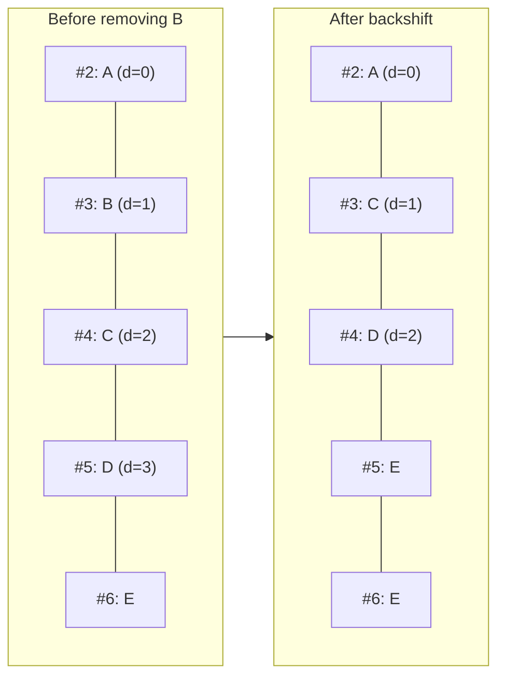

Each shifted entry's probe distance drops by exactly one — fine, because by hypothesis its distance was at least 1 (otherwise we would have stopped).

#### Index invariants

1. **Power-of-two capacity, mask is `capacity - 1`.** Set in `with_capacity`, never mutated.
2. **`len < capacity` after every operation.** Asserted on insert. Guarantees at least one empty bucket exists for probe termination.
3. **No tombstones.** Every bucket is exactly *empty* or *occupied*. `slot_indexes[i] == u32::MAX` is the sole occupancy predicate.
4. **Robin Hood ordering.** At any bucket encountered during a probe walk, if its occupant has probe distance strictly less than the searcher's distance, the searched key cannot be in the table.
5. **The first entry of any contiguous run has probe distance 0 or is empty.** Backshift maintains this.
6. **No reserved values other than `u32::MAX` in `slot_indexes`.** Insert asserts `slot_index != u32::MAX`.
7. **Allocation-free after construction.** Two `Box<[T]>` columns sized exactly in `with_capacity`.

---

### 4.4 `dirty_ring` — the bounded change log

File: `crates/gabion/src/crdt/dirty_ring.rs`.

A `DirtyRing` is a fixed-capacity ring buffer of "this cell just changed" entries. The cell store keeps two — `local_dirty` (changes whose origin is this node) and `forwarded_dirty` (changes learned from peers) — at `crdt.rs:285-286`. Drained each gossip tick.

#### The entry

```rust
pub struct DirtyEntry {
    pub handle: CellHandle,
    pub origin_sequence: u64,
}
```

Two fields:

1. **`handle`** — which cell was touched. `CellHandle` is itself an `(index, generation)` pair; the generation detects that a slot has been recycled to a different cell since the entry was written. (See [§5.3](#53-handles).)
2. **`origin_sequence`** — the cell's per-origin sequence number *at the moment of stamping*. This is what makes the ring safe to be lossy.

When the gossip path drains the ring, it does not blindly trust every entry. `dirty_entry_current` (`crdt.rs:959-971`) checks three things: slot index in range, slot's `generations[i]` still matches `handle.generation` (slot has not been recycled), and the slot's `origin_sequences[i]` still equals the entry's `origin_sequence`.

That last check is the point. If a later mutation on the same cell stamped a new sequence after this entry was pushed, the cell is already represented by the newer ring entry, and re-emitting the older one would only send stale state. The check silently skips superseded entries. **Duplicate entries for the same cell are therefore harmless** — only the most recent one ever passes validation — so the ring does not need to deduplicate on push.

#### The ring

```rust
pub struct DirtyRing {
    entries: Box<[DirtyEntry]>,
    head:    u32,
    len:     u32,
    overflow_seq: u64,
}
```

| Field | Meaning |
|-------|---------|
| `entries`     | Heap-allocated fixed-size slot array. Sized once at construction. |
| `head`        | Index where the **next** push will write. Always `0 <= head < capacity` when capacity > 0. |
| `len`         | How many slots currently hold valid data. Grows up to `capacity` then saturates. |
| `overflow_seq`| Monotonic counter, incremented every time a push displaces an older entry. |

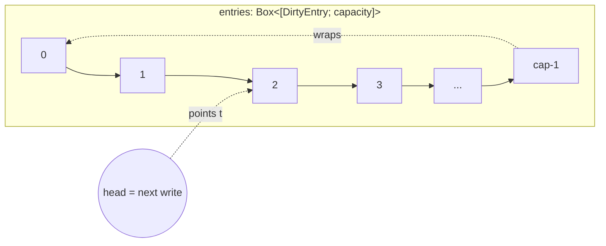

`head` is the *write cursor*, not a pointer to the newest entry — it is the address of the slot the next push will fill. The newest entry is at `(head - 1) mod cap`; the oldest is at `head` once the ring is full, or at index `0` while still filling. There is no separate `tail` — it is reconstructed on demand from `(head, len)`.

#### Two life stages

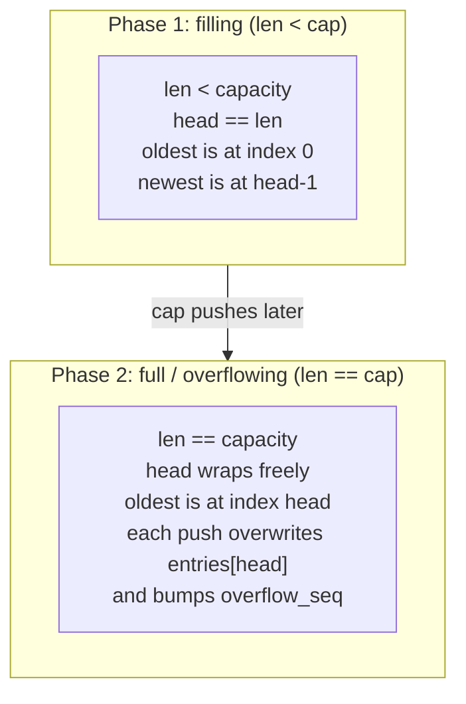

#### Push

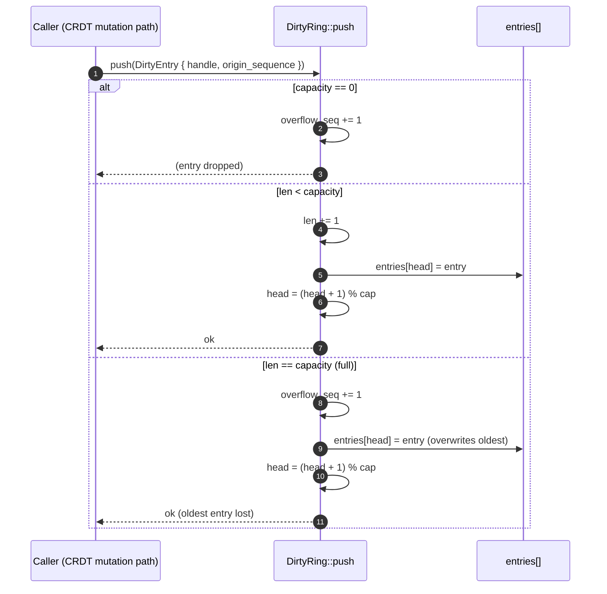

Branch-light, allocation-free, constant time. **`push` does not deduplicate** — deduplication would be `O(len)` or require an auxiliary set. Redundant entries are filtered cheaply at read time by the `origin_sequence` check.

#### Read

`iter` yields entries in insertion order, oldest first. `ring_entry_at(ring, offset)` is the same arithmetic exposed as a single-shot read — it exists for the hot `fill_gossip_frame` path, which calls mutating methods on `self` between successive entry reads. An iterator over `&self.local_dirty` would hold a shared borrow of `self` for the whole loop and forbid those mutations; `ring_entry_at` takes a `&DirtyRing` only for the duration of one call, returns a copy, and lets go.

There is no `pop` and no `drain`. The send path reads the ring non-destructively and resets it wholesale via `clear()`, which resets `head`, `len`, **and** `overflow_seq` to zero.

#### Overflow — bounded loss is fine

If a burst of writes overflows the ring, the oldest entries are dropped. The ring records the loss by bumping `overflow_seq` (a `u64` via `saturating_add`), but the entries themselves are gone. On its own that would be a correctness bug. The CRDT compensates by composing the dirty rings with a third lane — the **repair cursor** (see [§8.2](#82-the-repair-cursor--the-third-lane)) — that rotates over every active cell so that whatever the rings lose, the repair sweep rediscovers within one full rotation.

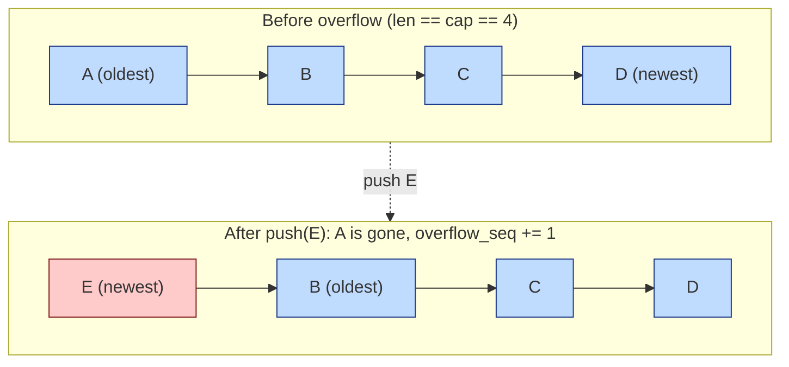

So the reliability story is:

- **Dirty rings** are the **optimistic fast path** — recently changed cells get broadcast within one gossip tick.
- **Repair sweep** is the **eventual-consistency backstop** — every cell, dirty or not, gets re-emitted on a rotating schedule.

The ring only *records* overflow (so a caller can observe "the dirty stream is no longer authoritative") and otherwise carries on.

#### Dirty ring invariants

1. **Capacity is immutable.** `entries.len()` never changes after `with_capacity`.
2. **Head bounds.** If `capacity() > 0`, then `0 <= head < capacity()`.
3. **Length bounds.** `0 <= len <= capacity()`.
4. **Logical contents.** The `len` valid entries, oldest to newest, are `entries[0..len]` if `len < capacity()`, otherwise `entries[head], entries[(head+1) % cap], ..., entries[(head + len - 1) % cap]`.
5. **No-op on zero capacity.** Every push is a no-op except for incrementing `overflow_seq`.
6. **`overflow_seq` monotonicity.** Non-decreasing between calls to `clear()`. Uses `saturating_add`, so it cannot wrap to zero.
7. **`overflowed()` agreement.** Returns `true` iff `overflow_seq > 0`.
8. **`clear` is total.** After `clear()`: `head == 0`, `len == 0`, `overflow_seq == 0`.
9. **`ring_entry_at` is a partial function.** Out-of-bounds offsets panic via the slice index; callers in `crdt.rs` bound `offset < ring.len()` themselves.

---

## 5. The cell store

With the foundations in hand, we can describe the store itself. It is defined in the top-level `crates/gabion/src/crdt.rs`.

### 5.1 Structure-of-arrays column layout

The most important shape choice in this module is **SoA** — Structure of Arrays. Instead of holding rows as a `Box<[Cell]>` where `Cell` is a struct, the store holds *each field in its own boxed slice*:

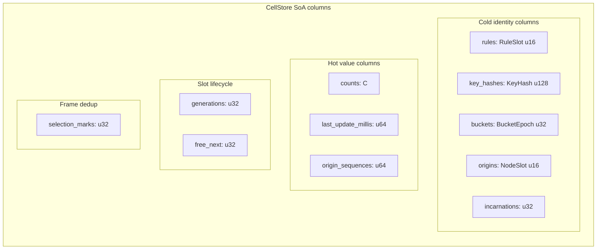

Each column is a `Box<[T]>` of length `capacity` (`crdt.rs:263-294`). Cell `i` is reconstructed by reading index `i` from every column.

**Why SoA?**

1. **Identity lookups touch only the cold columns.** `lookup_index` (`crdt.rs:486-500`) reads `rules`, `key_hashes`, `buckets`, `origins`, `incarnations` to confirm a hash match. The hot value columns never enter cache during a lookup.
2. **Merge passes touch only the hot columns.** Fold paths can stream over `counts` without dragging 28 bytes of identity along with each value.
3. **Identity is *interned* into small ints.** Each cell's identity row is six small integers totalling 28 bytes (`RuleSlot u16 + KeyHash u128 + BucketEpoch u32 + NodeSlot u16 + Incarnation u32`). The module comment notes this replaces a 52-byte AoS struct (`crdt.rs:7-9`).

The interning is what the two dictionaries from [§4.2](#42-dictionary--identity-interning) buy.

#### Public surface types

A handful of types crop up everywhere; they live near the top of the file.

| Type | Role | Defined |
|---|---|---|
| `RuleId` (`u32`)        | Application-level rule id, opaque to the CRDT | `crdt.rs:54` |
| `BucketEpoch` (`u32`)   | `now_millis / rule.bucket_millis` — which bucket we are in | `crdt.rs:57` |
| `Incarnation` (`u32`)   | Distinguishes successive lifetimes of one node | `crdt.rs:60` |
| `RuleSlot` (`u16`)      | Interned index into `RuleDictionary` | `crdt.rs:63` |
| `NodeSlot` (`u16`)      | Interned index into `NodeDictionary` | `crdt.rs:66` |
| `KeyHash(u128)`         | The application key, already hashed to 128 bits | `crdt.rs:69-70` |
| `NodeId(u128)`          | A peer's stable identity | `crdt.rs:74` |
| `NodeIdentity`          | `(NodeId, Incarnation)` pair | `crdt.rs:77-81` |
| `CompactCellKey`        | `(rule, key_hash, bucket, origin, incarnation)` — all interned | `crdt.rs:148-155` |
| `CellHandle`            | A stable, generation-tagged reference to a slot | `crdt.rs:161-165` |
| `CellDelta<C>`          | One delta row appended to a `DeltaSink` | `crdt.rs:168-176` |
| `UpdateOutcome<C>`      | Per-row result of an update | `crdt.rs:180-185` |
| `CellRow<C>`            | Snapshot of one stored cell | `crdt.rs:188-195` |
| `InsertReject`          | Why an insert was rejected (any of three capacities full) | `crdt.rs:198-203` |
| `CellStoreStats`        | Counters for observability | `crdt.rs:218-229` |

The IO containers `ObservationBatch<C>` and `DeltaSink<C>` live in the `io` submodule and are described in [§6](#6-io-containers).

---

### 5.2 Slot lifecycle: freelist + generation tagging

The store has up to `capacity` cells. A **slot** is an index `0..capacity`. At any moment a slot is either:

- **active** — holds a live cell, the hash index has an entry for it, the dictionary refcounts are held, or
- **inactive** — sits on the **freelist**, all columns are stale but harmless.

The lifecycle is controlled by three columns and two scalars:

- `generations: Box<[u32]>` — one counter per slot. The **low bit** is the *active flag*; the **high 31 bits** are the **ABA tag**.
- `free_next: Box<[u32]>` — intrusive freelist link.
- `free_head: u32` — head of the freelist.
- `active_len: u32` — count of active slots.

#### The freelist

At construction (`crdt.rs:331-334`) the freelist is built as `0 → 1 → 2 → ... → cap-1 → NO_FREE`. Every slot is free.


`alloc_slot` (`crdt.rs:556-568`) pops the head: returns `free_head`, sets `free_head = free_next[old_head]`, writes `NO_FREE` into the popped slot's `free_next`, and bumps the generation by one (flipping the low bit 0 → 1).

`free_slot` (`crdt.rs:570-577`) pushes onto the head: bumps the generation by one (flipping 1 → 0), sets `free_next[slot] = free_head`, then `free_head = slot`.

The intrusive freelist costs zero extra memory beyond the `free_next` column. Allocation and deallocation are O(1) with perfect locality (you almost always reuse the most recently freed slot), and slots are interchangeable so there is no fragmentation.

#### The generation counter — active flag and ABA tag fused

Each slot has a single `u32` `generations[slot]` with two roles fused into it:

- **Low bit** (`& 1`): 0 = inactive, 1 = active. `is_active(slot)` is `(generations[slot] & 1) == 1` (`crdt.rs:482-484`).
- **Upper 31 bits**: an increasing **ABA tag** that distinguishes each successive lifetime of the slot.

Every `alloc_slot` and every `free_slot` does `generations[slot] = generations[slot].wrapping_add(1)`. Two operations per lifecycle, so even generations are inactive, odd generations are active:

```
generation 0 (inactive)  --alloc--> 1 (active, lifetime A)
                                      --free--> 2 (inactive)
                                      --alloc--> 3 (active, lifetime B)
                                      ...
```

This single counter answers two questions cheaply:

1. *Is this slot currently in use?* (low bit)
2. *Is this still the same use of this slot it was a moment ago?* (full equality check)

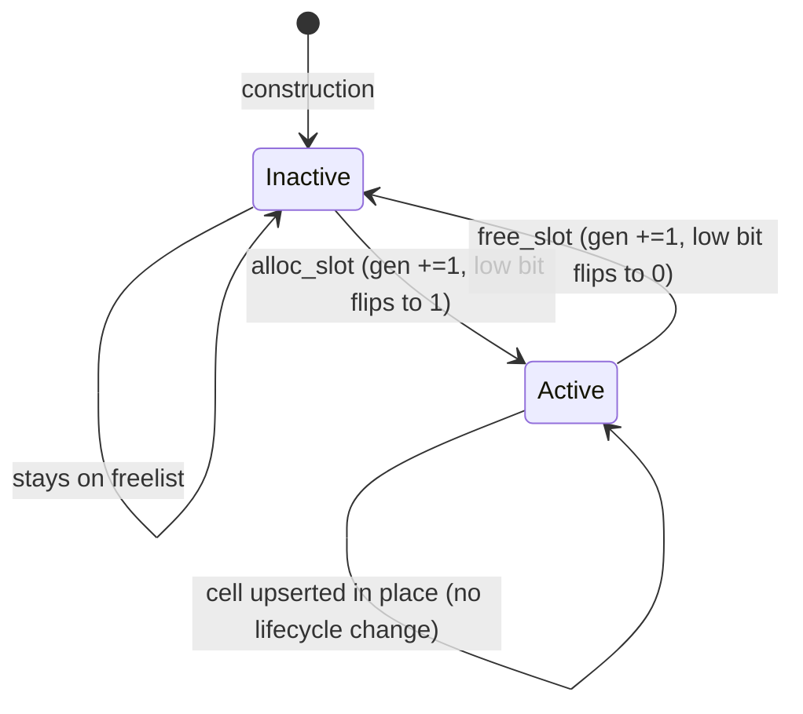

#### Freeing a cell — `free_cell_at`

When a cell is freed (e.g. expired), `free_cell_at` (`crdt.rs:579-598`) does the bookkeeping the slot-level `free_slot` does not:

1. Reconstruct `CompactCellKey` from the columns.
2. Remove the corresponding entry from `CellIndex`.
3. Decrement the rule dictionary refcount; the rule slot is released if nothing else references it.
4. Decrement the node dictionary refcount; if that frees the node slot, also clear the `PeerFrontierTable` column for it (see [§8.4](#84-peer_frontier--per-peer--per-origin-cursors)) and reset its `next_sequence_by_origin` counter.
5. Call `free_slot` to flip the generation and push onto the freelist.

Dictionary refcounts are why each `upsert` insert path calls `rule_dictionary.inc_ref(...)` and `node_dictionary.inc_ref(...)` (`crdt.rs:723-724`): the cell *holds* a reference and releases it here.

---

### 5.3 Handles

```rust
pub struct CellHandle { pub index: u32, pub generation: u32 }
```

A `CellHandle` captures both the slot index and the generation tag as it stood at handle-creation time (`handle_for`, `crdt.rs:475-480`).

`resolve` (`crdt.rs:506-517`) validates a handle in three checks:

```rust
if handle.index >= self.capacity { return None }
if self.generations[handle.index] != handle.generation { return None }
if (handle.generation & 1) != 1 { return None }
```

A stale handle — one whose slot was freed and reused — is rejected on a single `u32` equality compare against `generations[index]`. No epoch tables, no per-handle metadata, no allocation.

#### Why generation tagging — the ABA problem

Suppose handles were just `u32` indices, without a generation:

1. Caller A calls `find(...)` and gets a handle to slot 7.
2. Some unrelated path expires slot 7's bucket. The slot is freed; columns are now stale.
3. A new cell is inserted; the freelist pops slot 7 again. Slot 7 now holds a completely different counter.
4. Caller A calls `get(handle)` — and reads the wrong cell, silently. The same address (A) has been observed twice with a different value (B) in between. This is the **ABA problem.**

The handle's generation, combined with `resolve`'s equality check, makes the entire class of stale-handle bugs unobservable:

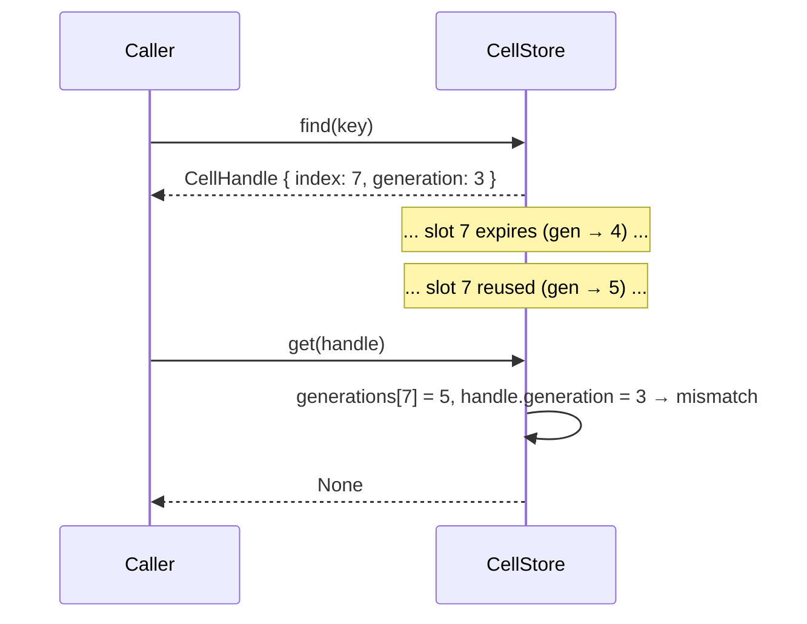

A single `u32` equality check makes the stale-handle bug disappear without ever scanning a freelist or maintaining tombstones.

---

### 5.4 The `Count` trait — width-parametric counters

```rust
pub trait Count: Copy + Eq + Ord + Default + Into<u64> + 'static {
    const MAX: Self;
    fn saturating_from_u64(value: u64) -> Self;
    fn saturating_add_hits(self, hits: u64) -> Self;
    fn saturating_delta(new: Self, old: Self) -> Self;
}
```

`CellStore<C: Count>` is generic over the count column's integer width. Implementations are provided for `u16`, `u32`, and `u64`. The width is fixed per `CellStore` instance via monomorphisation — *"narrow for high-throughput tables, wide for large limits"* (`crdt.rs:92-94`).

All arithmetic is **saturating**: incrementing a `u16` past 65,535 clamps at `u16::MAX` rather than wrapping. `saturating_delta(new, old)` is `new.saturating_sub(old)` and is used to compute the delta emitted into the `DeltaSink` on every change.

This trait is the only place width matters; everywhere else the store is column-agnostic.

---

## 6. I/O containers

File: `crates/gabion/src/crdt/io.rs`.

`io.rs` defines the two value types that carry data into and out of the store: `ObservationBatch<C>` (input) and `DeltaSink<C>` (output). Both are themselves SoA — the same shape choice that paid off inside the store extends to the IO buffers.

### Why SoA in the IO containers

The aggregator's job is exactly the kind of work SIMD is good at: read the `deltas` column, fold by key/rule into a running window. With a `Vec<CellDelta>`, the count is interleaved with `CellHandle` (8 B), `CompactCellKey` (~28 B), two other counts, and a bool — 60+ bytes per row. The CPU pulls a full cache line per element and discards most of it. With SoA, the `deltas` column is a contiguous `Vec<C>` — for `C = u32`, that is one count per four bytes, sixteen per cache line, ready for SIMD adds.

Three further reasons land in SoA's favour for this workload:

- **No per-row tag dispatch.** Every row has the same shape; no enum discriminant, no match per row.
- **Smaller, more uniform rows.** Each column is a packed array of a single primitive; there is no struct padding, which matters when the AoS row would otherwise carry a `u128` and force 16-byte alignment.
- **Predictable allocation.** Each column is one `Vec<T>`, sized at `with_capacity`, reused via `clear()` between frames. Easy to audit against the *"allocates only at construction"* rule (`crdt.rs:29`).

What you give up: cross-column invariants are not enforced by the type system. `push` is the social contract that patches this — the receiver runs `assert_consistent` under `debug_assertions`.

### `ObservationBatch<C>` — input columns

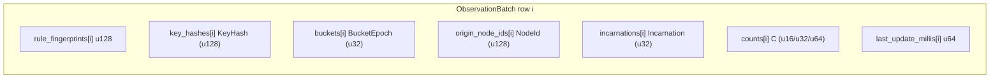

| Column | Meaning |
|---|---|
| `rule_fingerprints: Vec<u128>` | 128-bit hash of the rule definition. Resolved to a `RuleSlot` during ingest by looking up (or interning into) `RuleDictionary`. |
| `key_hashes: Vec<KeyHash>`     | 128-bit hash of the application key (account, IP, customer tuple…) — opaque to the CRDT. |
| `buckets: Vec<BucketEpoch>`    | Which time bucket the observation falls into. |
| `origin_node_ids: Vec<NodeId>` | The node that originally observed the event. **Ignored** by `ingest_local`, which always stamps `local_node_slot`. Used by `merge_remote` to record per-origin counters. |
| `incarnations: Vec<Incarnation>` | The origin's incarnation. Same ignore-for-local rule as `origin_node_ids`. |
| `counts: Vec<C>`               | Load-bearing; meaning depends on entry point. See below. |
| `last_update_millis: Vec<u64>` | Wall-clock timestamp to stamp onto the cell on apply. |

#### The dual meaning of `counts`

The same column plays two roles depending on the entry point that consumes the batch:

| Entry point | Meaning of `counts[i]` | Fold operation |
|---|---|---|
| `ingest_local` (`crdt.rs:786`) | Number of new hits to add to the local cell. | Saturating add. |
| `merge_remote` (`crdt.rs:826`) | The peer's *absolute* stored count for the cell. | Max-merge — only writes if `new > previous`. |

Mixing the two semantics in one batch is not supported; pick the entry point and fill `counts` accordingly.

#### API surface

| Method | Purpose | Source |
|---|---|---|
| `with_capacity(cap)`  | Allocate every column with `Vec::with_capacity(cap)` so no reallocation happens for the first `cap` rows. | `io.rs:22` |
| `push(...)`           | Append one row across all seven columns in lockstep. | `io.rs:61` |
| `len()` / `is_empty()`| Number of rows; defined as the length of `rule_fingerprints`. | `io.rs:44` |
| `clear()`             | `.clear()` each column. Capacity preserved. | `io.rs:50` |
| `assert_consistent()` | `debug_assert_eq!` each column's length to `rule_fingerprints.len()`. Called by `ingest_local` and `merge_remote` before iteration. | `io.rs:34` |

`push` is the only safe way to add a row — it pushes to every column unconditionally, so the parallel-length invariant cannot drift if all writes go through it.

### `DeltaSink<C>` — output columns

```mermaid
graph LR
    subgraph "DeltaSink row i"
        H["handles[i] CellHandle"]
        K["keys[i] CompactCellKey"]
        P["previous[i] C"]
        N["current[i] C"]
        D["deltas[i] C"]
        A["applies_locally[i] u8 (0/1)"]
    end
```

| Column | Meaning |
|---|---|
| `handles: Vec<CellHandle>`   | Generation-stamped pointer to the cell, so the caller can revisit the row without re-hashing the identity. |
| `keys: Vec<CompactCellKey>`  | Interned identity tuple — used by the aggregator to attribute the delta to the right rate-limit window. |
| `previous: Vec<C>`           | Stored count immediately before the merge. For a brand-new cell, `C::default()`. |
| `current: Vec<C>`            | Stored count after the merge. |
| `deltas: Vec<C>`             | `saturating_delta(current, previous)`; stored explicitly so the aggregator does not have to recompute it and so the saturation semantics are fixed at emission time. |
| `applies_locally: Vec<u8>`   | `0` / `1` flag. `1` means the rule has a resolved local rule id, so the local aggregator should fold this delta into its enforcement state. |

#### Visibility model

`ObservationBatch::push` is fully `pub` — the **caller** writes the batch. `DeltaSink::push` is `pub(super)` (`io.rs:134`) — the **`CellStore`** writes the sink; no outside caller has business appending to it. The columns themselves remain `pub` for read access.

#### Drain semantics

`DeltaSink` does not actually expose a "drain" in the standard-library sense. The pattern is:

1. Caller passes `&mut sink` to `ingest_local` / `merge_remote`.
2. The call returns; `sink` now has zero or more new rows appended.
3. Caller iterates `0..sink.len()`, folds each row into the aggregator state.
4. Caller calls `sink.clear()` before the next submission.

`clear()` is idempotent and preserves capacity — the next frame refills the same buffer. The convenience method `row(i)` materialises one delta as an AoS `CellDelta<C>` for callers that prefer the struct shape (logging, tests). There is no iterator that yields `CellDelta`s — production code walks the columns directly to keep the SoA benefits.

#### IO invariants

1. **Parallel column lengths.** Maintained by `push`; checked by `assert_consistent` at the entry points.
2. **Capacity is set at construction.** `with_capacity` is the only normal allocation point.
3. **Idempotent and capacity-preserving `clear`.** Calling `clear()` on an already-empty buffer is a no-op; capacity is not released.
4. **Same-row reads only.** A read at index `i` must read every column at the same `i`.
5. **`applies_locally` is canonical 0/1.** `push` writes `applies_locally as u8`, so the column only ever contains 0 or 1.

---

## 7. Data flow

With the store, the IO containers, and the four foundations defined, we can trace exactly how a write moves through the system.

### 7.1 Write: `ingest_local`

```mermaid
sequenceDiagram
    participant App as Application
    participant Batch as ObservationBatch<C>
    participant Store as CellStore
    participant Sink as DeltaSink<C>

    App->>Batch: with_capacity(N)   (once, at startup)
    loop per observation
        App->>Batch: push(rule_fp, key, bucket, origin, inc, count, ts)
    end
    App->>Store: ingest_local(&batch, &mut sink)
    Note over Store: assert_consistent()
    loop i = 0..batch.len()
        Store->>Store: rule_slot = intern_rule(batch.rule_fingerprints[i])
        Store->>Store: upsert(rule_slot, key, bucket, local_node_slot,
                              local_incarnation, default, accumulate=true,
                              hits=batch.counts[i], now=..., sink)
    end
    Store-->>Sink: zero or more pushed delta rows
    App->>Batch: clear()
```

`ingest_local(obs, sink)` (`crdt.rs:786-821`) loops over the observation batch and, for each row:

1. Finds the rule slot by fingerprint. If unknown, interns with a default descriptor — the rule is unknown locally, so `applies_locally()` will return `false`, but cells are still stored, forwarded, and expired.
2. Reads `hits = obs.counts[i].into()` — the **delta** of hits to add, not an absolute count.
3. Calls `upsert(rule_slot, key, bucket, local_node_slot, local_incarnation, default, accumulate=true, hits, now, sink)`.

The origin and incarnation columns of the batch are ignored on the local path — the local node is always the origin.

### 7.2 Write: `merge_remote`

`merge_remote(obs, sink)` (`crdt.rs:826-849`) is symmetric with three differences:

1. The origin and incarnation come from the batch (the peer that attributed the hit).
2. `obs.counts[i]` is an **absolute** observed count, not a delta. The store **max-merges**: keep `max(stored, observed)`.
3. `translate_identity` (`crdt.rs:742-780`) interns both the rule fingerprint and the `(node_id, incarnation)` pair into dictionary slots, admitting unknown rules with a default descriptor.

### 7.3 The shared `upsert` core

`upsert` (`crdt.rs:648-737`) is the worker that both entry points call. It branches on whether the cell already exists.

```mermaid
sequenceDiagram
    participant Cl as Caller (ingest_local / merge_remote)
    participant CS as CellStore::upsert
    participant Idx as CellIndex
    participant Cols as columns
    participant Seq as next_sequence_by_origin
    participant DR as DirtyRing
    participant Sink as DeltaSink

    Cl->>CS: upsert(rule_slot, key_hash, bucket, origin, inc, new, accumulate, hits, now, sink)
    CS->>Idx: lookup_index(key)
    alt cell exists
        Idx-->>CS: Some(slot)
        CS->>Cols: read counts[slot] as previous
        alt accumulate (local)
            CS->>CS: current = previous.saturating_add_hits(hits)
        else max-merge (remote)
            CS->>CS: current = max(new, previous)
        end
        alt current == previous
            CS-->>Cl: UpdateOutcome { changed: false, delta: None }
        else current > previous
            CS->>Cols: counts[slot] = current; last_update_millis[slot] = now
            CS->>Seq: seq = ++next_sequence_by_origin[origin]
            CS->>Cols: origin_sequences[slot] = seq
            CS->>DR: push DirtyEntry { handle, seq } into local_dirty or forwarded_dirty
            CS->>Sink: emit_delta(slot, previous, current, delta = saturating_delta(current, previous), rule_slot)
            CS-->>Cl: UpdateOutcome { changed: true, delta: Some(...) }
        end
    else cell does not exist
        CS->>CS: alloc_slot()
        alt freelist exhausted
            CS-->>Cl: Err(InsertReject::CellStoreFull)
        else slot allocated
            CS->>Cols: write rules/key_hashes/buckets/origins/incarnations/counts/last_update
            CS->>Seq: seq = ++next_sequence_by_origin[origin]
            CS->>Cols: origin_sequences[slot] = seq
            CS->>CS: rule_dictionary.inc_ref(); node_dictionary.inc_ref()
            CS->>Idx: insert_unchecked(hash, slot)
            CS->>DR: push DirtyEntry { handle, seq }
            CS->>Sink: emit_delta(slot, 0, initial, initial, rule_slot)
            CS-->>Cl: UpdateOutcome { changed: true, delta: Some(...) }
        end
    end
```

Two subtleties matter:

- **The dirty-ring stamp is `seq`, not the new count.** A subsequent update on the same cell allocates a fresh `seq` and pushes a new `DirtyEntry`; the old entry, if still in the ring, is *invalidated* by the mismatch. `dirty_entry_current` (`crdt.rs:959-971`) checks the entry's `origin_sequence` against the cell's current `origin_sequences[slot]`. Stale ring entries quietly skip themselves on consumption.
- **The delta row carries both `previous` and `current`.** A higher-level aggregator can fold without re-reading the store.

#### Dirty stamping — which ring receives the entry?

```mermaid
flowchart LR
  U[upsert raises count] --> S{origin == local node slot?}
  S -->|yes| LD[local_dirty: push DirtyEntry handle, seq]
  S -->|no| FD[forwarded_dirty: push DirtyEntry handle, seq]
  U --> SQ[next_sequence_by_origin origin += 1]
  SQ --> OS[origin_sequences slot = seq]
  U --> DS[DeltaSink push: handle, key, prev, curr, delta, applies_locally]
```

The `local_dirty` lane is what gets gossiped first — changes this node originated. The `forwarded_dirty` lane is what we re-broadcast on behalf of peers (anti-entropy via forwarding).

#### The per-origin sequence allocator

`next_sequence_by_origin` (`crdt.rs:294`, `:369-370`) is sized to `node_dictionary_capacity`. Each origin gets its own monotonic counter, and `next_origin_sequence` (`crdt.rs:602-606`) saturating-adds one before returning. The first sequence ever minted is therefore 1; `0` reads back from a never-allocated origin slot as "nothing here yet."

The sequence has two jobs:

1. Disambiguate ring entries for the same cell — only the latest entry survives validation.
2. Provide ordering metadata for `PeerFrontierTable` so peers can advance their per-origin acknowledgement cursors.

When a node slot is freed by refcount, the counter for that slot is reset (`crdt.rs:595`).

#### The `local_node_slot` pin

When `CellStore::new` runs, it interns the local identity into the node dictionary and then immediately calls `node_dictionary.inc_ref(local_node_slot)` (`crdt.rs:337-341`) — *"Pin the local slot so it cannot be freed via `dec_ref`."*

This matters because `free_cell_at` decrements the node refcount and, if it hits zero, releases the slot. Without the pin, freeing the last cell whose origin is the local node could free the local node slot itself — leaving the store unable to attribute its own writes. The extra refcount is a one-time pin and is never released.

### 7.4 Read: `find`, `resolve`, `get`, `count_of`

All read primitives are lock-free.

| Method | Role |
|---|---|
| `find(key) -> Option<CellHandle>` | Hashes the key, walks `CellIndex` until a probe hit matches all five cold columns. Returns the generation-tagged handle. |
| `resolve(handle) -> Option<u32>` | Bounds-checks, then `generations[handle.index] == handle.generation && (handle.generation & 1) == 1`. |
| `get(handle) -> Option<CellRow<C>>` | Reads every column for a slot and assembles a snapshot. |
| `count_of(handle) -> Option<C>` | Hot fast path: touches only the `counts` column. |
| `active_handles()` | Diagnostic helper that walks `0..capacity` and yields handles only for slots with odd generation. Scans the full capacity, not just `active_len`; not for hot paths. |

There is no atomic "snapshot the whole store" operation. The structure is single-threaded; a snapshot is logically the iterator `active_handles().map(|h| store.get(h).unwrap())`. Higher layers persist via the `DeltaSink` stream and the `peer_frontier` checkpoints.

---

## 8. Gossip and convergence

A node converges with its peers through three lanes that the cell store composes each gossip frame.

### 8.1 The two dirty rings

The store keeps two `DirtyRing`s (see [§4.4](#44-dirty_ring--the-bounded-change-log) for the ring buffer itself) side by side at `crdt.rs:285-286`:

| Field            | Origin of entries                                                   | Gossip lane |
|------------------|---------------------------------------------------------------------|-------------|
| `local_dirty`    | Updates whose origin is **this** node (`origin == local_node_slot`).| Lane 1 — emitted first in `fill_gossip_frame`. |
| `forwarded_dirty`| Updates received from **other** nodes that this node is relaying.   | Lane 2 — emitted after the local ring fills its share of the frame. |

The `DirtyRing` type itself does not care which lane it is; both instances are identical implementations. The split is a policy decision: locally-originated updates ship before forwarded ones, so a hot local writer does not starve on relayed chatter. Each ring has its own configurable capacity (defaulting to 64 each at `crdt.rs:252`).

`visit_local_dirty` and `visit_forwarded_dirty` (`crdt.rs:931-957`) stream the ring entries through a caller closure. Each entry is validated by `dirty_entry_current` — stale entries are silently skipped. These visitors do **not** deduplicate; a multi-lane composer must dedup itself (see [§8.3](#83-fill_gossip_frame-and-per-frame-dedup)).

### 8.2 The repair cursor — the third lane

The dirty rings have finite capacity. If a burst of writes overflows the ring, the oldest entries are dropped (the ring bumps `overflow_seq` as a hint, but the entries themselves are gone). On their own, dirty rings can lose information.

The **repair cursor** is the safety net. It is a single `u32` that rotates over `0..capacity` and, on each gossip frame, sweeps forward a small slice, emitting handles for any active slot it lands on.

```mermaid
flowchart LR
  subgraph cap[capacity slots]
    direction LR
    s0[0]
    s1[1]
    s2[2]
    s3[3]
    s4[4]
    s5[5]
    s6[6]
    s7[7]
  end
  cur((repair_cursor)) -.points at.-> s2
  s2 -->|visit| s3 -->|visit| s4
```

The cursor only advances on slots it actually visited (`crdt.rs:990` and `:1067`), so a partial sweep resumes where it left off next frame. Over many frames every active cell is guaranteed to be retransmitted at least once per full rotation — the convergence property dirty-only gossip cannot give you on its own.

### 8.3 `fill_gossip_frame` and per-frame dedup

`fill_gossip_frame` (`crdt.rs:1010-1078`) stitches the three lanes together in priority order:

1. **Lane 1 — local dirty.** Newest local changes get the most prompt broadcast.
2. **Lane 2 — forwarded dirty.** Recent changes heard from peers, re-broadcast for fan-out.
3. **Lane 3 — repair slice.** Rotating sweep of the active set, capped at the remaining budget.

Per-frame deduplication is O(1) and allocation-free: every frame `bump_selection_epoch` (`crdt.rs:901-914`) increments `selection_epoch`, and `mark_selected(slot)` (`crdt.rs:916-922`) writes the current epoch into `selection_marks[slot]`. If the slot was already marked this epoch, the caller skips it. Lane 3 therefore naturally cannot re-emit a cell that lanes 1 or 2 already pushed.

```mermaid
sequenceDiagram
    participant App as Gossip layer
    participant CS as CellStore::fill_gossip_frame
    participant LD as local_dirty
    participant FD as forwarded_dirty
    participant SM as selection_marks
    participant RC as repair_cursor

    App->>CS: fill_gossip_frame(max_cells=N, out)
    CS->>CS: bump_selection_epoch()
    loop over local_dirty (oldest first)
        CS->>LD: ring_entry_at(offset)
        CS->>CS: dirty_entry_current(entry)?
        CS->>SM: mark_selected(slot)?
        alt fresh & not yet marked
            CS->>App: out.push(handle)
        end
    end
    loop over forwarded_dirty
        CS->>FD: ring_entry_at(offset)
        CS->>CS: dirty_entry_current(entry)?
        CS->>SM: mark_selected(slot)?
        alt fresh & not yet marked
            CS->>App: out.push(handle)
        end
    end
    loop rotating from repair_cursor until budget filled or full sweep
        CS->>CS: is_active(slot)?
        CS->>SM: mark_selected(slot)?
        alt active & not yet marked
            CS->>App: out.push(handle)
        end
    end
    CS->>RC: repair_cursor = next_cursor
```

The `selection_epoch` is a `u32` that wraps. On wrap to zero, `bump_selection_epoch` does a one-shot scrub of `selection_marks` and resets to 1 so the new epoch is unambiguous (`crdt.rs:904-913`) — *"pathological in practice — u32 epochs cover billions of frames — but cheap insurance."*

### 8.4 `peer_frontier` — per-peer × per-origin cursors

File: `crates/gabion/src/crdt/peer_frontier.rs`.

`PeerFrontierTable` is a small bookkeeping table that lets the outbound gossip layer skip cells a given peer has already acknowledged. **It is a latency optimisation, not a convergence mechanism.** The module's own docstring is explicit:

> Latency optimization only — convergence is guaranteed by the repair lane, not by this table.

Equally important is what it is **not**: it is *not* indexed per `(rule, key, bucket)` and it is *not* consulted from the CRDT's `observe` / `upsert` write path. If gossip is dropped or reordered, the repair cursor in `CellStore` eventually rotates over every active cell and reconciles. The frontier just lets the happy path avoid resending what each peer already has.

#### What it tracks

For every `(peer, origin-node)` pair this process tracks, the table remembers two monotonic cursors:

- `last_sent_seq` — the highest origin-sequence number we have transmitted to that peer for cells owned by that origin.
- `last_acked_seq` — the highest origin-sequence number that peer has acknowledged receiving for cells owned by that origin.

Together these answer one question: *"which of my active cells does peer X still need to hear about from origin O?"*

#### Layout

```rust
pub struct PeerFrontierTable {
    peer_ids:        Box<[Option<NodeId>]>, // length = peer_capacity
    last_acked_seq:  Box<[u64]>,            // length = peer_capacity * node_capacity
    last_sent_seq:   Box<[u64]>,            // length = peer_capacity * node_capacity
    peer_capacity:   u16,
    node_capacity:   u16,
}
```

`last_acked_seq` and `last_sent_seq` are conceptually a `peer_capacity × node_capacity` matrix flattened in **peer-major** order: one row per peer, with all that peer's per-origin cursors contiguous in memory. Two of the three hot operations — `remove_peer` (clears a row) and `lacks_indices` (scans one peer's row against the origin column) — touch one peer at a time, so peer-major matches the access pattern.

```mermaid
flowchart LR
  subgraph last_acked_seq["last_acked_seq[peer_capacity * node_capacity]"]
    direction LR
    R0["peer 0 row (node_capacity entries)"]
    R1["peer 1 row (node_capacity entries)"]
    R2["peer 2 row (node_capacity entries)"]
    Rk["..."]
    R0 --- R1 --- R2 --- Rk
  end
  subgraph peer_ids["peer_ids[peer_capacity]"]
    P0["Some(NodeId)"]
    P1["Some(NodeId)"]
    P2["None (free slot)"]
    Pk["..."]
  end
  P0 -. indexes .-> R0
  P1 -. indexes .-> R1
  P2 -. indexes .-> R2
```

`peer_ids` is a tiny linear-probe interning table — `Option<NodeId>` slots scanned via `position`. `intern_peer` is meant to be a once-per-peer-handshake operation, not a per-message one.

#### Primitives

| Operation | Purpose |
|---|---|
| `intern_peer(peer)` / `find_peer(peer)` / `remove_peer(peer)` | Manage peer slot allocation. `intern_peer` scans for an existing entry first, then claims a free slot. Table full returns `None`. |
| `last_sent(peer, origin)` / `last_acked(peer, origin)` | Plain indexed `u64` reads. Zero means "no information." |
| `record_sent(peer, origin, seq)` / `record_acked(peer, origin, seq)` | Pure "raise the high-water mark" operations — guarded by `<`, so stale or duplicate calls are no-ops. |
| `lacks_indices(peer, active_origins, origin_sequences, active_indices, out)` | The hot consumer; described below. |
| `clear_node_slot(node_slot)` | Wipes one origin column when its slot is recycled by the cell store. |

**Idempotence.** The `<` guards on `record_*` make every update a max-merge: a late or duplicate `record_*` carrying a stale sequence is silently ignored. Two callers racing? Both succeed; the smaller is a no-op. An ack arriving twice? The second is a no-op.

#### The hot consumer — `lacks_indices`

```mermaid
sequenceDiagram
    autonumber
    participant Repair as Repair driver
    participant Front as PeerFrontierTable
    participant Cells as CellStore arrays

    Repair->>Cells: borrow active_indices, active_origins, origin_sequences
    Repair->>Front: lacks_indices(peer_slot, ..., out=&mut Vec)
    loop for each idx in active_indices
        Front->>Front: origin := active_origins[idx]
        Front->>Front: last := last_acked_seq[flat_index(peer_slot, origin)]
        alt origin_sequences[idx] > last
            Front-->>Repair: push idx into out
        else
            Front-->>Repair: skip (peer already has this)
        end
    end
    Repair->>Repair: gossip cells named by out to this peer
```

For each candidate cell, the join asks: *"is this cell's current `origin_sequence` strictly greater than what peer X has acked for the origin that owns this cell?"* If yes, the index goes into `out`.

#### Why per-`(peer, origin)`, and not a single cursor?

Imagine origin **O** emits sequences `1, 2, 3`. Peer **A** received `1, 2`. Peer **B** received `1, 3` (frame `2` was dropped on the wire to B). With a single global "highest sequence sent to anyone" cursor, the next gossip round cannot distinguish *whose* frontier is lagging — we either re-broadcast everything (wasteful) or under-deliver (incorrect). Per-`(peer, origin)` state captures exactly *which* peer is behind on *which* origin's stream.

#### Reordered acks: the canonical scenario

```mermaid
sequenceDiagram
    autonumber
    participant Tx as gossip transport
    participant F as PeerFrontierTable
    Note over F: last_acked[A,O] = 0, last_acked[B,O] = 0

    Tx->>F: record_acked(A, O, 1)
    Note over F: 0 < 1 → last_acked[A,O] = 1

    Tx->>F: record_acked(A, O, 2)
    Note over F: 1 < 2 → last_acked[A,O] = 2

    Tx->>F: record_acked(B, O, 1)
    Note over F: 0 < 1 → last_acked[B,O] = 1

    Tx->>F: record_acked(A, O, 1)   (delayed duplicate)
    Note over F: 2 < 1 is false → NO-OP

    Note over F: state: last_acked[A,O] = 2, last_acked[B,O] = 1

    Tx->>F: lacks_indices(B, ..., out)
    Note over F: cells with origin_sequence ∈ {2, 3} still need B
```

Two things to notice:

- The duplicate `record_acked(A, O, 1)` is silently dropped because A's frontier is already at 2. Without that guard we would rewind A's cursor and uselessly retransmit sequence 2 to A.
- B's frontier sits at 1 independently of A's. A subsequent `lacks_indices(B, ...)` correctly identifies that B is missing sequences 2 and 3. A single-cursor design would have lost this distinction.

#### Interaction with the cell store

The only call to a `peer_frontier` mutator from inside `crdt.rs` is `clear_node_slot`, invoked from `free_cell_at` (`crdt.rs:592-596`) when the node dictionary frees a `NodeSlot` because the last cell owned by that origin was evicted. Two things must reset together: the origin-sequence allocator (so the next user of the slot starts at sequence 1 again) and every peer's frontier into this slot (so old acks from a long-departed origin do not silently suppress retransmission of the new origin's cells). Every other `record_sent` / `record_acked` / `intern_peer` call is driven from the gossip transport layer outside this module.

#### Frontier invariants

1. **Monotonic non-decreasing per cell.** For any fixed `(peer_slot, node_slot)`, both `last_sent_seq` and `last_acked_seq` only ever stay the same or increase. Enforced by the `<` guards.
2. **Idempotent updates.** Repeated `record_sent` / `record_acked` with the same arguments leave state unchanged.
3. **Order-independence.** Applying any permutation of `record_*` calls produces the same final state — each field is `max` over the multiset of sequences.
4. **Zero is "no information."** A freshly-constructed table, a freshly-cleared row (via `remove_peer`), and a freshly-cleared column (via `clear_node_slot`) all read as 0 on every cell.
5. **No allocation after construction.** All three arrays are `Box<[T]>` of fixed length set in `new`.
6. **No stale state across slot reuse.** When the parent `CellStore` recycles a `NodeSlot`, it calls `clear_node_slot` before the slot can be re-handed-out to a new `(NodeId, Incarnation)`.
7. **Convergence is someone else's job.** Lose every byte of this table and the CRDT still converges — the repair cursor takes over.

---

## 9. Expiry

`expire(current_epoch_by_rule, live_buckets)` (`crdt.rs:855-872`) sweeps the active set and frees any cell whose bucket has aged out. The keep-rule is:

```
keep if buckets[slot] + live_buckets[rule] >= current_epoch_by_rule[rule]
```

A cell is kept while its bucket plus the rule's live window covers the current epoch. Cells in older buckets are freed via `free_cell_at`, which cascades to dictionary refcount decrements and frontier cleanup. Both input slices are indexed by `RuleSlot`.

---

## 10. End-to-end traced example

Walk through a small concrete sequence to tie everything together.

**Initial state.** Empty store, capacity 4. `free_head = 0`, freelist `0 → 1 → 2 → 3 → NO_FREE`. All generations are 0 (inactive).

**Step 1 — local hit on rule `R1`, key `K`, bucket `42`, count 1.**

- `lookup_index` misses.
- `alloc_slot` pops slot 0. `generations[0] = 1` (active, lifetime A). `free_head = 1`.
- Cell columns at index 0 set: `rules[0] = R1_slot, key_hashes[0] = K, buckets[0] = 42, origins[0] = local_node_slot, incarnations[0] = local_incarnation, counts[0] = 1, last_update_millis[0] = now`.
- `next_sequence_by_origin[local_node_slot]` advances to 1; `origin_sequences[0] = 1`.
- Dictionary refs incremented for both rule and node.
- `CellIndex` inserts `(hash, 0)`.
- `local_dirty` pushes `DirtyEntry { handle: { 0, 1 }, origin_sequence: 1 }`.
- `DeltaSink` row: `(handle {0,1}, key, previous=0, current=1, delta=1, applies_locally=true)`.

**Step 2 — another local hit on the same cell, count 5.**

- `lookup_index` finds slot 0.
- `accumulate = true`, `previous = 1`, `next = previous.saturating_add_hits(5) = 6`.
- `counts[0] = 6`, sequence advances to 2, `origin_sequences[0] = 2`.
- `local_dirty` pushes a *new* entry for slot 0 with sequence 2. The earlier entry with sequence 1 is now stale — `dirty_entry_current` next frame sees `origin_sequences[0] = 2 ≠ 1` and skips it.
- `DeltaSink` row appended: `(handle, key, 1, 6, 5, ...)`.

**Step 3 — bucket 42 expires.**

- `expire` iterates, sees `buckets[0] = 42` with `current_epoch_by_rule[R1] = 44`, `live_buckets[R1] = 1`. Since `42 + 1 < 44`, the cell is expired.
- `free_cell_at(0)` removes from `CellIndex`, decrements rule and node refcounts, calls `free_slot(0)`.
- `generations[0]` goes from 1 → 2 (inactive, ABA tag now 1).
- Slot 0 pushes back onto freelist; `free_head = 0`, `free_next[0]` points at the old head.

**Step 4 — someone still holds `CellHandle { 0, 1 }` from step 1.**

- `resolve(handle)`: `generations[0] = 2 ≠ 1`. Returns `None`. No stale read, no panic.

**Step 5 — the freelist hands slot 0 back out for a brand-new cell.**

- `alloc_slot` pops 0. `generations[0]` goes 2 → 3 (active, lifetime B, ABA tag 1).
- Old handle `{0, 1}` still resolves to `None`. New handle is `{0, 3}`.

The same physical slot has been recycled, the columns hold completely different data, and the old reference is rejected by a single `u32` equality check.

---

## 11. Invariants reference

The whole structure relies on the following properties. They are grouped by submodule for navigation.

### Cell store (top-level `crdt.rs`)

1. **Generation parity ⇔ active flag.** `(generations[slot] & 1) == 1` iff the slot is active. Maintained by exactly one `wrapping_add(1)` in each of `alloc_slot` and `free_slot`.
2. **Freelist is a valid linked list.** `free_head` is `NO_FREE` or a slot index in `0..capacity`; each `free_next[slot]` for an inactive slot is `NO_FREE` or another inactive slot index.
3. **No slot appears on the freelist twice.** `alloc_slot` pops only the head and writes `NO_FREE` into the popped slot's `free_next`; `free_slot` only pushes a slot once.
4. **Hash index contains an entry iff slot is active.** `upsert`'s insert path calls `index.insert_unchecked`; `free_cell_at` calls `index.remove`.
5. **Dictionary refcounts cover exactly the live cells.** Insert path calls `inc_ref` on both dictionaries; `free_cell_at` calls `dec_ref`. The local node slot has one extra permanent refcount (pin).
6. **`active_len` equals the number of slots with odd generation.** Maintained by `alloc_slot` (`+= 1`) and `free_slot` (`-= 1`).
7. **`origin_sequences[slot]` is monotonically non-decreasing while a slot is active.** `next_origin_sequence` allocates before each write.
8. **A `DirtyEntry` is consumable iff `generations[idx] == entry.handle.generation` and `origin_sequences[idx] == entry.origin_sequence`.** Both checks inside `dirty_entry_current`.
9. **`CellHandle` is resolvable iff in-range, generation matches, low bit is set.**
10. **`selection_marks[slot] == selection_epoch`** means the slot has been emitted in the current frame composition; per-frame dedup relies on this.
11. **`next_sequence_by_origin[node_slot]` is reset to 0 only when the node slot is fully freed** (refcount drops to zero in `free_cell_at`).
12. **No allocation after construction.**

### Dictionaries

1. Stable mapping during a slot's lifetime.
2. No duplicates.
3. `len <= capacity <= u16::MAX - 1`.
4. No allocation after construction.
5. `intern` never mutates refcounts.
6. A freed slot is unreachable via `find` before recycling.
7. `RuleDictionary::intern` overwrites the descriptor on a hit; `NodeDictionary::intern` does not.
8. Different incarnations always get different `NodeSlot`s.
9. `EMPTY_DICT_SLOT = u16::MAX` is both "no slot" and "end of free list."
10. `inc_ref` saturates; `dec_ref` is a floor.

### Hash mixers

1. Determinism across peers (load-bearing).
2. Total function.
3. Allocation- and syscall-free.
4. `#[inline(always)]` is required so constants fold at call sites.
5. All five `CompactCellKey` fields participate.
6. The hash is a probe hint, not an identity.

### Robin Hood index

1. Power-of-two capacity, mask is `capacity - 1`.
2. `len < capacity` after every operation.
3. No tombstones.
4. Robin Hood ordering: at any bucket encountered during a probe walk, if the occupant's probe distance is strictly less than the searcher's, the key is not in the table.
5. The first entry of any contiguous run has probe distance 0 or is empty.
6. No reserved values other than `u32::MAX` in `slot_indexes`.
7. Allocation-free after construction.

### Dirty ring

1. Capacity is immutable.
2. `0 <= head < capacity()`.
3. `0 <= len <= capacity()`.
4. Logical contents are `entries[0..len]` while filling, else the wrap-around slice starting at `head`.
5. Zero capacity is a no-op except for `overflow_seq`.
6. `overflow_seq` is monotonic; uses `saturating_add`.
7. `overflowed()` iff `overflow_seq > 0`.
8. `clear` is total.
9. `ring_entry_at` panics on out-of-bounds; callers bound the offset.

### IO containers

1. Parallel column lengths.
2. Capacity is set at construction.
3. `clear()` is idempotent and capacity-preserving.
4. Same-row reads only.
5. `applies_locally` is canonical 0/1.

### Peer frontier

1. Monotonic non-decreasing per cell.
2. Idempotent updates.
3. Order-independence.
4. Zero is "no information."
5. No allocation after construction.
6. No stale state across slot reuse.
7. Convergence is someone else's job (the repair cursor).

---

## 12. Cross-module map

A reverse lookup of the submodule names that appear in `crdt.rs`:

| Name | Submodule | What it is |
|---|---|---|
| `RuleDictionary`, `NodeDictionary` | `dictionary` | Bounded interners with refcounts and their own free-list lifecycle. |
| `RuleDescriptor`, `NodeDescriptor` | `dictionary` | Per-slot payload for each dictionary. |
| `pow2_index_capacity_for` | `dictionary` | Power-of-two sizing helper for `CellIndex`. |
| `DirtyRing`, `DirtyEntry`, `ring_entry_at` | `dirty_ring` | Bounded ring of recent changes, with `overflow_seq` for loss detection. |
| `hash_compact_cell_key`, `hash_fingerprint`, `hash_node_identity`, `mix64` | `hash` | SplitMix / MurmurHash-style mixers. |
| `CellIndex` | `index` | Robin Hood open-addressing hash table, backshift deletion, power-of-two capacity. |
| `ObservationBatch`, `DeltaSink` | `io` | SoA input and output buffers. |
| `PeerFrontierTable` | `peer_frontier` | Per-peer × per-origin send/ack cursors — latency hint only; convergence is the repair lane's job. |

#### Public entry points on `CellStore`, at a glance

| Method | Role |
|---|---|
| `new(config, local_identity)` | Build a store; all allocation happens here. |
| `capacity()`, `active_len()`, `is_empty()`, `stats()` | Observability. |
| `intern_rule`, `intern_node`, `find_rule`, `find_node` | Dictionary plumbing. |
| `find(key)` | Hash-index lookup by `CompactCellKey`. |
| `resolve(handle)`, `get(handle)`, `count_of(handle)` | Handle-based reads. |
| `active_handles()` | Diagnostic full-scan iterator. |
| `ingest_local(obs, sink)` | Apply locally observed hits (saturating add). |
| `merge_remote(obs, sink)` | Merge peer observations (max-merge). |
| `expire(current_epoch_by_rule, live_buckets)` | Free aged-out cells. |
| `clear_dirty()` | Drop the dirty rings; stored cells untouched. |
| `clear()` | Reset to empty; preserves local identity registration. |
| `visit_local_dirty`, `visit_forwarded_dirty` | Stream dirty lanes (no dedup). |
| `visit_repair_slice(max, visit)` | Rotate a slice of active cells. |
| `fill_gossip_frame(max, out)` | Compose a frame: local dirty + forwarded dirty + repair slice, deduped. |
| `peer_frontiers()`, `peer_frontiers_mut()` | Per-peer send/ack frontier access. |
| `repair_cursor()` | Read the current cursor position. |

---

## 13. Glossary

- **ABA problem.** A subtle stale-handle bug: address A points to value X, gets recycled to value Y, then back to X, so a comparison `cur == old` succeeds even though the intervening Y was observable.
- **ABA tag.** Extra bits in a handle that change on every recycle, so an old handle cannot match a new use of the same slot.
- **AoS / SoA.** Array-of-Structures vs. Structure-of-Arrays — two memory layouts for tabular data.
- **Anti-entropy.** Background reconciliation: nodes periodically swap state so anything dropped in transit eventually re-delivers.
- **Avalanche.** Property of a hash function: a one-bit change in the input flips, on average, half the output bits.
- **Backshift deletion.** Deleting from an open-addressed table by walking forward and pulling displaced entries one slot back, until you hit empty or an ideal-slot entry.
- **Bucket epoch.** `now_millis / rule.bucket_millis` — which time window an observation belongs to.
- **CRDT.** Conflict-free Replicated Data Type. Multiple nodes can mutate independently and the result still converges once everyone has seen everyone's updates.
- **Cell.** One logical counter inside the store, keyed by `(rule, key, bucket, origin, incarnation)`.
- **Dictionary / interning.** Giving every distinct value a single canonical home in a fixed-size array, handing out a small integer slot in exchange.
- **Dirty ring.** Bounded ring of "this cell just changed" entries.
- **Fingerprint.** A canonical 128-bit hash of a rule's shape and parameters.
- **Frontier / high-water mark.** Watermark up to which something is known true; max-merged over time.
- **G-counter.** Grow-only counter — a CRDT where each replica only ever increases its own component, and merge is element-wise max.
- **Generation.** A `u32` per slot; low bit is the active flag, high 31 bits are the ABA tag.
- **Handle.** `(index, generation)` pair that points at a cell and detects recycling.
- **Idempotent merge.** Applying the same update twice gives the same state as applying it once.
- **Incarnation.** Small integer bumped each restart, distinguishing successive lifetimes of one node.
- **Open addressing.** Hash-table collision resolution by walking forward in the same flat array.
- **Origin.** Node that originally produced a write. Origin tags do not change when peers forward an update.
- **Origin sequence.** Per-origin monotonic `u64` counter, allocated on every write.
- **Probe distance.** How far an entry sits from its ideal slot, measured along the probe sequence.
- **Repair cursor.** A `u32` that rotates over every active slot to retransmit cells the dirty rings missed.
- **Robin Hood hashing.** Linear probing with displacement-equalising swaps on insert.
- **Saturating add.** `a + b` clamped at the type's max instead of wrapping.
- **Slot.** Index in `0..capacity` into the SoA columns.
- **Stamping.** Writing a `DirtyEntry` after mutating a cell.
- **Tombstone.** Deleted-but-don't-skip marker in some open-addressed tables. Not used here.
