# The `crdt` module

A guide to `crates/gabion/src/crdt/*` for somebody who has never opened this code before. The deep-dive companion to [`README.md`](README.md#how-gossip-works) — which documents the gossip runtime that sits on top of the structures described here. Anti-entropy, coverage fanout, threshold emissions, and peer selection all live there; this file is the data structures and the writes that flow through them.

Read it end-to-end and you should be able to open `crdt.rs` and recognise every type, every column, and every method named below.

---

## Table of contents

1. [The problem the module solves](#1-the-problem-the-module-solves)
2. [Module map](#2-module-map)
3. [Foundations](#3-foundations)
   - 3.1 [`hash` — deterministic mixers](#31-hash--deterministic-mixers)
   - 3.2 [`dictionary` — identity interning](#32-dictionary--identity-interning)
   - 3.3 [`index` — the Robin Hood hash table](#33-index--the-robin-hood-hash-table)
   - 3.4 [`dirty_ring` — the bounded change log](#34-dirty_ring--the-bounded-change-log)
4. [The cell store](#4-the-cell-store)
   - 4.1 [Structure-of-arrays column layout](#41-structure-of-arrays-column-layout)
   - 4.2 [Slot lifecycle: freelist + generation tagging](#42-slot-lifecycle-freelist--generation-tagging)
   - 4.3 [Handles](#43-handles)
   - 4.4 [The `Count` trait — width-parametric counters](#44-the-count-trait--width-parametric-counters)
   - 4.5 [Defaults and the production tunables](#45-defaults-and-the-production-tunables)
5. [I/O containers](#5-io-containers)
   - 5.1 [`Observation` and `ObservationBatch` — input](#51-observation-and-observationbatch--input)
   - 5.2 [`DeltaSink` — output for rising counts](#52-deltasink--output-for-rising-counts)
   - 5.3 [`ExpirationSink` — output for aged-out cells](#53-expirationsink--output-for-aged-out-cells)
   - 5.4 [`CompactCellKey` vs `CellIdentity`](#54-compactcellkey-vs-cellidentity)
6. [Data flow](#6-data-flow)
   - 6.1 [Write: `ingest_local`](#61-write-ingest_local)
   - 6.2 [Write: `merge_remote`](#62-write-merge_remote)
   - 6.3 [The shared `upsert` core](#63-the-shared-upsert-core)
   - 6.4 [Read: `find`, `resolve`, `get`, `count_of`](#64-read-find-resolve-get-count_of)
7. [Gossip and convergence](#7-gossip-and-convergence)
   - 7.1 [The two dirty rings](#71-the-two-dirty-rings)
   - 7.2 [The repair cursor — the third lane](#72-the-repair-cursor--the-third-lane)
   - 7.3 [`fill_gossip_frame` and per-frame dedup](#73-fill_gossip_frame-and-per-frame-dedup)
   - 7.4 [`peer_frontier` — per-peer × per-origin cursors](#74-peer_frontier--per-peer--per-origin-cursors)
   - 7.5 [`fill_gossip_frame_for_peer` and `peer_lacks`](#75-fill_gossip_frame_for_peer-and-peer_lacks)
8. [Expiry](#8-expiry)
9. [End-to-end traced example](#9-end-to-end-traced-example)
10. [Invariants reference](#10-invariants-reference)
11. [Cross-module map](#11-cross-module-map)
12. [Glossary](#12-glossary)

> *Anchor aliases.* Other docs cross-link these sections without the leading section numbers. The HTML anchors below — `module-map`, `gossip-and-convergence`, `expiry`, `invariants-reference` — sit on the respective headings so both `#2-module-map` (GitHub's auto-slug) and the bare `#module-map` resolve.

---

## 1. The problem the module solves

A node receives a stream of **hits** — events that should increment a counter. Which counter to increment depends on five fields:

- a **rule** (e.g. "100 requests / minute per API key"),
- an application **key** (e.g. the hashed API key),
- a time **bucket** (which one-minute slice we are in right now),
- the **origin** node that observed the hit, and
- that origin's **incarnation** (a small integer bumped each restart, so successive lifetimes of one node are distinguishable).

A rate-limit decision wants the global sum across all origins for the current bucket. Each node owns its origin column locally, learns the others by gossip, and never decrements; because counts only rise, the structure is safely mergeable by taking the per-origin maximum and summing across origins, which is what makes it a CRDT.

The `crdt` module is responsible for:

1. **Storing** these counters compactly and at bounded capacity (no allocation after construction).
2. **Observing** local hits and **merging** observations heard from peers.
3. **Emitting deltas** when a stored count rises and **emitting expirations** when an aged-out cell is freed, so an external aggregate store stays consistent with the active set.
4. **Marking dirty** any cell that just changed, so the gossip layer knows what to send next.
5. **Repairing** silently by rotating over the active set, so anti-entropy still converges when dirty tracking overflows.
6. **Expiring** cells whose bucket has aged out of the live window.

Everything in the module is single-threaded and bounded, with all capacities picked at `CellStore::new` time and never grown thereafter. The module-level comment says it plainly: *"Nothing in this module allocates after construction."* Two storage conventions enforce this. The store's own columns are `Box<[T]>` — slices that cannot grow, sized once at construction — while the caller-owned I/O containers (§5) are `Vec<T>` so that the caller can `clear()` them between frames and reuse the same capacity, calling `with_capacity` once at startup so they never reallocate in steady state.

For the cluster-level protocol — anti-entropy, coverage fanout, threshold-fire emissions, peer selection — see [`README.md`](README.md#how-gossip-works). This document does not describe those; it describes the data structures the runtime drives.

---

<a id="module-map"></a>
## 2. Module map

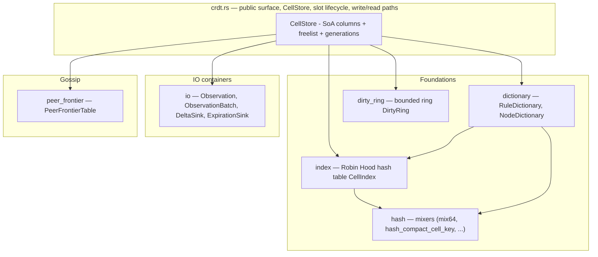

§3 walks the four foundations bottom-up — they have no dependencies on the cell store and compose into it. §4 introduces the store; §5 the I/O containers; §6 traces a write through both; §7 covers gossip frame composition; §8 covers expiry.

---

## 3. Foundations

These four submodules are the load-bearing primitives. They have no dependencies on the cell store itself, so it is easiest to understand them first; the cell store then composes them.

### 3.1 `hash` — deterministic mixers

File: `crates/gabion/src/crdt/hash.rs`.

`hash.rs` is roughly forty lines of pure arithmetic. Its job is to turn structured CRDT identifiers — a 128-bit rule fingerprint, a `(node_id, incarnation)` pair, or a five-field `CompactCellKey` — into a 64-bit hash that the Robin Hood index and the dictionaries can use as a probe position.

#### The shared finalizer: `mix64`

```rust
#[inline(always)]
pub(super) fn mix64(mut h: u64) -> u64 {
    h ^= h >> 33;
    h = h.wrapping_mul(0xff51_afd7_ed55_8ccd);
    h ^= h >> 33;
    h = h.wrapping_mul(0xc4ce_b9fe_1a85_ec53);
    h ^= h >> 33;
    h
}
```

This is Austin Appleby's `fmix64` finalizer from MurmurHash3. The constants are not chosen here; they are the published values that achieve full bit-avalanche — flipping any one input bit flips, on average, half the output bits. Three rounds of shift-multiply-xor are enough to produce a well-mixed `u64` from a `u64`.

`wrapping_mul` means "ignore overflow," which gives us the `Z/2^64` group operation that any open-addressing hash table is naturally built on. `#[inline(always)]` is load-bearing: the function is called twice per CRDT lookup, and inlining lets LLVM fold its constants into each call site.

#### `hash_compact_cell_key` — the main entry point

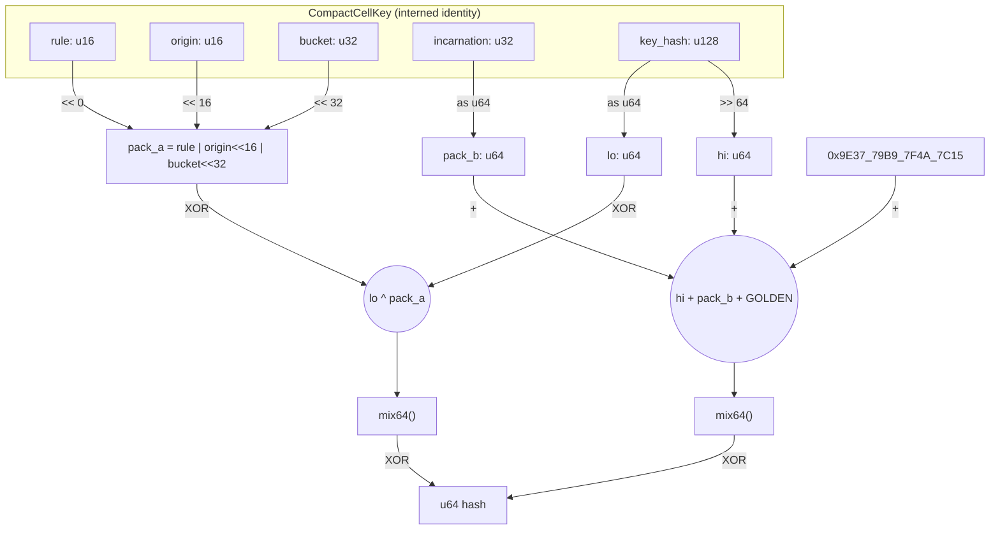

The algorithm packs `rule | origin | bucket` into one `u64` (16 + 16 + 32 = 64 bits, no overlap), splits the 128-bit `key_hash` into low and high halves, and runs two independent `mix64` lanes that are XOR-folded at the end. The `0x9E3779B97F4A7C15` constant, which is `2^64 / golden_ratio` and is also known as SplitMix64's increment, prevents the all-zero input from collapsing to zero and breaks symmetry between the two lanes.

#### Invariants — what callers rely on

1. **Determinism across peers (load-bearing).** The CRDT only converges if every node agrees on the bucket assignment for a given cell. The function uses no runtime seed, so the output depends only on the input bytes. *Do not introduce per-process randomness here.*
2. **Total function.** Every `CompactCellKey` produces a `u64`, with no panic, no `Option`, and no error path.
3. **Allocation- and syscall-free.** The body is pure arithmetic on stack integers.
4. **All five `CompactCellKey` fields participate.** If a sixth field is added, this function must be updated, or distinct cells will collide.
5. **The hash is a probe hint, not an identity.** Hash collisions are inevitable in a 2^64 universe, so `CellIndex` returns candidate slots whose stored hash matches and the caller — `CellStore::lookup_index` — confirms a hit by re-comparing all five identity columns.

#### Why a small custom mixer, not SipHash

`std::collections::HashMap` defaults to SipHash with a per-process random seed because it must resist hash-DoS over adversarial byte inputs. None of that reasoning applies here: the inputs are already-hashed 128-bit keys plus 16/32-bit dictionary slots, there is no DoS surface inside this function, and a random seed would actively *break* the CRDT by making peers disagree on bucket assignments.

Two sibling helpers — `hash_fingerprint(u128)` and `hash_node_identity(NodeId, Incarnation)` — follow the same recipe with different large odd constants, so the rule and node dictionaries see uncorrelated distributions even if two values happen to share a bit pattern.

---

### 3.2 `dictionary` — identity interning

File: `crates/gabion/src/crdt/dictionary.rs`.

Every cell carries a `RuleSlot` (`u16`) and a `NodeSlot` (`u16`) instead of a full 128-bit rule fingerprint and a full `(NodeId, Incarnation)` pair. The two dictionaries are what turn the long identities into those small handles.

**Why intern at all?**

1. **Compact rows.** A `u16` slot in every cell replaces 128 bits of fingerprint plus 160 bits of node identity; the module-level comment notes this drops the per-row identity cost from 52 bytes to 28.
2. **Fast equality on small ints.** Cell-to-cell comparisons become `u16 == u16` rather than 128-bit compares.
3. **No per-cell allocation.** All descriptor storage lives inside pre-allocated boxed slices.
4. **Stable local mapping.** For the lifetime of a single dictionary, a given fingerprint (or node identity) maps to one slot, and that slot is not reused for a different value while its refcount is non-zero.

One subtlety is worth flagging: slots are **not** globally stable across peers. Peer A might assign `RuleSlot = 3` to a fingerprint that peer B happens to call `RuleSlot = 7`. The wire formats therefore key on fingerprints and on `(NodeId, Incarnation)` rather than on slot numbers, because slots are a purely local optimisation.

#### Shared layout

Both dictionaries share the same five fields plus capacity:

| Field         | Type             | Role                                                                                         |
| ------------- | ---------------- | -------------------------------------------------------------------------------------------- |
| `descriptors` | `Box<[Desc]>`    | One slot per index. Holds the canonical record. Default at free slots.                       |
| `refcounts`   | `Box<[u32]>`     | Parallel array. Zero means "free". Non-zero means "in use by N cells".                       |
| `index`       | `CellIndex`      | `hash(value) → slot`, with a closure to confirm equality on hits.                            |
| `free_next`   | `Box<[u16]>`     | Intrusive singly linked list of free slots. `free_next[i]` is the next free slot after `i`.  |
| `free_head`   | `u16`            | Head of the free list. `EMPTY_DICT_SLOT` (`u16::MAX`) when full.                             |
| `len`         | `u16`            | Number of live (non-zero-refcount) slots.                                                    |
| `capacity`    | `u16`            | Total slots allocated; set once at construction.                                              |

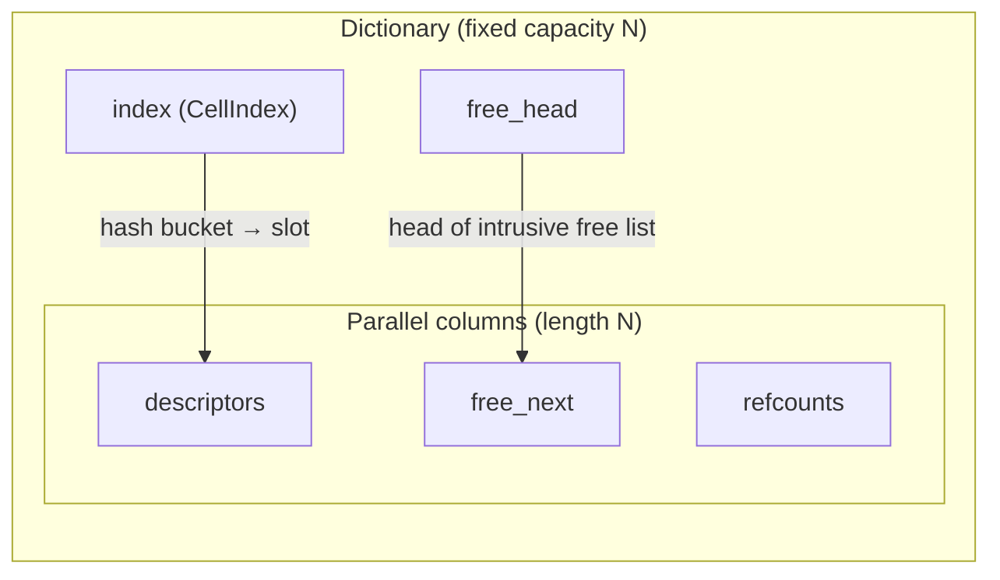

`EMPTY_DICT_SLOT = u16::MAX` does double duty: it marks both "no such slot" and "end of free list," and the constructors assert `capacity < u16::MAX` precisely so that real slot values can never collide with the sentinel.

Right after `with_capacity(8)` every slot is free, chained as `0 → 1 → … → 7 → EMPTY`. Allocation peels off the head and freeing pushes back onto it, with the intrusive list living inside the same `free_next` slice that was sized once at construction.

#### `RuleDictionary`

```rust
pub struct RuleDescriptor {
    pub fingerprint: u128,
    pub window_millis: u32,
    pub bucket_millis: u32,
    pub limit: u64,
    pub flags: u32,
    pub local_rule_id: u32, // u32::MAX => wire-only
}
```

`fingerprint` is the canonical 128-bit identity and the key the hash index hashes. The remaining fields describe the rate-limit rule itself.

`local_rule_id` carries a useful sentinel: a value of `u32::MAX` (the `Default`) means the rule is known on the wire only. Cells under such rules are still tracked, replicated, and expired, but `applies_locally()` returns `false` so the local aggregator skips them — which is what happens when a peer is gossiping a rule the local node does not itself enforce.

**Read path.** `descriptor(slot)` bounds-checks and verifies `refcount > 0` before returning. A free slot returns `None` even though the backing array still holds a default value at that index. `find(fingerprint)` hashes via `hash_fingerprint`, asks `CellIndex` for candidate slots, and confirms a match with `fingerprint == fingerprint`.

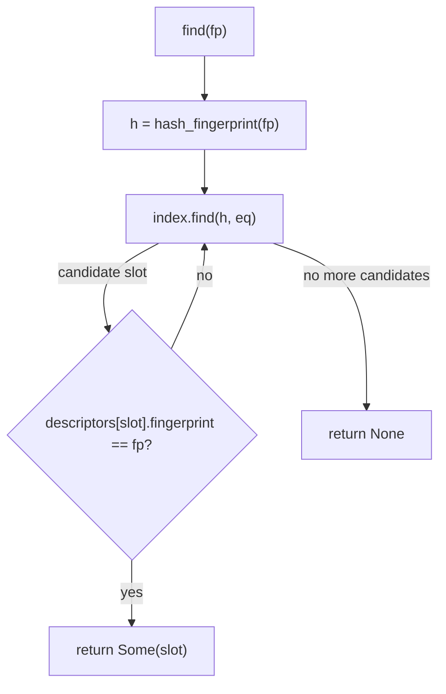

**Write path — `intern`.** `intern(descriptor) -> Option<RuleSlot>` is the only way to create a rule slot:

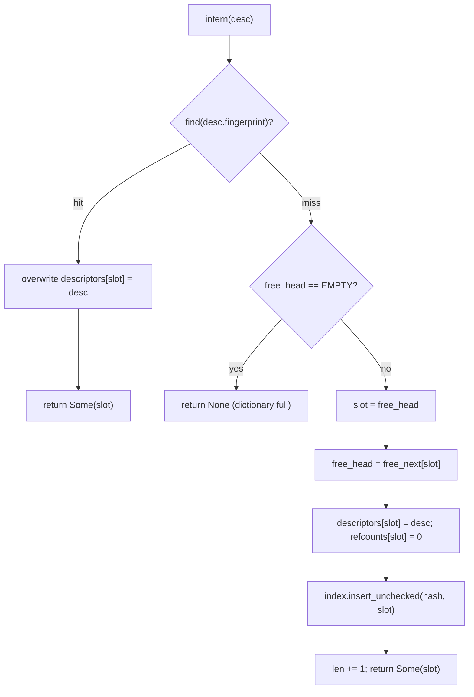

`intern` overwrites the descriptor on a hit, which is how mutable
metadata like `local_rule_id` updates make their way in. When a rule
first arrives on the wire (wire-only, `local_rule_id = u32::MAX`)
and is later registered locally, a re-intern with a real
`local_rule_id` patches the descriptor in place without disturbing
the slot. `intern` deliberately does not touch refcounts: a freshly
interned slot starts at `refcount = 0`, and the `CellStore` calls
`inc_ref` and `dec_ref` as cells reference and release the slot.

**Refcounting.** `inc_ref` saturates at `u32::MAX`; `dec_ref` is a no-op at zero. When `dec_ref` drives the count to zero, four things happen in sequence:

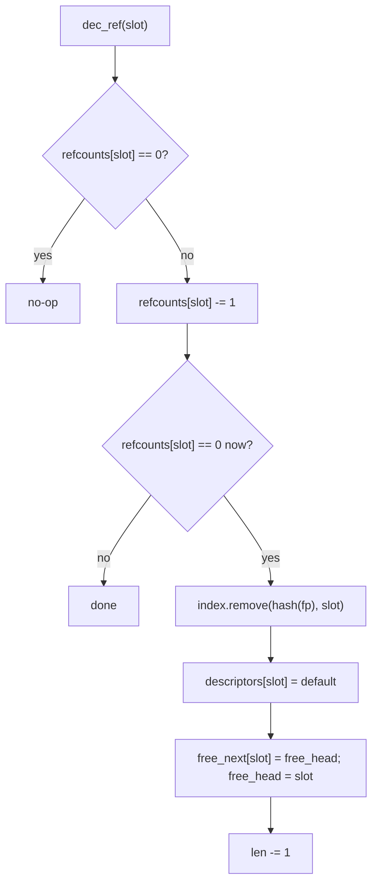

The descriptor reset is critical: it clears the fingerprint so that a `find` during recycling cannot resolve to the now-free slot.

#### `NodeDictionary`

`NodeDictionary` is structurally a twin of `RuleDictionary` — same five fields, same free list, same hash-index lookup — but with three deliberate differences.

```rust
pub struct NodeDescriptor {
    pub node_id: NodeId,
    pub incarnation: Incarnation,
}
```

The interned key is the *pair* `(node_id, incarnation)`, not just the node id, and this distinction is load-bearing. When a node restarts (or otherwise increments its incarnation), the new `(node_id, incarnation)` is a different key from the old one: `intern` allocates a fresh slot, and old cells produced by the previous incarnation stay pinned to the old slot until released. The two incarnations cannot alias inside the CRDT, which is exactly what we need; otherwise replayed sequence numbers from the dead incarnation could clobber state from the live one.

The three asymmetries with the rule version are:

1. **`intern` does not overwrite the descriptor on a hit.** There is nothing to overwrite, because the descriptor *is* the key.
2. **`dec_ref` returns `bool`.** A return value of `true` means this call dropped the refcount to zero and freed the slot, which the caller uses to decide whether to also tear down per-origin auxiliary state — the per-origin sequence allocator and the per-peer frontier rows.
3. **Different incarnations get different slots.** A node that bumps its incarnation never shares a `NodeSlot` with its previous identity.

#### Capacity sizing — `pow2_index_capacity_for`

```rust
pub(super) fn pow2_index_capacity_for(capacity: u32) -> u32 {
    let base = capacity.max(1).next_power_of_two();
    base.saturating_mul(2).max(2)
}
```

The helper offers three guarantees. The result is always a power of two, which lets the hash index use bitmasking instead of modulo; it doubles the descriptor capacity so the index sits at roughly a 50% load factor at full occupancy; and the bounds are safe at the edges, because `.max(1)` keeps `next_power_of_two` defined, `.saturating_mul(2)` guards against `u32` overflow at the absurd end, and `.max(2)` floors the result at two buckets. As a worked example, `capacity = 100` rounds up to `next_power_of_two(100) = 128`, which doubles to `256` index buckets, giving about 39% load at full occupancy.

#### Dictionary invariants

1. **Stable mapping during a slot's lifetime.** Once a value is interned to a slot, that slot is stable until `refcount` drops to zero.
2. **No duplicates.** At any time at most one live slot holds a given key.
3. **Bounded size.** `len <= capacity <= u16::MAX - 1`.
4. **No allocation after construction.**
5. **`intern` never mutates refcounts.**
6. **A freed slot is unreachable via `find` before it is recycled** — `dec_ref` removes the index entry and resets the descriptor *before* pushing the slot onto the free list.
7. **`RuleDictionary::intern` overwrites the descriptor on a hit; `NodeDictionary::intern` does not.**
8. **Different incarnations get different `NodeSlot`s.**
9. **`EMPTY_DICT_SLOT = u16::MAX`** is both "no slot" and "end of free list"; the capacity assertion makes the dual use safe.
10. **`inc_ref` saturates; `dec_ref` is a floor** — refcounts can neither overflow nor underflow.

---

### 3.3 `index` — the Robin Hood hash table

File: `crates/gabion/src/crdt/index.rs`.

The slot tables are accessed by index, but cells are looked up by `CompactCellKey`. That mapping lives in `CellIndex`, a power-of-two open-addressed hash table that uses Robin Hood probing for inserts and backshift deletion for removes, with no tombstones.

#### The minimum vocabulary

- **Open addressing.** Collisions are resolved by walking forward in the same flat array rather than by chaining. Everything stays contiguous.
- **Probe sequence.** The walk a key follows looking for its home. Here it is *linear*: `slot = (slot + 1) & mask`.
- **Power-of-two masking.** If capacity is a power of two, `x mod capacity == x & (capacity - 1)`. A single bitwise AND replaces a division.
- **Ideal slot.** `(hash as u32) & mask` — the bucket the key wants.
- **Probe distance / displacement.** How far an entry sits from its ideal slot, measured along the probe sequence. An entry living at its ideal slot has distance 0. The function is `slot.wrapping_sub(ideal) & mask`; the `wrapping_sub` plus mask handles wrap-around correctly.
- **Load factor.** `len / capacity`. This index keeps load factor strictly below 1 (it is fixed-capacity).
- **Robin Hood hashing.** On insert, when you find a bucket whose occupant has a *smaller* probe distance than the entry you are carrying, swap — leave yours, continue walking with theirs. Probe distances stay tightly bunched around their mean.
- **Tombstone.** A "deleted-but-don't-skip-me" marker used by simpler open-addressing tables. They accumulate forever under churn and inflate average probe distance. `CellIndex` does not use tombstones.
- **Backshift deletion.** When you remove an entry, walk forward and pull each subsequent displaced entry back by one slot — but only while those entries have probe distance > 0 (otherwise they would no longer be findable). The table ends up exactly as it would have been if the removed entry had never been inserted.

#### Why Robin Hood + backshift?

Three properties matter here, and this combination wins on all of them.

- **Bounded displacement under churn.** Plain linear probing concentrates clusters: a few keys hashing near each other build a long run, and every subsequent insertion into that cluster has to walk to the end of it. Robin Hood actively equalises displacement, because any entry that has walked further than the incumbent steals the slot, so the maximum probe distance stays small and slow-growing in practice.
- **No tombstone bloat.** A CRDT for rate-limit counters churns continuously as old buckets expire and free their cells while new ones arrive. A tombstoned table would either degrade over time or require periodic rebuilds, whereas backshift deletion restores the table to a freshly-inserted shape after every removal.
- **Simple cache behaviour.** The structure is two flat parallel arrays of `u32` and `u64`, so every probe step is a one-line index into contiguous memory and the probe sequence `slot = (slot + 1) & mask` reads sequentially in a way that CPU prefetchers can follow trivially.

The Robin Hood early-exit on probe distance is what makes deletion-by-backshift correct in the first place. If `find` encounters a bucket whose occupant has a smaller probe distance than the searcher has walked, the key being searched for cannot be in the table, because if it were it would have stolen this bucket from the current occupant during its own insert. That same fact guarantees, during `remove`'s backshift, that no other key relies on the now-empty slot remaining non-empty.

#### Data layout

Two parallel arrays of length `capacity` form the buckets:

| Column         | Width | Purpose                                                                                                                     |
|----------------|-------|-----------------------------------------------------------------------------------------------------------------------------|
| `slot_indexes` | `u32` | The row index in the outer `CellStore`. **Also encodes occupancy.**                                                         |
| `hashes`       | `u64` | The full hash of the key stored here. Used for ideal-slot math and as a fast pre-filter before the caller's equality check. |

A bucket is empty iff `slot_indexes[i] == EMPTY_INDEX_SLOT`, defined as `u32::MAX`, and only `slot_indexes` is authoritative for occupancy. The `hashes` column is data rather than state: it is zeroed on construction and zeroed by backshift when it vacates a bucket, but the value `0` is a perfectly legal stored hash, not a tombstone.

Capacity is fixed at construction (`with_capacity`) and must be a power of two greater than zero, with both conditions asserted; the table never resizes. The `CellStore` picks the index's capacity via `pow2_index_capacity_for(cell_capacity)`, which gives the index headroom, and insert asserts `self.len < self.capacity` so the index always reserves at least one empty bucket. That single empty bucket is the termination guarantee for the probe loops: as long as one bucket is empty, every walk eventually hits it and stops.

#### Lookup — `find`

`find(hash, eq)` searches for an entry whose stored hash equals `hash` and for which the caller-supplied closure `eq(stored_slot)` returns true. The split between hash equality (done by the index) and key equality (done by the caller's closure) is deliberate, because the index does not know what a key is: the caller — `CellStore` — owns the cold identity columns (`rules`, `key_hashes`, `buckets`, `origins`, `incarnations`) needed to confirm a true hit. The stored 64-bit hash is a near-perfect pre-filter, so the closure only fires on real hash collisions.

```mermaid
sequenceDiagram
  autonumber
  participant C as Caller (CellStore)
  participant I as CellIndex.find
  participant B as Buckets

  C->>I: find(hash, eq)
  alt len == 0
    I-->>C: None
  else
    I->>I: slot = hash & mask; dist = 0
    loop probe walk
      I->>B: read slot_indexes[slot], hashes[slot]
      alt slot empty
        I-->>C: None
      else dist > stored_dist
        Note over I: Robin Hood early exit
        I-->>C: None
      else hash matches AND eq(stored_slot)
        I-->>C: Some(stored_slot)
      else
        I->>I: slot = (slot+1) & mask; dist += 1
      end
    end
  end
```

The Robin Hood early exit is what makes negative lookups — the common case for any cache-like structure — cheap.

#### Insert — `insert_unchecked`

`insert_unchecked(hash, slot_index)` is `unchecked` because the caller has already verified the entry is not present. It carries two asserted preconditions: `slot_index != u32::MAX` and `self.len < self.capacity`.

```mermaid
sequenceDiagram
  autonumber
  participant C as Caller
  participant I as CellIndex.insert_unchecked
  participant B as Buckets

  C->>I: insert_unchecked(hash, slot_index)
  I->>I: assert slot_index != EMPTY; assert len < capacity
  I->>I: slot = hash & mask; carry = (hash, slot_index, dist=0)
  loop probe walk
    I->>B: read slot_indexes[slot]
    alt slot empty
      I->>B: write carry into bucket
      I->>I: len += 1
      I-->>C: return
    else carry.dist > occupant.dist
      Note over I,B: Robin Hood steal: swap carry with occupant
      I->>B: bucket := carry
      I->>I: carry := old occupant (with its own dist)
    end
    I->>I: slot = (slot+1) & mask; carry.dist += 1
  end
```

The invariant the loop preserves is exactly Robin Hood: at every step, the entry being carried has the larger displacement of the two candidates competing for the next bucket.

#### Delete — `remove` + `backshift`

The search phase of `remove` is structurally identical to `find` with two adaptations. Equality matches on both `stored_hash == hash` and `stored_slot == slot_index` (the caller already knows the exact slot), and on a successful match `remove` calls `backshift(slot)` and decrements `len`.

`backshift` slides subsequent displaced entries one slot back until it hits a stopping condition:

```text
loop:
  next = (slot + 1) & mask
  if bucket[next] is empty:           stop (clear bucket[slot])
  if probe_distance(bucket[next]) == 0:
      stop (clear bucket[slot])       # entry at its ideal slot cannot move back
  bucket[slot] = bucket[next]
  slot = next
```

Both stopping conditions matter. The "probe distance 0" case is the reason backshift is safe: an entry sitting at its ideal slot would become unreachable if pulled one slot earlier, so we leave it alone and clear the trailing bucket instead.

The diagram below shows one contiguous row of buckets. `B` is removed from slot #3, after which `C`, `D`, and `E` each shift one slot left and their probe distances each drop by exactly one — which is fine, because by hypothesis each distance was at least 1, otherwise backshift would have stopped. Slot #6 ends empty.

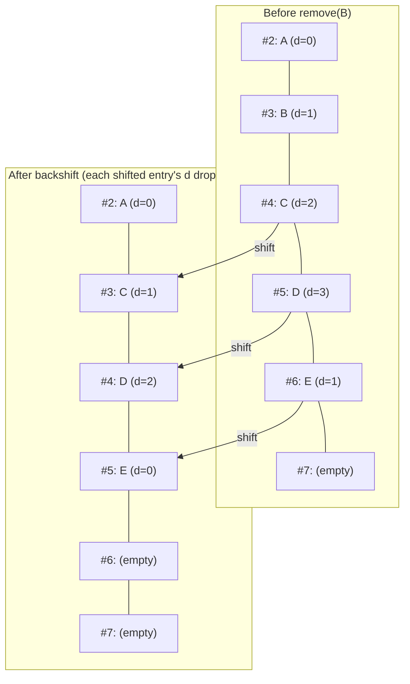

Each shifted entry's probe distance drops by exactly one.

#### Index invariants

1. **Power-of-two capacity, mask is `capacity - 1`.** Set in `with_capacity`, never mutated.
2. **`len < capacity` after every operation.** Guarantees at least one empty bucket exists for probe termination.
3. **No tombstones.** Every bucket is exactly *empty* or *occupied*. `slot_indexes[i] == u32::MAX` is the sole occupancy predicate.
4. **Robin Hood ordering.** At any bucket encountered during a probe walk, if its occupant has probe distance strictly less than the searcher's distance, the searched key cannot be in the table.
5. **The first entry of any contiguous run has probe distance 0 or is empty.** Backshift maintains this.
6. **No reserved values other than `u32::MAX` in `slot_indexes`.** Insert asserts `slot_index != u32::MAX`.
7. **Allocation-free after construction.** Two `Box<[T]>` columns sized exactly in `with_capacity`.

---

### 3.4 `dirty_ring` — the bounded change log

File: `crates/gabion/src/crdt/dirty_ring.rs`.

A `DirtyRing` is a fixed-capacity ring buffer of "this cell just changed" entries. The cell store keeps two of them: `local_dirty` for changes whose origin is this node, and `forwarded_dirty` for changes learned from peers. Both are drained each gossip tick.

#### The entry

```rust
pub struct DirtyEntry {
    pub handle: CellHandle,
    pub origin_sequence: u64,
}
```

The two fields play different roles. `handle` identifies which cell was touched; it is itself an `(index, generation)` pair, and the generation detects that a slot has been recycled to a different cell since the entry was written (§4.3). `origin_sequence` is the cell's per-origin sequence number at the moment of stamping, and it is what makes the ring safe to be lossy.

When the gossip path drains the ring, it does not blindly trust every entry. `dirty_entry_current` checks three things: that the slot index is in range, that the slot's `generations[i]` still matches `handle.generation` (so the slot has not been recycled), and that the slot's `origin_sequences[i]` still equals the entry's `origin_sequence`.

That last check is the point. If a later mutation on the same cell stamped a new sequence after this entry was pushed, the cell is already represented by the newer ring entry, and re-emitting the older one would only send stale state, so the check silently skips superseded entries. Duplicate entries for the same cell are therefore harmless, since only the most recent one ever passes validation, and the ring does not need to deduplicate on push.

#### The ring

```rust
pub struct DirtyRing {
    entries: Box<[DirtyEntry]>,
    head:    u32,
    len:     u32,
    overflow_seq: u64,
}
```

| Field | Meaning |
|-------|---------|
| `entries`     | Heap-allocated fixed-size slot array. Sized once at construction. |
| `head`        | Index where the **next** push will write. Always `0 <= head < capacity` when capacity > 0. |
| `len`         | How many slots currently hold valid data. Grows up to `capacity` then saturates. |
| `overflow_seq`| Monotonic counter, incremented every time a push displaces an older entry. |

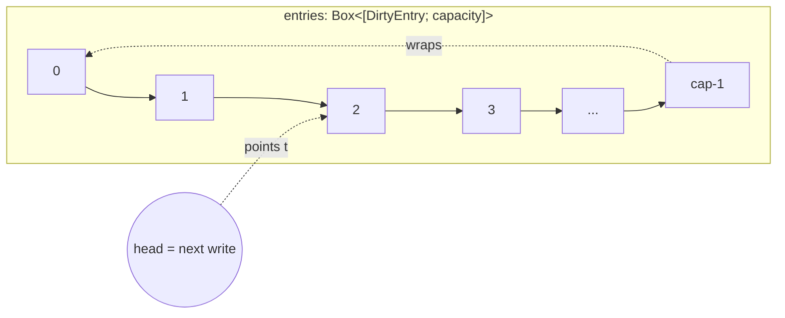

`head` is the write cursor rather than a pointer to the newest entry — it is the address of the slot the next push will fill. The newest entry sits at `(head - 1) mod cap`, and the oldest is at `head` once the ring is full or at index `0` while it is still filling. There is no separate `tail`; that information is reconstructed on demand from `head` and `len`.

While `len < capacity` the ring is *filling*: the oldest entry is at index `0`, the newest is at `head - 1`, and `head == len`. Once `len == capacity` the ring is *full*: the oldest entry is at `head`, every push overwrites that slot, and `overflow_seq` is bumped.

#### Push

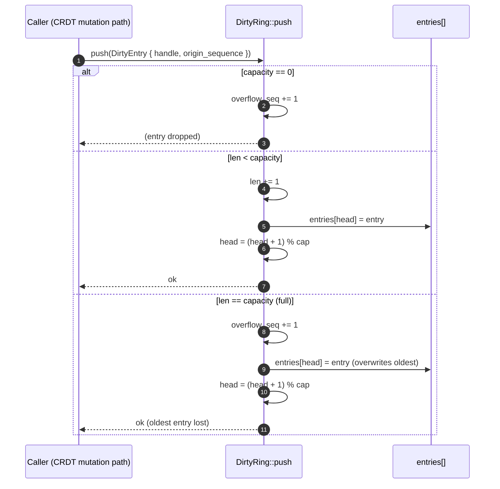

Each push runs in constant time. `push` does not deduplicate, because deduplication would be `O(len)` or require an auxiliary set; redundant entries are filtered cheaply at read time by the `origin_sequence` check instead.

#### Read

`iter` yields entries in insertion order, oldest first. `ring_entry_at(ring, offset)` is the same arithmetic exposed as a single-shot read, and it exists for the hot `fill_gossip_frame` path, which calls mutating methods on `self` between successive entry reads. An iterator over `&self.local_dirty` would hold a shared borrow of `self` for the whole loop and forbid those mutations, whereas `ring_entry_at` takes a `&DirtyRing` only for the duration of one call, returns a copy, and lets go.

There is no `pop` and no `drain`. The send path reads the ring non-destructively and resets it wholesale via `clear()`, which resets `head`, `len`, and `overflow_seq` to zero.

#### Overflow — bounded loss is fine

If a burst of writes overflows the ring, the oldest entries are dropped. The ring records the loss by bumping `overflow_seq` (a `u64` via `saturating_add`), but the entries themselves are gone, and on its own that would be a correctness bug. The CRDT compensates by composing the dirty rings with a third lane — the repair cursor (§7.2) — that rotates over every active cell so that whatever the rings lose, the repair sweep rediscovers within one full rotation.

The cell store emits a power-of-two rate-limited `tracing::warn!` from its `push_dirty` overflow path, naming the relevant capacity config key (`storage.local_dirty_capacity` or `storage.forwarded_dirty_capacity`) so that operators can see pressure without the log volume scaling with the overflow rate.

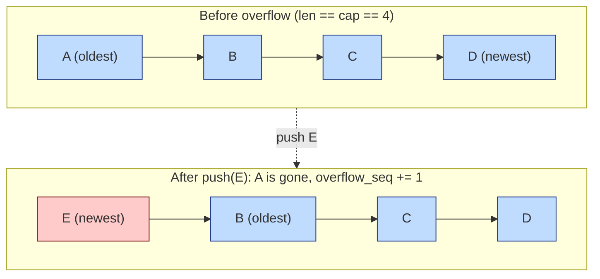

The dirty rings are the optimistic fast path, while the repair sweep
([§7.2](#72-the-repair-cursor--the-third-lane)) is the
eventual-consistency backstop that re-emits every active cell on a
rotating schedule. Together they tolerate ring overflow: although the
ring *records* the loss by bumping `overflow_seq` and the lost entries
are themselves gone, the repair sweep picks them up on the next
rotation.

#### Dirty ring invariants

1. **Capacity is immutable.** `entries.len()` never changes after `with_capacity`.
2. **Head bounds.** If `capacity() > 0`, then `0 <= head < capacity()`.
3. **Length bounds.** `0 <= len <= capacity()`.
4. **Logical contents.** The `len` valid entries, oldest to newest, are `entries[0..len]` if `len < capacity()`, otherwise the wrap-around slice starting at `entries[head]`.
5. **No-op on zero capacity.** Every push is a no-op except for incrementing `overflow_seq`.
6. **`overflow_seq` monotonicity.** Non-decreasing between calls to `clear()`. Uses `saturating_add`, so it cannot wrap to zero.
7. **`overflowed()` agreement.** Returns `true` iff `overflow_seq > 0`.
8. **`clear` is total.** After `clear()`: `head == 0`, `len == 0`, `overflow_seq == 0`.
9. **`ring_entry_at` is a partial function.** Out-of-bounds offsets panic via the slice index; callers in `crdt.rs` bound `offset < ring.len()` themselves.

---

## 4. The cell store

With the foundations in hand, the store itself can be described. It is defined in the top-level `crates/gabion/src/crdt.rs`.

### 4.1 Structure-of-arrays column layout

The most important shape choice in this module is SoA — Structure of Arrays. Instead of holding rows as a `Box<[Cell]>` where `Cell` is a struct, the store holds each field in its own boxed slice:

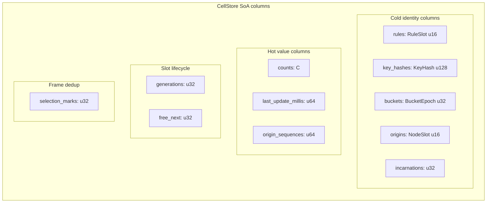

Each column is a `Box<[T]>` of length `capacity`. Cell `i` is reconstructed by reading index `i` from every column.

**Why SoA?**

1. **Identity lookups touch only the cold columns.** `lookup_index` reads `rules`, `key_hashes`, `buckets`, `origins`, and `incarnations` to confirm a hash match, so the hot value columns never enter cache during a lookup.
2. **Merge passes touch only the hot columns.** Fold paths can stream over `counts` without dragging 28 bytes of identity along with each value.
3. **Identity is interned into small ints.** Each cell's identity row is five small integers totalling 28 bytes (`RuleSlot u16 + KeyHash u128 + BucketEpoch u32 + NodeSlot u16 + Incarnation u32` = 2 + 16 + 4 + 2 + 4 = 28). The module comment notes that this replaces a 52-byte AoS struct.

The interning that makes this compaction possible is exactly what the two dictionaries from §3.2 buy.

The four most load-bearing public types in this section are `CompactCellKey` (the node-local interned identity used as the hash-index key), `CellIdentity` (the portable boundary identity exported through the sinks), `CellHandle` (a generation-stamped slot reference), and `InsertReject` (the single enum that names every capacity-exceeded rejection). The exhaustive list lives in `.audit/api-surface.md` and in `crates/gabion/src/crdt.rs`; rather than restate it here, those types are introduced inline at the section that depends on them, and `CellIdentity` versus `CompactCellKey` gets a dedicated treatment in §5.4.

---

### 4.2 Slot lifecycle: freelist + generation tagging

The store has up to `capacity` cells, where a **slot** is an index in `0..capacity`. At any moment a slot is either *active* — meaning it holds a live cell, the hash index has an entry for it, and the dictionary refcounts are held — or *inactive*, meaning it sits on the freelist with all columns stale but harmless.

The lifecycle is controlled by two columns and two scalars:

- `generations: Box<[u32]>` carries one counter per slot, whose low bit is the active flag and whose high 31 bits are the ABA tag.
- `free_next: Box<[u32]>` is the intrusive freelist link.
- `free_head: u32` holds the head of the freelist.
- `active_len: u32` is the count of active slots.

#### The freelist

At construction the freelist is built as `0 → 1 → 2 → ... → cap-1 → NO_FREE` so that every slot is free.

`alloc_slot` pops the head: it returns `free_head`, sets `free_head = free_next[old_head]`, writes `NO_FREE` into the popped slot's `free_next`, and bumps the generation by one — flipping the low bit from 0 to 1. `free_slot` reverses the operation by bumping the generation again (flipping 1 to 0), setting `free_next[slot] = free_head`, and then assigning `free_head = slot`.

The intrusive freelist costs zero extra memory beyond the `free_next` column. Allocation and deallocation are O(1) with perfect locality, since you almost always reuse the most recently freed slot, and slots are interchangeable so there is no fragmentation.

#### The generation counter — active flag and ABA tag fused

Each slot has a single `u32` `generations[slot]` with two roles fused into it. The low bit (`& 1`) is the active flag: zero means inactive, one means active, and `is_active(slot)` is just `(generations[slot] & 1) == 1`. The upper 31 bits hold an increasing ABA tag that distinguishes each successive lifetime of the slot.

Every `alloc_slot` and every `free_slot` runs `generations[slot] = generations[slot].wrapping_add(1)`. Because each lifecycle goes through two of those bumps, even generations are inactive and odd generations are active:

```
generation 0 (inactive)  --alloc--> 1 (active, lifetime A)
                                      --free--> 2 (inactive)
                                      --alloc--> 3 (active, lifetime B)
                                      ...
```

This single counter answers two questions cheaply: whether the slot is currently in use (read the low bit) and whether this is still the same use of that slot it was a moment ago (compare the full `u32` for equality).

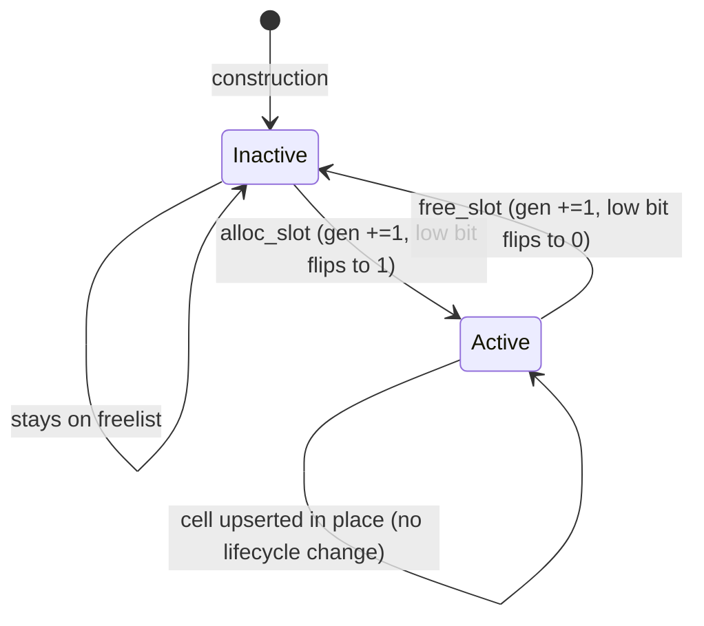

#### Freeing a cell — `free_cell_at`

When a cell is freed (e.g. expired), `free_cell_at` does the bookkeeping the slot-level `free_slot` does not:

1. Reconstruct `CompactCellKey` from the columns.
2. Remove the corresponding entry from `CellIndex`.
3. Decrement the rule dictionary refcount; the rule slot is released if nothing else references it.
4. Decrement the node dictionary refcount; if that frees the node slot, also clear the `PeerFrontierTable` column for it (§7.4) and reset its `next_sequence_by_origin` counter.
5. Call `free_slot` to flip the generation and push onto the freelist.

Dictionary refcounts are why each `upsert` insert path calls `rule_dictionary.inc_ref(...)` and `node_dictionary.inc_ref(...)`: the cell *holds* a reference and releases it here.

---

### 4.3 Handles

```rust
pub struct CellHandle { pub index: u32, pub generation: u32 }
```

A `CellHandle` captures both the slot index and the generation tag as it stood at handle-creation time (`handle_for`).

`resolve` validates a handle in three checks:

```rust
if handle.index >= self.capacity { return None }
if self.generations[handle.index] != handle.generation { return None }
if (handle.generation & 1) != 1 { return None }
```

A stale handle — one whose slot was freed and reused — is rejected on a single `u32` equality compare against `generations[index]`, without any epoch tables, per-handle metadata, or allocation.

#### Why generation tagging — the ABA problem

Suppose handles were just `u32` indices, without a generation. Caller X calls `find(...)` and gets a handle to slot 7. Some unrelated path then expires slot 7's bucket, the slot is freed, and its columns are now stale. A new cell is inserted, the freelist pops slot 7 again, and slot 7 now holds a completely different counter. When caller X calls `get(handle)`, it reads the wrong cell silently: the same address has been observed twice with a different value in between, which is the classic ABA problem.

The handle's generation, combined with `resolve`'s equality check, makes the entire class of stale-handle bugs unobservable:

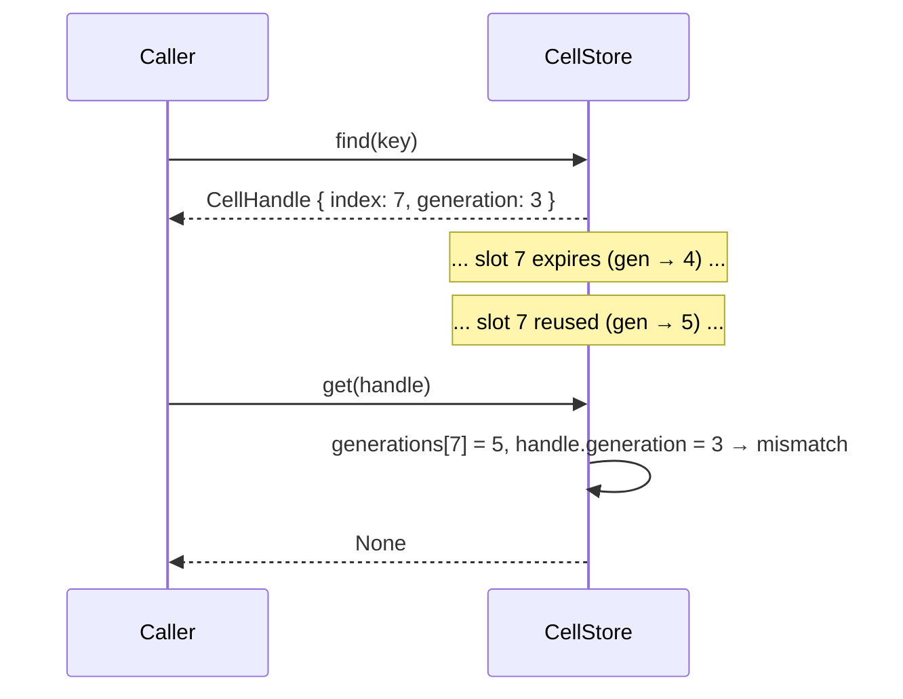

A single `u32` equality check makes the stale-handle bug disappear without ever scanning a freelist or maintaining tombstones.

---

### 4.4 The `Count` trait — width-parametric counters

```rust
pub trait Count: Copy + Eq + Ord + Default + Into<u64> + 'static {
    const MAX: Self;
    fn saturating_from_u64(value: u64) -> Self;
    fn saturating_add_hits(self, hits: u64) -> Self;
    fn saturating_delta(new: Self, old: Self) -> Self;
}
```

`CellStore<C: Count>` is generic over the count column's integer width. Implementations are provided for `u16`, `u32`, and `u64`. The width is fixed per `CellStore` instance via monomorphisation — narrow for high-throughput tables, wide for large limits.

All arithmetic is saturating, so incrementing a `u16` past 65,535 clamps at `u16::MAX` rather than wrapping; `saturating_delta(new, old)` is `new.saturating_sub(old)`, used to compute the delta emitted into the `DeltaSink` on every change.

This trait is the only place width matters, and everywhere else the store is column-agnostic.

---

### 4.5 Defaults and the production tunables

The cell store carries its own construction-time defaults (`CellStoreConfig::default()`) that are deliberately small — the type exists to keep unit tests cheap and to make the construction surface explicit. The deployed adapters use the larger constants from `gabion::defaults` instead.

| Knob                                    | `CellStoreConfig::default()` | `gabion::defaults`                     |
|-----------------------------------------|------------------------------|----------------------------------------|
| `cell_capacity`                         | 256                          | `STORAGE_MAX_CELLS` = 131,072          |
| `rule_dictionary_capacity`              | 32                           | `STORAGE_RULE_DICTIONARY_CAPACITY` = 64|
| `node_dictionary_capacity`              | 32                           | `STORAGE_NODE_DICTIONARY_CAPACITY` = 1,024 |
| `local_dirty_capacity`                  | 64                           | `STORAGE_LOCAL_DIRTY_CAPACITY` = 65,536 |
| `forwarded_dirty_capacity`              | 64                           | `STORAGE_FORWARDED_DIRTY_CAPACITY` = 524,288 |
| `peer_capacity`                         | 16                           | `STORAGE_PEER_CAPACITY` = 256          |

`gabion::defaults` is the canonical home for the production tunables; both adapters (`gabion-server`, `gabion-nginx`) read them. Each is exposed as an operator-visible config key — touching any of them is an operator decision, not a library-level one.

---

## 5. I/O containers

File: `crates/gabion/src/crdt/io.rs`.

`io.rs` defines three SoA value types that carry data into and out of the store: `ObservationBatch<C>` for input, `DeltaSink<C>` for the output of rising counts, and `ExpirationSink<C>` for aged-out cells. All three are themselves SoA, because the same shape choice that paid off inside the store extends to the I/O buffers.

### Why SoA in the I/O containers

The aggregator's job — folding a column of deltas by key and rule into a running window — is exactly what SoA lets you stream a single column through. With a `Vec<CellDelta>` the count is interleaved with `CellHandle`, `CellIdentity`, two other counts, and a bool, so the CPU pulls a full cache line per element and discards most of it. With SoA, the `deltas` column is a contiguous `Vec<C>`, which for `C = u32` packs sixteen counts per cache line.

Three further reasons matter. Every row has the same shape, so there is no enum discriminant and no per-row match dispatch. Each column is a packed array of a single primitive, so the rows are smaller and free of struct padding. And every column is a single `Vec<T>`, sized at `with_capacity` and reused via `clear()` between frames, which makes it easy to audit against the no-allocation-after-construction rule.

The trade-off is that cross-column invariants are not enforced by the type system. `push` is the social contract that patches this, and the receiver runs `assert_consistent` under `debug_assertions`.

### 5.1 `Observation` and `ObservationBatch` — input

The input shape has two layers. Callers build rows as a `Observation<C>` struct and push them into `ObservationBatch<C>`, which keeps the SoA columns:

```rust
#[derive(Clone, Copy, Debug)]
pub struct Observation<C: Count> {
    pub rule_fingerprint: u128,
    pub key_hash: KeyHash,
    pub bucket: BucketEpoch,
    pub origin: NodeId,
    pub incarnation: Incarnation,
    pub count: C,
    pub last_update_millis: u64,
}

#[derive(Clone, Debug, Default)]
pub struct ObservationBatch<C: Count> {
    pub rule_fingerprints: Vec<u128>,
    pub key_hashes: Vec<KeyHash>,
    pub buckets: Vec<BucketEpoch>,
    pub origin_node_ids: Vec<NodeId>,
    pub incarnations: Vec<Incarnation>,
    pub counts: Vec<C>,
    pub last_update_millis: Vec<u64>,
}
```

The `Observation` row exists because constructing seven positional arguments at the call site is error-prone, especially when two of them share the type `u128`. Bundling them into a struct names each field, and `ObservationBatch::push(row)` then unpacks the row into the SoA columns in one place.

| Column | Meaning |
|---|---|
| `rule_fingerprints: Vec<u128>` | 128-bit hash of the rule definition. Resolved to a `RuleSlot` during ingest by looking up (or interning into) `RuleDictionary`. The fingerprint is produced by `gabion::rules::Descriptor`. |
| `key_hashes: Vec<KeyHash>`     | 128-bit hash of the application key (account, IP, customer tuple…) — opaque to the CRDT. |
| `buckets: Vec<BucketEpoch>`    | Which time bucket the observation falls into. |
| `origin_node_ids: Vec<NodeId>` | The node that originally observed the event. **Ignored** by `ingest_local`, which always stamps `local_node_slot`. Used by `merge_remote` to record per-origin counters. |
| `incarnations: Vec<Incarnation>` | The origin's incarnation. Same ignore-for-local rule as `origin_node_ids`. |
| `counts: Vec<C>`               | Load-bearing; meaning depends on entry point. See below. |
| `last_update_millis: Vec<u64>` | Wall-clock timestamp to stamp onto the cell on apply. |

#### The dual meaning of `counts`

The same column plays two roles depending on the entry point that consumes the batch:

| Entry point | Meaning of `counts[i]` | Fold operation |
|---|---|---|
| `ingest_local` | Number of new hits to add to the local cell. | Saturating add. |
| `merge_remote` | The peer's *absolute* stored count for the cell. | Max-merge — only writes if `new > previous`. |

Mixing the two semantics in one batch is not supported; pick the entry point and fill `counts` accordingly. (The internal `upsert` core expresses this constraint in the type system — see §6.3.)

#### API surface

| Method | Purpose |
|---|---|
| `with_capacity(cap)`  | Allocate every column with `Vec::with_capacity(cap)` so no reallocation happens for the first `cap` rows. |
| `push(row: Observation<C>)` | Append one row across all seven columns in lockstep. |
| `len()` / `is_empty()`| Number of rows; defined as the length of `rule_fingerprints`. |
| `clear()`             | `.clear()` each column. Capacity preserved. |
| `assert_consistent()` | `debug_assert_eq!` each column's length to `rule_fingerprints.len()`. Called by `ingest_local` and `merge_remote` before iteration. |

`push` is the only safe way to add a row, since it pushes to every column unconditionally, so the parallel-length invariant cannot drift as long as all writes go through it.

### 5.2 `DeltaSink` — output for rising counts

```rust
#[derive(Clone, Debug, Default)]
pub struct DeltaSink<C: Count> {
    pub handles: Vec<CellHandle>,
    pub keys: Vec<CellIdentity>,
    pub previous: Vec<C>,
    pub current: Vec<C>,
    pub deltas: Vec<C>,
    pub applies_locally: Vec<u8>, // byte flags, not Vec<bool>
}
```

| Column | Meaning |
|---|---|
| `handles`         | Generation-stamped pointer to the cell, so the caller can revisit the row without re-hashing the identity. |
| `keys`            | **Portable** identity tuple `(rule_fingerprint, key_hash, bucket)` — see §5.4. The aggregate store keys on this; it never sees a node-local slot. |
| `previous`        | Stored count immediately before the merge. For a brand-new cell, `C::default()`. |
| `current`         | Stored count after the merge. |
| `deltas`          | `saturating_delta(current, previous)`; stored explicitly so the aggregator does not have to recompute it and so the saturation semantics are fixed at emission time. |
| `applies_locally` | `0` / `1` flag. `1` means the rule has a resolved local rule id, so the local aggregator should fold this delta into its enforcement state. |

#### Visibility model

`ObservationBatch::push` is fully `pub` because the caller writes the batch, while `DeltaSink::push` is `pub(super)` because the `CellStore` writes the sink and no outside caller has business appending to it. The columns themselves remain `pub` for read access.

#### Drain semantics

`DeltaSink` does not actually expose a "drain"; instead the caller passes `&mut sink` to `ingest_local` or `merge_remote`, the call returns with zero or more new rows appended, the caller iterates `0..sink.len()` and folds each row into its aggregator state, then calls `sink.clear()` before the next submission.

`clear()` is idempotent and preserves capacity, so the next frame refills the same buffer. The convenience method `row(i)` materialises one delta as an AoS `CellDelta<C>` for callers that prefer the struct shape — typically logging and tests — but there is no iterator that yields `CellDelta`s, because production code walks the columns directly to keep the SoA benefits.

### 5.3 `ExpirationSink` — output for aged-out cells

`ExpirationSink` is a symmetric SoA sink that captures the other half of the active-set signal: every freed cell. The CRDT module appends one row per cell that `expire` releases, before the slot is freed, so that the external aggregate store can keep its summary consistent with the CRDT's active set as cells age out.

```rust
#[derive(Clone, Debug, Default)]
pub struct ExpirationSink<C: Count> {
    pub handles: Vec<CellHandle>,
    pub keys: Vec<CellIdentity>,
    pub last_counts: Vec<C>,
    pub last_update_millis: Vec<u64>,
    pub applies_locally: Vec<u8>,
}
```

| Column | Meaning |
|---|---|
| `handles`            | Generation-stamped pointer to the cell that just expired. Resolvable through this call only — after the slot is freed the handle no longer matches. |
| `keys`               | Portable `CellIdentity` (§5.4). |
| `last_counts`        | The stored count at the moment of expiry. |
| `last_update_millis` | The last write timestamp on the cell. |
| `applies_locally`    | Byte flag, same semantics as `DeltaSink`. |

`ExpirationSink::push` is `pub(super)` so that only `CellStore::expire` and its convenience wrapper `expire_at` (§8) append to it, and the same read-then-`clear()` pattern as `DeltaSink` applies.

`CellExpiration<C>` is the AoS row type — the same shape as `CellDelta<C>` but with the columns described above — returned by `ExpirationSink::row(i)` for the same logging-and-tests convenience.

### 5.4 `CompactCellKey` vs `CellIdentity`

Two cell-identity types exist in the public surface; the distinction is load-bearing.

```rust
pub struct CompactCellKey {     // node-local
    pub rule: RuleSlot,         // u16 dictionary slot
    pub key_hash: KeyHash,
    pub bucket: BucketEpoch,
    pub origin: NodeSlot,       // u16 dictionary slot
    pub incarnation: Incarnation,
}

pub struct CellIdentity {       // portable
    pub rule_fingerprint: u128, // never a slot
    pub key_hash: KeyHash,
    pub bucket: BucketEpoch,
}
```

`CompactCellKey` is the *node-local* identity. Its `rule` and `origin` are dictionary slots — `u16`s meaningful only inside this process, where slot 3 on this node might be slot 7 on another. This is the key the hash index probes on, the key inserted into and removed from the index, and the key reconstructed from the cold columns inside `lookup_index`.

`CellIdentity` is the *portable* identity. Its `rule_fingerprint` is the same `u128` on every node by construction, because the fingerprint is a content hash of the rule definition produced by `gabion::rules::Descriptor`. Origin identity is intentionally omitted, because the external aggregate store keys on `(rule_fingerprint, key_hash, bucket)` and has no business interpreting the originator.

`DeltaSink::keys` and `ExpirationSink::keys` are both `Vec<CellIdentity>`, not `Vec<CompactCellKey>`. The aggregate store boundary is exactly where node-local slots stop being meaningful, so the sinks shed them at emission time.

#### I/O invariants

1. **Parallel column lengths.** Maintained by `push`; checked by `assert_consistent` at the entry points.
2. **Capacity is set at construction.** `with_capacity` is the only normal allocation point.
3. **Idempotent and capacity-preserving `clear`.**
4. **Same-row reads only.** A read at index `i` must read every column at the same `i`.
5. **`applies_locally` is canonical 0/1.** `push` writes `applies_locally as u8`, so the column only ever contains 0 or 1.

---

## 6. Data flow

With the store, the I/O containers, and the four foundations defined, the trace through the system is direct.

### 6.1 Write: `ingest_local`

```mermaid
sequenceDiagram
    participant App as Application
    participant Batch as ObservationBatch<C>
    participant Store as CellStore
    participant Sink as DeltaSink<C>

    App->>Batch: with_capacity(N)   (once, at startup)
    loop per observation
        App->>Batch: push(Observation { rule_fp, key, bucket, origin, inc, count, ts })
    end
    App->>Store: ingest_local(&batch, &mut sink)
    Note over Store: assert_consistent()
    loop i = 0..batch.len()
        Store->>Store: rule_slot = intern_rule(batch.rule_fingerprints[i])
        Store->>Store: upsert(UpsertSpec { rule_slot, key, bucket,
                              origin_slot = local_node_slot,
                              incarnation = local_incarnation,
                              now_millis, mode: Accumulate { hits } }, sink)
    end
    Store-->>Sink: zero or more pushed delta rows
    App->>Batch: clear()
```

`ingest_local(obs, sink)` loops over the observation batch and, for each row:

1. Finds the rule slot by fingerprint. If the rule is unknown, it is interned with a default descriptor; since the rule is unknown locally, `applies_locally()` will return `false`, but cells are still stored, forwarded, and expired.
2. Reads `hits = obs.counts[i].into()` — the *delta* of hits to add, not an absolute count.
3. Calls `upsert(UpsertSpec { …, mode: Accumulate { hits } }, sink)`.

The origin and incarnation columns of the batch are ignored on the local path because the local node is always the origin.

### 6.2 Write: `merge_remote`

`merge_remote(obs, sink)` is symmetric with `ingest_local` apart from three differences. The origin and incarnation come from the batch — that is, from the peer that attributed the hit. `obs.counts[i]` is an *absolute* observed count rather than a delta, so the store max-merges by keeping `max(stored, observed)`. And `translate_identity` interns both the rule fingerprint and the `(node_id, incarnation)` pair into dictionary slots, admitting unknown rules with a default descriptor. The call is then `upsert(UpsertSpec { …, mode: MaxMerge { observed } }, sink)`.

### 6.3 The shared `upsert` core

`upsert` is the worker that both entry points call. Its signature is designed to make the two modes mutually exclusive at the type level:

```rust
fn upsert(
    &mut self,
    spec: UpsertSpec<C>,
    sink: &mut DeltaSink<C>,
) -> Result<UpdateOutcome<C>, InsertReject>;

struct UpsertSpec<C: Count> {
    rule_slot: RuleSlot,
    key_hash: KeyHash,
    bucket: BucketEpoch,
    origin_slot: NodeSlot,
    incarnation: Incarnation,
    now_millis: u64,
    mode: UpsertMode<C>,
}

enum UpsertMode<C: Count> {
    Accumulate { hits: u64 },
    MaxMerge   { observed: C },
}
```

The tagged-union `UpsertMode` is the point of the design. Previously, `upsert` took a positional `accumulate: bool` flag along with both a `hits: u64` and an `observed: C` argument, and nothing stopped a caller from setting the bool one way and filling the count the other. The struct-plus-enum shape prevents that miscall at compile time: an `UpsertMode::Accumulate` carries `hits` and only `hits`, while an `UpsertMode::MaxMerge` carries `observed` and only `observed`. It is the "make invalid states unrepresentable" axiom turned into a type signature.

The branch on existence:

```mermaid
sequenceDiagram
    participant Cl as Caller (ingest_local / merge_remote)
    participant CS as CellStore::upsert
    participant Idx as CellIndex
    participant Cols as columns
    participant Seq as next_sequence_by_origin
    participant DR as DirtyRing
    participant Sink as DeltaSink

    Cl->>CS: upsert(UpsertSpec { …, mode }, sink)
    CS->>Idx: lookup_index(CompactCellKey)
    alt cell exists
        Idx-->>CS: Some(slot)
        CS->>Cols: previous = counts[slot]
        alt mode = Accumulate { hits }
            CS->>CS: current = previous.saturating_add_hits(hits)
        else mode = MaxMerge { observed }
            CS->>CS: current = if observed > previous { observed } else { previous }
        end
        alt current == previous
            CS-->>Cl: UpdateOutcome { changed: false, delta: None }
        else current > previous
            CS->>Cols: counts[slot] = current; last_update_millis[slot] = now
            CS->>Seq: seq = ++next_sequence_by_origin[origin_slot]
            CS->>Cols: origin_sequences[slot] = seq
            CS->>DR: push_dirty(origin_slot, handle, seq)
            CS->>Sink: emit_delta(slot, previous, current, delta, rule_slot)
            CS-->>Cl: UpdateOutcome { changed: true, delta: Some(...) }
        end
    else cell does not exist
        CS->>CS: alloc_slot()
        alt freelist exhausted
            CS-->>Cl: Err(InsertReject::CellStoreFull)
        else slot allocated
            CS->>Cols: write rules/key_hashes/buckets/origins/incarnations/counts/last_update
            CS->>Seq: seq = ++next_sequence_by_origin[origin_slot]
            CS->>Cols: origin_sequences[slot] = seq
            CS->>CS: rule_dictionary.inc_ref(); node_dictionary.inc_ref()
            CS->>Idx: insert_unchecked(hash, slot)
            CS->>DR: push_dirty(origin_slot, handle, seq)
            CS->>Sink: emit_delta(slot, 0, initial, initial, rule_slot)
            CS-->>Cl: UpdateOutcome { changed: true, delta: Some(...) }
        end
    end
```

The dirty-ring stamp is `seq`, not the new count. A subsequent update
on the same cell allocates a fresh `seq` and pushes a new
`DirtyEntry`, so the old entry — if it is still in the ring — is
invalidated by the mismatch: `dirty_entry_current` checks the entry's
`origin_sequence` against the cell's current
`origin_sequences[slot]`, and stale ring entries quietly skip
themselves on consumption. The delta row carries both `previous` and
`current` so that a higher-level aggregator can fold without
re-reading the store.

#### Dirty stamping — which ring receives the entry?

The routing decision is one comparison made inside `push_dirty`:

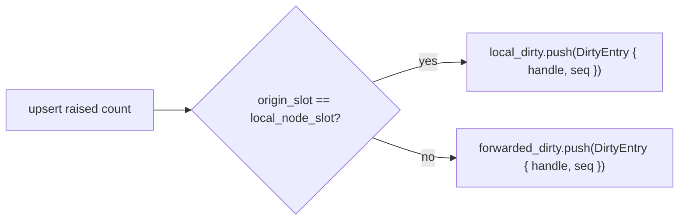

The `local_dirty` lane is what gets gossiped first, since it carries changes this node originated; the `forwarded_dirty` lane is what we re-broadcast on behalf of peers as anti-entropy via forwarding.

`ingest_local` hard-codes `origin_slot: self.local_node_slot`, so its writes always land in `local_dirty`. `merge_remote` passes through the peer's interned slot, which falls through into `forwarded_dirty` for remote-origin observations or, if the peer happens to be relaying something our local node originated, back into `local_dirty`.

#### The per-origin sequence allocator

`next_sequence_by_origin` is sized to `node_dictionary_capacity`. Each origin gets its own monotonic counter, and `next_origin_sequence` saturating-adds one before returning, so the first sequence ever minted is 1; a `0` read back from a never-allocated origin slot means "nothing here yet."

The sequence has two jobs. It disambiguates ring entries for the same cell, since only the latest entry survives validation, and it supplies ordering metadata for `PeerFrontierTable` so that peers can advance their per-origin acknowledgement cursors. When a node slot is freed by refcount, the counter for that slot is reset.

#### The `local_node_slot` pin

When `CellStore::new` runs, it interns the local identity into the node dictionary and then immediately calls `node_dictionary.inc_ref(local_node_slot)` — pinning the local slot so it cannot be freed via `dec_ref`.

This matters because `free_cell_at` decrements the node refcount and releases the slot if the count hits zero. Without the pin, freeing the last cell whose origin is the local node could free the local node slot itself, leaving the store unable to attribute its own writes. The extra refcount is a one-time pin that is never released.

### 6.4 Read: `find`, `resolve`, `get`, `count_of`

All read primitives are lock-free.

| Method | Role |
|---|---|
| `find(key) -> Option<CellHandle>` | Hashes the key, walks `CellIndex` until a probe hit matches all five cold columns. Returns the generation-tagged handle. |
| `find_rule(fp)` / `find_node(id, inc)` | Read-only dictionary lookups; do not intern. |
| `resolve(handle) -> Option<u32>` | Bounds-checks, then `generations[handle.index] == handle.generation && (handle.generation & 1) == 1`. |
| `get(handle) -> Option<CellRow<C>>` | Reads every column for a slot and assembles a snapshot. |
| `count_of(handle) -> Option<C>` | Hot fast path: touches only the `counts` column. |
| `active_handles()` | Diagnostic helper that walks `0..capacity` and yields handles only for slots with odd generation. Scans the full capacity, not just `active_len`; not for hot paths. |

There is no atomic "snapshot the whole store" operation. The structure is single-threaded, so a snapshot is logically the iterator `active_handles().map(|h| store.get(h).unwrap())`; higher layers persist via the `DeltaSink`/`ExpirationSink` streams and the `peer_frontier` checkpoints.

---

<a id="gossip-and-convergence"></a>
## 7. Gossip and convergence

A node converges with its peers through three lanes that the cell store composes into each gossip frame.

### 7.1 The two dirty rings

The store keeps two `DirtyRing`s (see §3.4 for the ring buffer itself) side by side:

| Field            | Origin of entries                                                   | Gossip lane |
|------------------|---------------------------------------------------------------------|-------------|
| `local_dirty`    | Updates whose origin is **this** node (`origin == local_node_slot`).| Lane 1 — emitted first in `fill_gossip_frame`. |
| `forwarded_dirty`| Updates received from **other** nodes that this node is relaying.   | Lane 2 — emitted after the local ring fills its share of the frame. |

The `DirtyRing` type itself does not care which lane it is — both instances are identical implementations. The split is a policy decision: locally-originated updates ship before forwarded ones so that a hot local writer does not starve on relayed chatter, and each ring has its own configurable capacity.

`visit_local_dirty` and `visit_forwarded_dirty` stream the ring entries through a caller closure, validating each entry with `dirty_entry_current` and silently skipping stale entries. These visitors do not deduplicate, so a multi-lane composer must dedup itself (§7.3).

### 7.2 The repair cursor — the third lane

The dirty rings have finite capacity. If a burst of writes overflows the ring, the oldest entries are dropped: the ring bumps `overflow_seq` as a hint, but the entries themselves are gone, and on their own the dirty rings can lose information.

The repair cursor is the safety net. It is a `u32` that rotates over `0..capacity` and, on each gossip frame, sweeps forward a small slice and emits handles for any active slot it lands on. The cursor only advances on slots it actually visited, so a partial sweep resumes where it left off on the next frame. Over many frames every active cell is therefore guaranteed to be retransmitted at least once per full rotation, which is the convergence property dirty-only gossip cannot give you on its own.

`visit_repair_slice(max_cells, visit)` is the standalone interface, and `fill_gossip_frame` (§7.3) folds it in as lane 3.

### 7.3 `fill_gossip_frame` and per-frame dedup

`fill_gossip_frame(max_cells, out)` stitches the three lanes together in priority order — local dirty, then forwarded dirty, then a rotating repair slice — into a single output buffer of cell handles capped at `max_cells`. The gossip runtime calls this once per outgoing frame.

Per-frame deduplication is O(1) and allocation-free. Every frame, `bump_selection_epoch` increments `selection_epoch`, and `mark_selected(slot)` writes the current epoch into `selection_marks[slot]`; if the slot was already marked this epoch, the caller skips it. Lane 3 therefore naturally cannot re-emit a cell that lanes 1 or 2 already pushed.

```mermaid
sequenceDiagram
    participant App as Gossip layer
    participant CS as CellStore::fill_gossip_frame
    participant LD as local_dirty
    participant FD as forwarded_dirty
    participant SM as selection_marks
    participant RC as repair_cursor

    App->>CS: fill_gossip_frame(max_cells=N, out)
    CS->>CS: out.clear(); bump_selection_epoch()
    loop over local_dirty (oldest first)
        CS->>LD: ring_entry_at(offset)
        CS->>CS: dirty_entry_current(entry)?
        CS->>SM: mark_selected(slot)?
        alt fresh & not yet marked
            CS->>App: out.push(handle)
        end
    end
    loop over forwarded_dirty
        CS->>FD: ring_entry_at(offset)
        CS->>CS: dirty_entry_current(entry)?
        CS->>SM: mark_selected(slot)?
        alt fresh & not yet marked
            CS->>App: out.push(handle)
        end
    end
    loop rotating from repair_cursor until budget filled or full sweep
        CS->>CS: is_active(slot)?
        CS->>SM: mark_selected(slot)?
        alt active & not yet marked
            CS->>App: out.push(handle)
        end
    end
    CS->>RC: repair_cursor = next_cursor
```

The `selection_epoch` is a `u32` that wraps. On wrap to zero, `bump_selection_epoch` does a one-shot scrub of `selection_marks` and resets the epoch to 1 so the new epoch is unambiguous. Since `u32` epochs cover billions of frames, the wraparound branch exists as cheap insurance rather than a real hot path.

### 7.4 `peer_frontier` — per-peer × per-origin cursors

File: `crates/gabion/src/crdt/peer_frontier.rs`.

`PeerFrontierTable` is a small bookkeeping table that lets the outbound gossip layer skip cells a given peer has already acknowledged. It is a latency optimisation rather than a convergence mechanism, as the module's own docstring makes explicit:

> Latency optimization only — convergence is guaranteed by the repair
> lane, not by this table.

It is not indexed per `(rule, key, bucket)` and it is not consulted from the CRDT's write path. If gossip is dropped or reordered, the repair cursor in `CellStore` eventually rotates over every active cell and reconciles; the frontier just lets the happy path avoid resending what each peer already has.

#### What it tracks

For every `(peer, origin-node)` pair this process tracks, the table remembers two monotonic cursors: `last_sent_seq` is the highest origin-sequence number we have transmitted to that peer for cells owned by that origin, and `last_acked_seq` is the highest origin-sequence number the peer has acknowledged receiving. Together these answer one question: *which of my active cells does peer X still need to hear about from origin O?*

#### Layout

```rust
pub struct PeerFrontierTable {
    peer_ids:        Box<[Option<NodeId>]>, // length = peer_capacity
    last_acked_seq:  Box<[u64]>,            // length = peer_capacity * node_capacity
    last_sent_seq:   Box<[u64]>,            // length = peer_capacity * node_capacity
    peer_capacity:   u16,
    node_capacity:   u16,
    full_rejects:    u64,
}
```

`last_acked_seq` and `last_sent_seq` are conceptually a `peer_capacity × node_capacity` matrix flattened in **peer-major** order: one row per peer, with all that peer's per-origin cursors contiguous in memory.

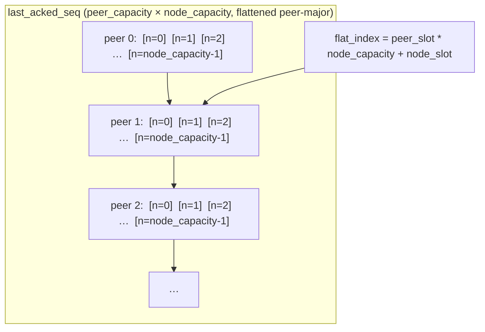

Two of the three hot operations — `remove_peer`, which clears one peer's row, and `lacks_indices`, which scans one peer's row against the origin column — touch one peer at a time, so peer-major matches the access pattern.

`peer_ids` is a tiny linear-probe interning table of `Option<NodeId>` slots scanned via `position`. `intern_peer` is meant to be a once-per-peer-handshake operation, not a per-message one.

`full_rejects` counts the times `intern_peer` had to refuse because every peer slot was occupied. The same field drives a power-of-two rate-limited `tracing::warn!` that names `storage.peer_capacity` as the config key an operator should raise. Convergence still holds when this happens, because gossip to the unregistered peer simply pays the cost of not having the per-peer frontier and falls back on full-frame compose plus repair.

#### Primitives

| Operation | Purpose |
|---|---|
| `intern_peer(peer)` / `find_peer(peer)` / `remove_peer(peer)` | Manage peer slot allocation. `intern_peer` scans for an existing entry first, then claims a free slot. Table full returns `None` and bumps `full_rejects`. |
| `last_sent(peer, origin)` / `last_acked(peer, origin)` | Plain indexed `u64` reads. Zero means "no information." |
| `record_sent(peer, origin, seq)` / `record_acked(peer, origin, seq)` | "Raise the high-water mark" operations — guarded by `<`, so stale or duplicate calls are no-ops. |
| `clear_node_slot(node_slot)` | Wipes one origin column when its slot is recycled by the cell store. |
| `lacks_indices(peer, active_origins, origin_sequences, active_indices, out)` | Brute-force "which cells does this peer lack" scan — used in tests and digest-mismatch repair. The hot per-frame consumer is `peer_lacks`, inlined into `fill_gossip_frame_for_peer` (§7.5). |

**Idempotence.** The `<` guards on `record_*` make every update a max-merge, so a late or duplicate `record_*` carrying a stale sequence is silently ignored. If two callers race, both succeed and the one carrying the smaller sequence is a no-op; if an ack arrives twice, the second call is a no-op.

#### Why per-`(peer, origin)`, and not a single cursor?

Imagine origin **O** emits sequences `1, 2, 3`. Peer **A** received `1` and `2`, while peer **B** received `1` and `3` because frame `2` was dropped on the wire to B. With a single global "highest sequence sent to anyone" cursor, the next gossip round cannot distinguish whose frontier is lagging, so it either re-broadcasts everything (wasteful) or under-delivers (incorrect). Per-`(peer, origin)` state captures exactly which peer is behind on which origin's stream.

#### Reordered acks: the canonical scenario

```mermaid
sequenceDiagram
    autonumber
    participant Tx as gossip transport
    participant F as PeerFrontierTable
    Note over F: last_acked[A,O] = 0, last_acked[B,O] = 0

    Tx->>F: record_acked(A, O, 1)
    Note over F: 0 < 1 → last_acked[A,O] = 1

    Tx->>F: record_acked(A, O, 2)
    Note over F: 1 < 2 → last_acked[A,O] = 2

    Tx->>F: record_acked(B, O, 1)
    Note over F: 0 < 1 → last_acked[B,O] = 1

    Tx->>F: record_acked(A, O, 1)   (delayed duplicate)
    Note over F: 2 < 1 is false → NO-OP

    Note over F: state: last_acked[A,O] = 2, last_acked[B,O] = 1

    Note over F: a later fill_gossip_frame_for_peer(B) will see B lacks 2 and 3
```

The duplicate `record_acked(A, O, 1)` is silently dropped because A's
frontier is already at 2; without that guard we would rewind A's
cursor and uselessly retransmit sequence 2 to A. B's frontier sits
at 1 independently of A's, and a subsequent peer-aware frame compose
for B correctly identifies that B is missing sequences 2 and 3 — a
distinction that a single-cursor design would have lost.

#### `lacks_indices` — the test / digest-repair helper

`lacks_indices(peer, active_origins, origin_sequences, active_indices, out)` walks a caller-supplied list of `active_indices`, joins each index against the peer's row, and writes back the indices the peer hasn't acked yet:

```mermaid
sequenceDiagram
    autonumber
    participant Repair as Repair driver (tests / digest mismatch)
    participant Front as PeerFrontierTable
    participant Cells as CellStore arrays

    Repair->>Cells: borrow active_indices, active_origins, origin_sequences
    Repair->>Front: lacks_indices(peer_slot, ..., out=&mut Vec)
    loop for each idx in active_indices
        Front->>Front: origin := active_origins[idx]
        Front->>Front: last := last_acked_seq[flat_index(peer_slot, origin)]
        alt origin_sequences[idx] > last
            Front-->>Repair: push idx into out
        else
            Front-->>Repair: skip (peer already has this)
        end
    end
    Repair->>Repair: gossip cells named by out to this peer
```

This is the brute-force form: it builds the whole "needs to be sent" list up front and is the right tool when something has gone wrong, such as a digest mismatch or a manual repair test. The production hot path does not buy that list; it makes the same decision one cell at a time inside the frame composer (§7.5).

#### Interaction with the cell store

The only call to a `peer_frontier` mutator from inside `crdt.rs` is `clear_node_slot`, invoked from `free_cell_at` when the node dictionary frees a `NodeSlot` because the last cell owned by that origin was evicted. Two things must reset together: the origin-sequence allocator, so the next user of the slot starts at sequence 1 again, and every peer's frontier into this slot, so old acks from a long-departed origin do not silently suppress retransmission of the new origin's cells. Every other call to `record_sent`, `record_acked`, or `intern_peer` is driven from the gossip transport layer outside this module.

#### Frontier invariants

1. **Monotonic non-decreasing per cell.** For any fixed `(peer_slot, node_slot)`, both `last_sent_seq` and `last_acked_seq` only ever stay the same or increase. Enforced by the `<` guards.
2. **Idempotent updates.** Repeated `record_sent` / `record_acked` with the same arguments leave state unchanged.
3. **Order-independence.** Applying any permutation of `record_*` calls produces the same final state.
4. **Zero is "no information."** A freshly-constructed table, a freshly-cleared row (via `remove_peer`), and a freshly-cleared column (via `clear_node_slot`) all read as 0 on every cell.
5. **No allocation after construction.** All three arrays are `Box<[T]>` of fixed length set in `new`.
6. **No stale state across slot reuse.** When the parent `CellStore` recycles a `NodeSlot`, it calls `clear_node_slot` before the slot can be re-handed-out to a new `(NodeId, Incarnation)`.
7. **Convergence is someone else's job.** Lose every byte of this table and the CRDT still converges — the repair cursor takes over.

### 7.5 `fill_gossip_frame_for_peer` and `peer_lacks`

The peer-aware sibling of `fill_gossip_frame` is `fill_gossip_frame_for_peer(max_cells, peer_slot, out)`. It walks the same three lanes in the same order, with the same `selection_marks` dedup. The two **dirty** lanes add one filter per cell — skip it if the peer already has it — but the **repair** lane (lane 3) does *not*: it sweeps the rotating active-set slice unconditionally. That asymmetry is load-bearing for correctness, not just bandwidth (see below).

That filter is a tiny inlined helper:

```rust
#[inline]
fn peer_lacks(&self, peer_slot: u16, cell_index: usize) -> bool {
    let origin = self.origins[cell_index];
    let last   = self.peer_frontiers.last_acked(peer_slot, origin);
    self.origin_sequences[cell_index] > last
}
```

`peer_lacks` is the hot per-frame consumer of the frontier table. Per candidate cell, it reads two contiguous slices — `origins[cell_index]` and `origin_sequences[cell_index]` — and one `u64` out of the peer-major `last_acked_seq` array, with no allocation and no branch other than the comparison itself.

`fill_gossip_frame_for_peer` chains its checks per candidate cell in the order they fail fastest. The dirty lanes run `dirty_entry_current`, then `peer_lacks(peer_slot, cell_index)` to skip cells the peer is already current on, then `mark_selected(slot)` to deduplicate across lanes within this frame; otherwise the handle is pushed. The repair lane runs only `is_active` and `mark_selected` — it deliberately omits `peer_lacks`.

The gossip runtime calls `fill_gossip_frame_for_peer` once per peer-target per tick, so the per-tick UDP fanout is peer-shaped: the dirty lanes hand each peer the fresh cells it has not yet acknowledged, capped at the frame budget, while the repair lane rotates the rest of the active set past it over successive ticks. Two peers receiving from the same compositor therefore see overlapping but not identical content.

The repair lane omits `peer_lacks` for **correctness**, not bandwidth. `last_acked` is a per-`(peer, origin)` high-watermark, and `merge_remote` re-stamps a remote cell with the *merging* node's local origin counter rather than carrying the origin's sequence on the wire — so a replica's stored `origin_sequence` and a peer's `last_acked` live in different per-node sequence spaces, and a single watermark cannot represent a gap (a peer holding sequence 5 but not 4). If every lane pruned on it, a cell the watermark wrongly believes the peer holds would be suppressed on *every* holder forever and the cluster would never converge. Gating only the dirty lanes keeps `peer_lacks` as the latency optimization it is; the repair lane's unconditional sweep — re-merged idempotently via the max-merge in `merge_remote` — is the convergence guarantee the `PeerFrontierTable` doc comment delegates to it. (This was a real bug: a rare partition-heal counterexample stranded one cell on one node forever until the repair lane was ungated.)

When a peer has not been interned because the table was full, the runtime falls back to plain `fill_gossip_frame`; the wasted bandwidth shows up as redundant retransmission, and the `full_rejects` log line points the operator at the relevant config key.

---

<a id="expiry"></a>
## 8. Expiry

`expire(current_epoch_by_rule, live_buckets, sink)` sweeps the active set and frees any cell whose bucket has aged out. The keep rule is:

```
keep if buckets[slot] + live_buckets[rule] >= current_epoch_by_rule[rule]
```

A cell is kept while its bucket plus the rule's live window covers the current epoch. Cells in older buckets are emitted into the `ExpirationSink` and then freed via `free_cell_at`. Both input slices are indexed by `RuleSlot`, and out-of-range slot indices — a rule whose dictionary slot lies beyond either array — are silently skipped, so the caller's array shape governs which rules participate.

The emission order matters. `expire` calls `emit_expiration(sink, slot)` before `free_cell_at(slot)`, because `emit_expiration` needs the rule descriptor to construct the portable `CellIdentity` (the rule's fingerprint) and to read `applies_locally`, whereas `free_cell_at` decrements the rule's refcount and may drop the descriptor entirely. The emit-then-free order keeps the fingerprint lookup live for the row that needs it.

The convenience entry point `expire_at(now_millis, sink)` derives the two arrays from each rule's `RuleDescriptor` (its `window_millis` and `bucket_millis`) using pre-allocated scratch storage held in the cell store, then delegates to `expire`. It is the allocation-free entry point for "expire whatever has aged out as of now," while the lower-level `expire` exists for callers — tests, alternative time sources — that want to drive the epochs explicitly.

---

## 9. End-to-end traced example

A small concrete sequence that ties the previous sections together.

**Initial state.** Empty store, capacity 4. `free_head = 0`, freelist `0 → 1 → 2 → 3 → NO_FREE`. All generations are 0 (inactive).

**Step 1 — local hit on rule `R1`, key `K`, bucket `42`, count 1.**

- `lookup_index` misses.
- `alloc_slot` pops slot 0. `generations[0] = 1` (active, lifetime A). `free_head = 1`.
- Cell columns at index 0 set: `rules[0] = R1_slot, key_hashes[0] = K, buckets[0] = 42, origins[0] = local_node_slot, incarnations[0] = local_incarnation, counts[0] = 1, last_update_millis[0] = now`.
- `next_sequence_by_origin[local_node_slot]` advances to 1; `origin_sequences[0] = 1`.
- Dictionary refs incremented for both rule and node.
- `CellIndex` inserts `(hash, 0)`.
- `local_dirty` pushes `DirtyEntry { handle: { 0, 1 }, origin_sequence: 1 }`.
- `DeltaSink` row appended: `(handle {0,1}, CellIdentity { R1_fingerprint, K, 42 }, previous=0, current=1, delta=1, applies_locally=true)`.

**Step 2 — another local hit on the same cell, count 5.**

- `lookup_index` finds slot 0.
- `mode = Accumulate { hits: 5 }`, `previous = 1`, `next = previous.saturating_add_hits(5) = 6`.
- `counts[0] = 6`, sequence advances to 2, `origin_sequences[0] = 2`.
- `local_dirty` pushes a *new* entry for slot 0 with sequence 2. The earlier entry with sequence 1 is now stale — `dirty_entry_current` next frame sees `origin_sequences[0] = 2 ≠ 1` and skips it.
- `DeltaSink` row appended: `(handle, identity, 1, 6, 5, ...)`.

**Step 3 — bucket 42 expires.**

- `expire_at(now)` computes `current_epoch_by_rule[R1] = 44` and `live_buckets[R1] = 1`. For slot 0, `buckets[0] = 42` and `42 + 1 < 44` → expired.
- `emit_expiration(sink, 0)` pushes one `ExpirationSink` row: `(handle {0,1}, CellIdentity { R1_fingerprint, K, 42 }, last_count=6, last_update_millis=…, applies_locally=true)`. The rule descriptor is still live for the lookup.
- `free_cell_at(0)` removes from `CellIndex`, decrements rule and node refcounts, calls `free_slot(0)`.
- `generations[0]` goes from 1 → 2 (inactive, ABA tag now 1).
- Slot 0 pushes back onto freelist; `free_head = 0`, `free_next[0]` points at the old head.

**Step 4 — someone still holds `CellHandle { 0, 1 }` from step 1.**

- `resolve(handle)`: `generations[0] = 2 ≠ 1`. Returns `None`. No stale read, no panic.

**Step 5 — the freelist hands slot 0 back out for a brand-new cell.**

- `alloc_slot` pops 0. `generations[0]` goes 2 → 3 (active, lifetime B, ABA tag 1).
- Old handle `{0, 1}` still resolves to `None`. New handle is `{0, 3}`.

The same physical slot has been recycled, the columns hold completely different data, and the old reference is rejected by a single `u32` equality check.

---

<a id="invariants-reference"></a>
## 10. Invariants reference

The whole structure relies on the following properties. They are grouped by submodule for navigation.

### Cell store (top-level `crdt.rs`)

1. **Generation parity ⇔ active flag.** `(generations[slot] & 1) == 1` iff the slot is active. Maintained by exactly one `wrapping_add(1)` in each of `alloc_slot` and `free_slot`.
2. **Freelist is a valid linked list.** `free_head` is `NO_FREE` or a slot index in `0..capacity`; each `free_next[slot]` for an inactive slot is `NO_FREE` or another inactive slot index.
3. **No slot appears on the freelist twice.** `alloc_slot` pops only the head and writes `NO_FREE` into the popped slot's `free_next`; `free_slot` only pushes a slot once.
4. **Hash index contains an entry iff slot is active.** `upsert`'s insert path calls `index.insert_unchecked`; `free_cell_at` calls `index.remove`.
5. **Dictionary refcounts cover exactly the live cells.** Insert path calls `inc_ref` on both dictionaries; `free_cell_at` calls `dec_ref`. The local node slot has one extra permanent refcount (pin).
6. **`active_len` equals the number of slots with odd generation.** Maintained by `alloc_slot` (`+= 1`) and `free_slot` (`-= 1`).
7. **`origin_sequences[slot]` is monotonically non-decreasing while a slot is active.** `next_origin_sequence` allocates before each write.
8. **A `DirtyEntry` is consumable iff `generations[idx] == entry.handle.generation` and `origin_sequences[idx] == entry.origin_sequence`.** Both checks inside `dirty_entry_current`.
9. **`CellHandle` is resolvable iff in-range, generation matches, low bit is set.**
10. **`selection_marks[slot] == selection_epoch`** means the slot has been emitted in the current frame composition; per-frame dedup relies on this.
11. **`next_sequence_by_origin[node_slot]` is reset to 0 only when the node slot is fully freed** (refcount drops to zero in `free_cell_at`).
12. **`expire` emits each freed cell into the `ExpirationSink` before calling `free_cell_at`.** The descriptor lookup for the portable `CellIdentity` would otherwise see a dropped refcount.
13. **No allocation after construction.**

### Dictionaries

1. Stable mapping during a slot's lifetime.
2. No duplicates.
3. `len <= capacity <= u16::MAX - 1`.
4. No allocation after construction.
5. `intern` never mutates refcounts.
6. A freed slot is unreachable via `find` before recycling.
7. `RuleDictionary::intern` overwrites the descriptor on a hit; `NodeDictionary::intern` does not.
8. Different incarnations always get different `NodeSlot`s.
9. `EMPTY_DICT_SLOT = u16::MAX` is both "no slot" and "end of free list."
10. `inc_ref` saturates; `dec_ref` is a floor.

### Hash mixers

1. Determinism across peers (load-bearing).
2. Total function.
3. Allocation- and syscall-free.
4. `#[inline(always)]` is required so constants fold at call sites.
5. All five `CompactCellKey` fields participate.
6. The hash is a probe hint, not an identity.

### Robin Hood index

1. Power-of-two capacity, mask is `capacity - 1`.
2. `len < capacity` after every operation.
3. No tombstones.
4. Robin Hood ordering: at any bucket encountered during a probe walk, if the occupant's probe distance is strictly less than the searcher's, the key is not in the table.
5. The first entry of any contiguous run has probe distance 0 or is empty.
6. No reserved values other than `u32::MAX` in `slot_indexes`.
7. Allocation-free after construction.

### Dirty ring

1. Capacity is immutable.
2. `0 <= head < capacity()`.
3. `0 <= len <= capacity()`.
4. Logical contents are `entries[0..len]` while filling, else the wrap-around slice starting at `head`.
5. Zero capacity is a no-op except for `overflow_seq`.
6. `overflow_seq` is monotonic; uses `saturating_add`.
7. `overflowed()` iff `overflow_seq > 0`.
8. `clear` is total.
9. `ring_entry_at` panics on out-of-bounds; callers bound the offset.

### I/O containers

1. Parallel column lengths.
2. Capacity is set at construction.
3. `clear()` is idempotent and capacity-preserving.
4. Same-row reads only.
5. `applies_locally` is canonical 0/1.
6. `DeltaSink::keys` and `ExpirationSink::keys` carry `CellIdentity` — the portable identity that omits the node-local slot.

### Peer frontier

1. Monotonic non-decreasing per cell.
2. Idempotent updates.
3. Order-independence.
4. Zero is "no information."
5. No allocation after construction.
6. No stale state across slot reuse.
7. Convergence is someone else's job (the repair cursor).

---

## 11. Cross-module map

A reverse lookup of the submodule names that appear in `crdt.rs`:

| Name | Submodule | What it is |
|---|---|---|
| `RuleDictionary`, `NodeDictionary` | `dictionary` | Bounded interners with refcounts and their own free-list lifecycle. |
| `RuleDescriptor`, `NodeDescriptor` | `dictionary` | Per-slot payload for each dictionary. |
| `pow2_index_capacity_for` | `dictionary` | Power-of-two sizing helper for `CellIndex`. |
| `DirtyRing`, `DirtyEntry`, `ring_entry_at` | `dirty_ring` | Bounded ring of recent changes, with `overflow_seq` for loss detection. |
| `hash_compact_cell_key`, `hash_fingerprint`, `hash_node_identity`, `mix64` | `hash` | SplitMix / MurmurHash-style mixers. |
| `CellIndex` | `index` | Robin Hood open-addressing hash table, backshift deletion, power-of-two capacity. |
| `Observation`, `ObservationBatch`, `DeltaSink`, `ExpirationSink` | `io` | SoA input row + input/output buffers. |
| `PeerFrontierTable` | `peer_frontier` | Per-peer × per-origin send/ack cursors — latency hint only; convergence is the repair lane's job. |

#### Public entry points on `CellStore`, at a glance

| Method | Role |
|---|---|
| `new(config, local_identity)` | Build a store; all allocation happens here. |
| `capacity()`, `active_len()`, `is_empty()`, `stats()` | Observability. |
| `intern_rule`, `intern_node`, `find_rule`, `find_node` | Dictionary plumbing. |
| `find(key)` | Hash-index lookup by `CompactCellKey`. |
| `resolve(handle)`, `get(handle)`, `count_of(handle)` | Handle-based reads. |
| `active_handles()` | Diagnostic full-scan iterator. |
| `ingest_local(obs, sink)` | Apply locally observed hits (saturating add). |
| `merge_remote(obs, sink)` | Merge peer observations (max-merge). |
| `expire(current_epoch_by_rule, live_buckets, sink)` | Free aged-out cells; emit one `ExpirationSink` row per freed cell. |
| `expire_at(now_millis, sink)` | Allocation-free convenience wrapper around `expire`. |
| `clear_dirty()` | Drop the dirty rings; stored cells untouched. |
| `clear()` | Reset to empty; preserves local identity registration. |
| `visit_local_dirty`, `visit_forwarded_dirty` | Stream dirty lanes (no dedup). |
| `visit_repair_slice(max, visit)` | Rotate a slice of active cells. |
| `fill_gossip_frame(max, out)` | Compose a frame: local dirty + forwarded dirty + repair slice, deduped. |
| `fill_gossip_frame_for_peer(max, peer_slot, out)` | Peer-aware variant; the two dirty lanes add a `peer_lacks` filter, the repair lane sweeps unconditionally (convergence backstop). |
| `peer_frontiers()`, `peer_frontiers_mut()` | Per-peer send/ack frontier access. |
| `repair_cursor()` | Read the current cursor position. |

---

## 12. Glossary

CRDT-internal terms first; a couple of cluster-wide terms repeated here for self-containment (the canonical cross-adapter glossary lives in the root README).

- **ABA problem.** A subtle stale-handle bug: address A points to value X, gets recycled to value Y, then back to X, so a comparison `cur == old` succeeds even though the intervening Y was observable.
- **ABA tag.** Extra bits in a handle that change on every recycle, so an old handle cannot match a new use of the same slot.
- **AoS / SoA.** Array-of-Structures vs. Structure-of-Arrays — two memory layouts for tabular data.
- **Anti-entropy.** Background reconciliation: nodes periodically swap state so anything dropped in transit eventually re-delivers. The protocol lives in [`README.md`](README.md#how-gossip-works); this file just exposes the structures the runtime consumes.
- **Avalanche.** Property of a hash function: a one-bit change in the input flips, on average, half the output bits.
- **Backshift deletion.** Deleting from an open-addressed table by walking forward and pulling displaced entries one slot back, until you hit empty or an ideal-slot entry.
- **Bucket epoch.** `now_millis / rule.bucket_millis` — which time window an observation belongs to.
- **CRDT.** Conflict-free Replicated Data Type. Multiple nodes can mutate independently and the result still converges once everyone has seen everyone's updates.
- **Cell.** One logical counter inside the store, keyed by `(rule, key, bucket, origin, incarnation)`.
- **`CellIdentity`.** The portable cell identity: `(rule_fingerprint, key_hash, bucket)`. The boundary type for the sinks (§5.4).
- **`CompactCellKey`.** The node-local cell identity using interned `RuleSlot` and `NodeSlot` indices. Lives only inside one process (§5.4).
- **Dictionary / interning.** Giving every distinct value a single canonical home in a fixed-size array, handing out a small integer slot in exchange.
- **Dirty ring.** Bounded ring of "this cell just changed" entries.
- **Fingerprint.** A canonical 128-bit hash of a rule's shape and parameters. Same on every node by construction; produced by `gabion::rules::Descriptor`.
- **Frontier / high-water mark.** Watermark up to which something is known true; max-merged over time.
- **G-counter.** Grow-only counter — a CRDT where each replica only ever increases its own component, and merge is element-wise max.
- **Generation.** A `u32` per slot; low bit is the active flag, high 31 bits are the ABA tag.
- **Handle.** `(index, generation)` pair that points at a cell and detects recycling.
- **Idempotent merge.** Applying the same update twice gives the same state as applying it once.
- **Incarnation.** Small integer bumped each restart, distinguishing successive lifetimes of one node.
- **Open addressing.** Hash-table collision resolution by walking forward in the same flat array.
- **Origin.** Node that originally produced a write. Origin tags do not change when peers forward an update.
- **Origin sequence.** Per-origin monotonic `u64` counter, allocated on every write.
- **Probe distance.** How far an entry sits from its ideal slot, measured along the probe sequence.
- **Repair cursor.** A `u32` that rotates over every active slot to retransmit cells the dirty rings missed.
- **Robin Hood hashing.** Linear probing with displacement-equalising swaps on insert.
- **Saturating arithmetic.** Operations that clamp at the type's max instead of overflowing. The whole module uses saturating adds so a hot counter can never wrap to zero.
- **Slot.** Index in `0..capacity` into the SoA columns.
- **Stamping.** Writing a `DirtyEntry` after mutating a cell.
- **`UpsertSpec` / `UpsertMode`.** The struct/enum pair that makes "local hits" and "remote observed counts" mutually exclusive at the type level inside the shared `upsert` core (§6.3).
- **Tombstone.** Deleted-but-don't-skip marker in some open-addressed tables. Not used here.
