# gabion

The pure-Rust library at the heart of every gabion deployment. It owns
the CRDT, the gossip runtime, the wire codec, the rule machinery, and the
discovery interface, while knowing nothing about YAML, gRPC, or nginx.
Both adapters in the workspace (`gabion-server` and `gabion-nginx`) build
their configuration on top of the same library types and call the same
hot paths.

This README is the canonical guide to the library. If you want to
understand how the cluster stays consistent, how a packet is shaped, or
which knob to turn when an operator asks, read it end-to-end. For the
CRDT data structures behind the gossip protocol, see [`CRDT.md`](CRDT.md).
For cross-adapter vocabulary (rule, descriptor, bucket, fail-open), see
the [repo root README](../../README.md#glossary).

## Contents

- [Module map](#module-map)
- [How gossip works](#how-gossip-works)
  - [The wire frame](#the-wire-frame)
  - [The anti-entropy loop](#the-anti-entropy-loop)
  - [Coverage fanout](#coverage-fanout)
  - [Adaptive emit rate](#adaptive-emit-rate)
  - [Dirty rings and the peer frontier](#dirty-rings-and-the-peer-frontier)
- [Operator knobs](#operator-knobs)
- [What we measured](#what-we-measured)
- [References](#references)

## Module map

The library is divided into six modules, and every type that crosses an
adapter boundary lives in exactly one of them. The dependency graph is
a DAG, so no module imports from a module that imports it.

| Module       | Path                          | What it owns                                                                                                                              |
|--------------|-------------------------------|--------------------------------------------------------------------------------------------------------------------------------------------|
| `crdt`       | `src/crdt/*`                  | The per-origin counter store. Robin Hood hash index, structure-of-arrays columns, bounded dirty rings, per-peer frontier. Allocates only at construction. See [`CRDT.md`](CRDT.md). |
| `rules`      | `src/rules/*`                 | `Rule`, `RuleTable`, `Descriptor`, fingerprint hashing. Two nodes with the same rules produce identical `rule_fingerprint` values, which is what makes the CRDT addressable across the cluster. |
| `gossip`     | `src/gossip/*`                | `GossipRuntime`, `GossipClient`, `GossipTransport`, `Clock`, the `sim::SimTransport` used in tests, and the `AdminCommand` / `AdminSnapshot` observability surface. |
| `wire`       | `src/wire/*`                  | The on-the-wire codec. One UDP packet = header + rule dictionary + node dictionary + cell rows + optional HMAC tag. Each packet decodes independently. |
| `discovery`  | `src/discovery/*`             | `PeerDiscovery` trait and the Kubernetes EndpointSlice implementation. Adapters consume `PeerEvent` streams; the gossip runtime treats peer add/remove as a normal `select!` arm. |
| `defaults`   | `src/defaults.rs`             | Constants shared by both adapters: tick interval, fanout floor, payload caps, the per-rule error budget, and the min-emit floor. |

`gossip` sits at the top of that graph and depends on every other
module, whereas `wire` and `crdt` are independent of each other.
`defaults` is a leaf: `rules` and `gossip` import it, and it imports
nothing else in this crate. Adapters consume the public surface of
`gossip`, `rules`, and `discovery`, together with the constants in
`defaults`.

## How gossip works

Gossip is the protocol that turns N independent counter stores into one
*eventually consistent* counter store. Every node admits requests
against its local view of the cluster aggregate, and gossip is what
keeps that view fresh. From the adapter's side it shows up as a single
call: admission writes a row through `GossipClient::record`, and a
later runtime tick turns those rows into outbound frames.

The protocol has two adaptive aspects, and they are the reason gabion
holds up under load that a textbook anti-entropy loop would not:

1. **Coverage fanout** — the per-tick peer count is sized to the
   *coverage threshold* `⌈ln(n)+c⌉` (`n` = peer count), the fanout that
   provably reaches every node. It scales with cluster size, not the
   dirty set: a burst rides one fat frame instead of widening the pick.
   `fanout` is the floor; small clusters go full-mesh.
2. **Adaptive emit rate** — the gossip cadence adapts to per-rule
   pressure. Heartbeats fire every `tick_interval` unconditionally, but
   the runtime also fires a synthetic *threshold* tick between
   heartbeats whenever a hot rule's locally unreplicated hits would
   exceed its per-site error budget. The budget bounds cluster-wide
   unreplicated error per rule by 1 % of the rule's limit (default), no
   matter the request rate. A floor `min_emit_interval` caps the worst
   case so an adversarial workload cannot pin the gossip socket.

The rest of this section walks through each in turn, then closes with
the dirty rings and peer frontier — the data structures that decide
which cells go to which peer.

### The wire frame

Every gossip frame is one self-describing UDP packet, with no session
state on either side: each frame decodes independently, even if its
predecessor was dropped. Loss of a packet costs you a few cells until
the next tick refills them.

The header is fixed at 72 bytes. Every multi-byte field is encoded
little-endian; the first four bytes on the wire are `0x32 0x47 0x42
0x47` so a packet capture reads `2GBG`. (The numeric `MAGIC` literal
`0x4742_4732` spells "GBG2" when written most-significant byte first;
the LE encoding then writes those bytes in reverse.)

```
byte  field                  width
----  ---------------------  -----
0     MAGIC                  4   (0x4742_4732)
4     VERSION                2   (= 1)
6     flags                  2   (FLAG_MORE | FLAG_AUTHENTICATED)
8     cluster_id_hash       16
24    sender_node_id        16
40    sender_incarnation     4
44    count_width            4   (2, 4, or 8 — width of the count column;
                                  matches u16/u32/u64 `impl Count`)
48    cell_count             4
52    body_len               4
56    min_origin_sequence    8
64    max_origin_sequence    8
----                       ----
                            72
```

The body follows immediately. When `cell_count > 0` it carries a
*per-frame* rule dictionary, a per-frame node dictionary, and the cell
rows. Each cell row references rule and node slots by `u8` index into
those dictionaries (so the same fingerprint isn't repeated 4096 times),
plus its `key_hash`, `bucket`, origin incarnation, `last_update_millis`,
`origin_sequence`, and `count`:

```
[rule_dict_len    : u8     ]    R rules in this frame (1–255)
[rule_dict        : u128×R ]    rule fingerprints
[node_dict_len    : u8     ]    D origins in this frame (1–255)
[node_dict        : u128×D ]    origin node ids
[rule_slot        : u8 ×N  ]    each < R
[key_hash         : u128×N ]
[bucket           : u32 ×N ]
[node_slot        : u8 ×N  ]    each < D
[origin_incarn.   : u32 ×N ]
[last_update_ms   : u64 ×N ]
[origin_sequence  : u64 ×N ]
[count            : C  ×N  ]    count_width × N bytes
```

When the frame carries no cells (a frontier ack, say), the body is
empty.

If the cluster is configured with a shared HMAC key, an additional
**32-byte HMAC-SHA256 tag** is appended over the header and body, and
`FLAG_AUTHENTICATED` is set. Inbound packets whose tag fails verify are
dropped on the floor, and the whole cluster must agree on the key.

The codec lives in `src/wire/{header,body,auth}.rs`. The library's own
`FrameLimits::default()` is 256 KB — useful for tests and the simulator
— but production adapters plumb `gabion::defaults::GOSSIP_MAX_PAYLOAD_BYTES`
(1400 bytes, the safe IPv4 MSS floor) into `FrameLimits` so frames stay
well below the path MTU and avoid IP fragmentation. Frames larger than
the cap split into multiple packets at the sender, and each packet is
independently decodable.

### The anti-entropy loop

The runtime (`GossipRuntime`, in `src/gossip/runtime.rs`) is a
single-threaded event loop driven by one `tokio::select!` with six
arms: limit requests from the adapter, inbound packets, outbound
writability, peer membership churn, admin commands, and the heartbeat
tick. After every iteration that produced delta or expiration rows, the
runtime calls `aggregates.apply(...)` exactly once — that is the
contract with the downstream rate-limit decision path. Empty iterations
(an idle tick, a peer event with no CRDT effect) short-circuit the
apply so the read side of the aggregate is never disturbed for no
reason.

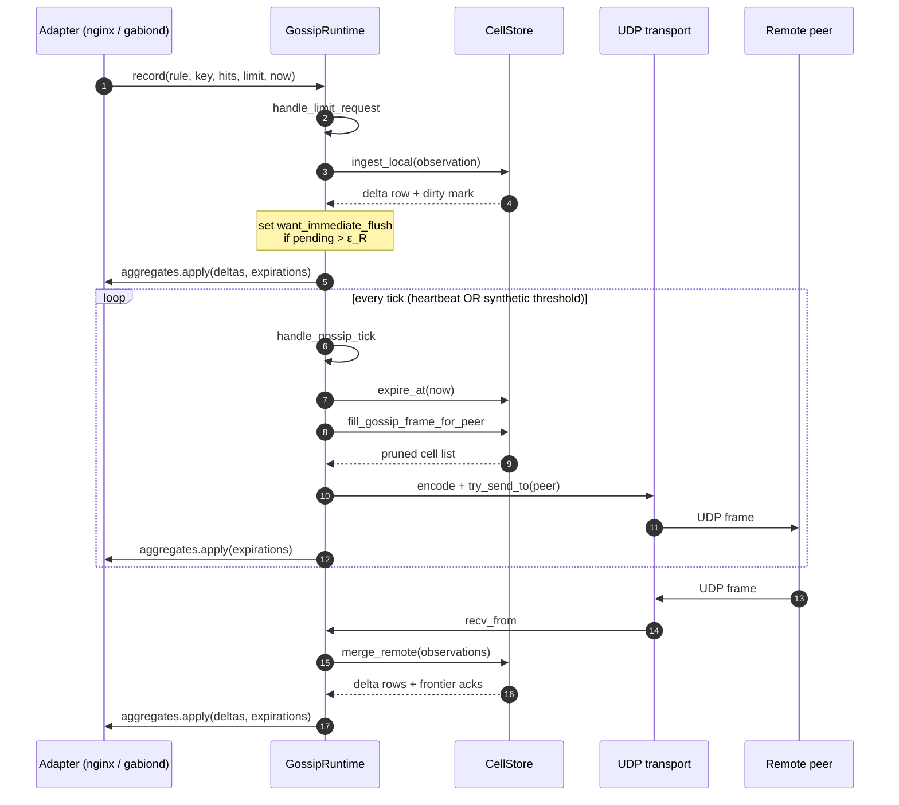

`CellStore::merge_remote` performs the CRDT join: max-merge per
`(origin, key, bucket)`, sum across origins. Every dirty row also goes
into a peer-frontier ring so the next outbound frame can prune anything
that peer has already acknowledged.

### Coverage fanout

Three separate concerns pull on the gossip plane, and it is tempting to
fold them all into the fanout knob. They are governed by three different
variables, and gabion keeps them apart:

| Concern | Governed by | Mechanism |
|---|---|---|
| **Coverage** — reach every node reliably | cluster size `n` | **fanout** = `⌈ln(n)+c⌉` |
| **Volume** — a big burst of dirty cells | dirty-set size | frame fill: `max_cells_per_tick` + packet-splitting |
| **Urgency** — a fresh delta matters *now* | per-rule error budget | threshold-fire emissions (`target_err_bps`) |

Only the first is a fanout question. Kermarrec, Massoulié & Ganesh (IEEE
TPDS 2003, *Probabilistic Reliable Dissemination in Large-Scale
Systems*, Theorem 1) prove that a directed gossip round with mean fanout
`ln(n)+c` reaches **every** node with probability → `e^(−e^(−c))`:
*"there is a sharp threshold in the required fanout at log n."* The
fanout needs to grow by only 1 each time `n` rises by a factor of e, and
a single round *"can easily be modified … to send several notifications
per gossip message"* — which is exactly what gabion does: the whole
dirty set rides one fat frame, so burst **volume** never widens the peer
pick — many cells share one packet, so a burst does not translate into
proportionally more rounds.

The pick lives in `GossipRuntime::handle_gossip_tick`:

```rust
let n = peers.len();
let coverage = (n as f64).ln() + GOSSIP_COVERAGE_MARGIN;   // c = 4.0
let pick_count = config.fanout.max(coverage.ceil() as usize).min(n);
```

A partial Fisher-Yates shuffle then picks `pick_count` distinct peers
from `self.peers`. The peers must be distinct rather than sampled with
replacement, because sampling the same peer twice in one tick would burn
a send-pool slot encoding the same frame twice. `config.fanout` is a
hard floor; `.min(n)` makes small clusters full-mesh (coverage demands
it there and the bandwidth is trivial). Some example pick counts at
`fanout = 3`, `c = 4`:

| peers `n` | `⌈ln(n)+c⌉` | `pick_count`               |
|-----------|-------------|----------------------------|
| 1         | 4           | 1 (capped at peers)        |
| 4         | 6           | 4 (capped at peers)        |
| 15        | 7           | 7                          |
| 31        | 8           | 8                          |
| 63        | 9           | 9                          |
| 255       | 10          | 10                         |
| 9 999     | 14          | 14                         |

Fanout trades **bandwidth** (linear in the pick: the cluster ships
`n·pick·frame` per tick) against **coverage-failure probability**
(`≈ e^(−e^(−c))` per round) and **latency** (`≈ log_{1+pick} n` rounds,
with diminishing return above the threshold). `⌈ln(n)+c⌉` is the
provably-minimal fanout for reliable coverage, so that is the operating
point; `c = 4` is a per-round 98.2%, and because anti-entropy runs
continuously, any node missed in one round is caught by the next and
end-to-end reliability compounds far past that. The bandwidth floor on
quiet ticks is unchanged from a fixed fanout — the pick is stable for a
given cluster size, not pulsing with load. The `coverage_fanout` bench
[below](#what-we-measured) shows the pick tracking `⌈ln(n)+c⌉` and
staying flat as burst volume changes.

### Adaptive emit rate

The heartbeat tick is bounded below by `tick_interval` (default
500 ms). That cadence works for cold rules but is pessimistic for hot
ones, because a saturating burst between two heartbeats could leak many
admissions past the limit before the next tick. Lowering
`tick_interval` for everyone is not an answer either: it costs
bandwidth on every quiet rule in the cluster.

The runtime crosses this trade with a per-rule error budget.
`GossipRuntime::handle_limit_request` keeps a small `rule_pending`
column indexed by rule slot; each admission adds its hits. The runtime
also computes a per-site safe zone:

```
ε_R = max(1, L_R · target_err_bps / (10_000 · N))
```

where `L_R` is the rule's limit and `N` is the peer count. When
`rule_pending` for that rule crosses `ε_R`, the runtime sets
`want_immediate_flush = true`. On the next loop iteration the top of
the run loop reads that flag (instead of waiting on `tick.tick()`) and
dispatches a synthetic gossip tick straight away. The post-emit sweep
inside `handle_gossip_tick` zeroes the rule's pending column and stamps
its `last_emit_ms`.

The constant `target_err_bps` is in basis points of each rule's own
limit, default 100 = 1 %. The cluster-wide unreplicated error per rule
is then bounded by `N · ε_R` (Sharfman, Schuster & Keren, SIGMOD 2006)
— roughly 1 % of the rule's limit, regardless of the request rate.

A floor `min_emit_interval` (default 5 ms) sits in front of the flush:
the runtime won't set `want_immediate_flush` if the gap since the last
emit is below the floor. Under adversarial traffic ε saturates to 1 and
every hit would otherwise emit; the floor caps the worst-case emit rate
so a bad client cannot pin the gossip socket.

```mermaid
stateDiagram-v2
    [*] --> Idle
    Idle --> Accumulating: limit request<br/>adds hits to rule_pending
    Accumulating --> Accumulating: pending ≤ ε_R
    Accumulating --> ReadyToFire: pending > ε_R
    ReadyToFire --> Idle: now − last_emit < min_emit_interval<br/>(floor blocks the emit)
    ReadyToFire --> Emit: now − last_emit ≥ min_emit_interval
    Emit --> Idle: synthetic tick dispatched,<br/>rule_pending reset,<br/>last_emit_ms stamped
    Idle --> Emit: heartbeat tick<br/>(unconditional; drains cold rules)
```

Three operational properties fall out of this design. The cluster-wide
unreplicated error per rule is bounded: at the default
`target_err_bps = 100`, the global error never exceeds 1 % of the
rule's limit no matter how fast requests come in. Cold rules still
propagate, because the heartbeat is independent of the threshold path
and any rule whose pending count never reaches ε_R still replicates
every `tick_interval`. Finally, under an adversarial workload where ε
saturates and every hit would otherwise emit, `min_emit_interval` caps
the worst-case emit rate; convergence still happens, but the cluster
absorbs the burst at a different bandwidth budget.

The `error_budget` and `min_emit_clamp` bench suites measure both
sides of this trade.

### Dirty rings and the peer frontier

Three data structures decide which cells the current tick sends to
which peer:

1. **`local_dirty`** — every locally-observed hit pushes onto this
   bounded ring. Drained by every tick (heartbeat and threshold).
2. **`forwarded_dirty`** — every cell merged from a peer pushes onto a
   separate ring, so the runtime can forward a remote delta even if
   its local origin column is quiet. Larger than `local_dirty` because
   forwarded cells fan out N-to-many.
3. **`peer_frontier`** — for each peer × each origin slot, the highest
   sequence number that peer has already acked. The sender uses this
   to skip cells the recipient already has.

Together they keep `fill_gossip_frame_for_peer` allocation-free and
strictly bounded: the runtime walks at most `max_cells_per_tick` cells
through the three lanes (local dirty → forwarded dirty → repair),
prunes each candidate against the peer's frontier, and stops when the
budget is exhausted. The rings are pre-sized at construction; pushes
that hit the cap bump an overflow counter and silently drop, and the
next repair-lane sweep picks the dropped cell back up.

`CRDT.md` documents these structures end-to-end with traces, slot
lifecycles, and invariant proofs. Read it once if you ever need to
debug the CRDT.

## Operator knobs

Most deployments leave the defaults alone, because they are chosen to
keep convergence well under a second at typical cluster sizes
(≤ 256). The table below is for the days when you do need to tune, and
it splits into the two adaptive halves of the protocol.

### Heartbeat cadence and fanout (coverage fanout)

| Knob                 | Default     | What it controls                                                                                                                       | When to tune                                                                                                  |
|----------------------|-------------|----------------------------------------------------------------------------------------------------------------------------------------|----------------------------------------------------------------------------------------------------------------|
| `tick_interval`      | 500 ms      | Heartbeat cadence — period between proactive gossip ticks.                                                                             | Bigger clusters tolerate longer intervals; lower it only if you need sub-100 ms convergence on cold rules.    |
| `fanout`             | 3           | Fanout floor. The runtime scales the actual pick to the coverage threshold `⌈ln(n)+c⌉` (`c` = `GOSSIP_COVERAGE_MARGIN`, 4), capped at the peer count. | Rarely tune — the floor binds only if you lower `GOSSIP_COVERAGE_MARGIN`. To trade bandwidth for coverage, change the margin, not this floor. |
| `max_cells_per_tick` | 4 096       | Cap on cells `fill_gossip_frame_for_peer` will emit in one tick. Cells over the cap roll forward to the next tick via the repair lane. | Raise if you run many rules and the dirty ring backlogs visibly under burst.                                  |
| `max_payload_bytes`  | 1 400       | UDP datagram budget. The codec splits a tick's frame across multiple packets when the cell list overflows.                             | Lower if your network path has a tighter MTU; never raise past the IPv4 safe floor of 1400.                   |

### Per-rule error budget (adaptive emit rate)

| Knob                 | Default     | What it controls                                                                                                                       | When to tune                                                                                                  |
|----------------------|-------------|----------------------------------------------------------------------------------------------------------------------------------------|----------------------------------------------------------------------------------------------------------------|
| `target_err_bps`     | 100 (= 1 %) | Per-rule error budget in basis points of the rule's limit. Tighter = more threshold fires, looser = more local lag.                    | Lower if a hot rule needs tighter convergence than 1 %; higher if bandwidth is the bottleneck.                |
| `min_emit_interval`  | 5 ms        | Floor between two threshold-fire emissions. Caps worst-case emit rate when ε saturates under adversarial load.                         | Raise if a bad client is pinning the gossip socket; lower to chase microsecond convergence on tiny clusters.  |

The `gabion::defaults` module is the single source of truth for these
constants. Both adapters read from it, so if you change a default the
two adapters move together. Per-adapter configuration translates each
knob to its surface name — see [`crates/server/README.md`](../server/README.md)
for the YAML keys and [`crates/nginx/README.md`](../nginx/README.md) for
the directives.

## What we measured

Every figure below is regenerated from current code by running the
gossip simulator across the suites; see
[`../gossip-bench/README.md`](../gossip-bench/README.md) for the
"how to re-run it" perspective. The figures here are committed to
`figures/` so this README renders correctly on GitHub without first
running the bench.

The suites split into four bundles. Steady-state convergence and scale
together show that the protocol meets its asymptotic bounds, while the
resilience suite shows that it survives the failure modes operators
see in practice. The adaptive machinery suites — `coverage_fanout`,
`error_budget`, `min_emit_clamp`, and `heartbeat_threshold_mix` — are
the empirical evidence for the two adaptive aspects of the protocol.

### Steady-state convergence

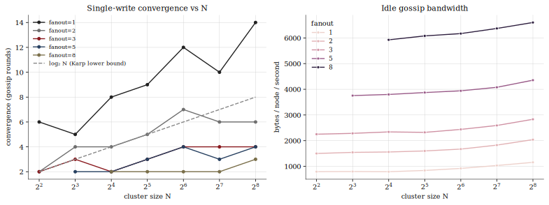

**Method.** Single write at node 0; measure rounds-to-converge as both
cluster size N and the static fanout floor sweep. Bandwidth is total
bytes sent across the run divided by `N · duration`.

**Takeaway.** Gabion sits at or below the Karp `log₂ N` lower bound at
every fanout above 1, because peer-frontier dedup lets the sender skip
cells the recipient already has. The empirical curve at f = 3 — well
under the f = 6 production default — is within one extra round of f = 8.

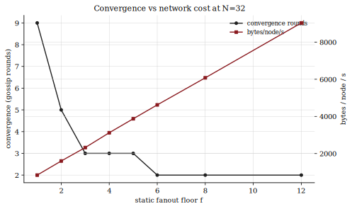

**Method.** Fix N = 32, sweep static `fanout` from 1 to 12, measure both
convergence rounds and bytes-per-node-per-second.

**Takeaway.** Rounds drop sharply between f = 1 and f = 3 and then
flatten, while bandwidth scales roughly linearly with `fanout`. The
sweet spot near f = 3–6 is where bandwidth stays modest while
convergence sits within a round of the asymptote.

### Scale

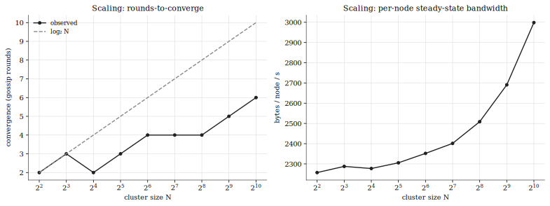

**Method.** Sweep N from 4 to 1024 at fixed `fanout = 3`. Time-to-
converge should track `log₂ N`; bytes-per-node-per-second should stay
roughly constant (SWIM's "constant load per node" property).

**Takeaway.** Rounds-to-converge sits at or below `log₂ N` all the way
through N = 1024, and per-node bandwidth is flat in N to within the
noise of a horizontal line.

### Resilience

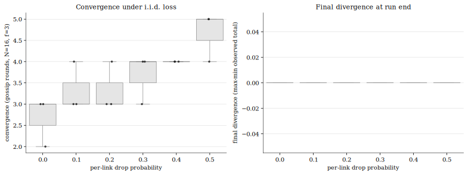

**Method.** Three trials at each per-link drop probability from 0 % to
50 %. N = 16, f = 3, 20 s of virtual time.

**Takeaway.** Convergence rounds climb only a small constant as loss
rises, and gabion converges in every trial including the 50 % loss row.
Bimodal Multicast (Birman et al. 1999) reports stable delivery to
~25–30 %; gabion's empirical tolerance is roughly twice that, thanks
to peer-frontier dedup plus the rotating repair lane.

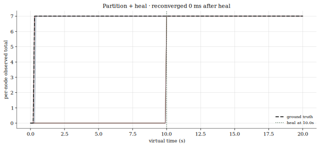

**Method.** Two equally-sized partitions, single write inside one,
heal at t = 10 s. Time-to-reconverge measured from the heal.

**Takeaway.** Once the links open, the next tick after heal drains the
partition, so reconvergence is bounded above by one `tick_interval`.

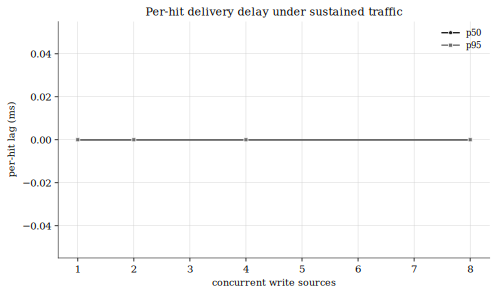

**Method.** Sustained writes from k sources concurrently; measure
per-hit p50 / p95 lag (Astrolabe-style staleness).

**Takeaway.** P50 and p95 lag both stay flat at a single `tick_interval`
regardless of the number of concurrent writers, because the dirty ring
drains in one round under steady state.

### Adaptive machinery

These four suites are the empirical evidence for the two adaptive
aspects of the protocol. `coverage_fanout` exercises coverage fanout;
`error_budget` and `min_emit_clamp` exercise adaptive emit rate; and
`heartbeat_threshold_mix` confirms the cold-rule heartbeat is
independent of the threshold path.


**Method.** Sweep two axes against a `DistinctKeyBurst` (each write
lands in its own cell store slot, so `local_dirty.len()` jumps to the
burst size in one step). Across cluster size `n ∈ {16, 64, 256}` at a
fixed burst, read the per-tick `peak_effective_fanout`. Across burst
size `cells ∈ {16, 256, 1024}` at a fixed `n`, read the effective fanout
(packets ÷ dirty-tick count). Static `fanout = 1` (the floor, which the
coverage threshold overrides).

**Takeaway.** The left panel: the observed peak fanout tracks
`⌈ln(n−1)+c⌉` — 7 at `n=16`, 9 at `n=64`, 10 at `n=256` — sitting right
on the predicted threshold and rising by ~1 per factor-of-e of cluster
growth, exactly the KMG law. The right panel: at fixed `n` the per-tick
fanout is **flat** across a 64× change in burst volume, because the
burst rides one fat frame rather than widening the peer pick — volume is
a frame-fill concern, not a fanout one. (Volume that overflows the dirty
ring is repaired by the rotating repair lane, not by fanning out wider.)

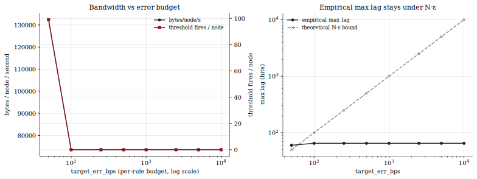

**Method.** Sustained workload at N = 16, `rule_limit = 10 000`,
`per_tick = 5` hits / source / sample. Sweep `target_err_bps` across
nearly three decades. Each scenario reports bandwidth,
threshold-fires/node, and the empirical
`max_lag = max(ground_truth − min(per_node_total))`, alongside the
theoretical `N · ε_R` bound.

**Takeaway.** Two regimes show up cleanly. While ε_R is small enough
that per-sample accumulated hits cross the budget (left of bps ≈ 100
here), the runtime fires nearly every sample and bandwidth climbs to
~130 kB/node/s. Past that crossover, ε_R is comfortably above the
per-sample hit count and the proactive heartbeat carries the work
alone — bandwidth drops to ~73 kB/node/s and threshold fires go to
zero. Empirical max lag plateaus at ~65 hits across the entire sweep
because the heartbeat alone keeps lag bounded by one `tick_interval`
× per-sample hit count — the budget only matters when it would force
gossip *faster* than that. Empirical max lag may briefly exceed
`N · ε_R` at the tight end of the sweep — those are hits in flight
between the bench's sample point and the next gossip apply, bounded by
one workload batch and absorbed by the following sample.

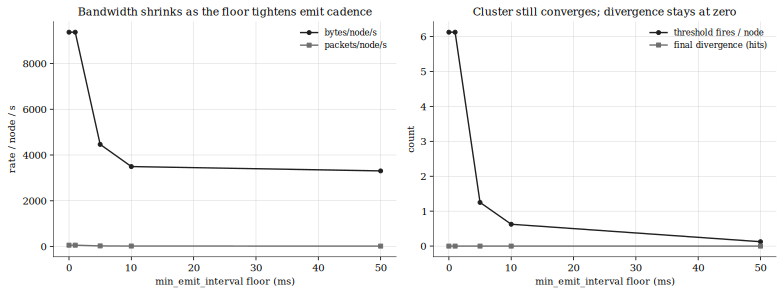

**Method.** Adversarial workload: drive 10 000 hits into 50 ms of
virtual time. The `BurstCompressed` workload calls `record(...)` with
`rule_limit = 1`, which forces `ε_R = max(1, 1 · bps / 80_000) = 1` at
every bps — so every hit crosses the budget. Sweep
`min_emit_interval ∈ {0, 1, 5, 10, 50}` ms.

**Takeaway.** Bandwidth scales inversely with the floor, which is what
caps worst-case emit rate. Threshold-fires-per-node drops by ~50×
across the sweep (6.1 at floor = 0 / 1 ms down to 0.1 at floor = 50 ms),
and final divergence stays at zero in every configuration — the cluster
still converges after the burst, just at a different bandwidth budget.

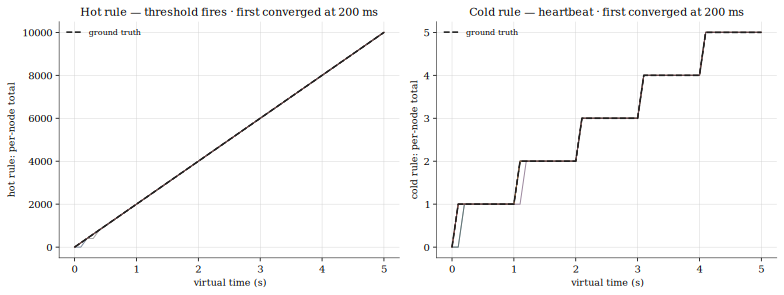

**Method.** Two rules side by side. The hot rule receives a saturating
burst every tick (threshold path); the cold rule receives one hit per
second (heartbeat path). Both must converge.

**Takeaway.** The left panel shows the hot rule converging
sub-heartbeat through threshold fires, while the right panel shows the
cold rule riding the proactive heartbeat. Cold-rule replication does
not depend on the threshold ever firing, because heartbeat and
threshold are independent code paths.

## References

In-tree primary sources:

- `src/gossip/runtime.rs` — the event loop. `GossipRuntime::run` is the
  outer `select!`; `handle_gossip_tick` carries the coverage-fanout
  pick; `handle_limit_request` carries the per-site safe zone and the
  threshold-fire flag.
- `src/wire.rs` and `src/wire/` — packet shape, encoders, HMAC
  authentication.
- `src/crdt.rs` and `src/crdt/` — counter store, dirty rings, peer
  frontier, expiry. The structures here are documented in depth in
  [`CRDT.md`](CRDT.md).
- [`../gossip-bench/REFERENCES.md`](../gossip-bench/REFERENCES.md) — the
  literature survey behind the benchmark methodology (Demers 1987,
  Karp 2000, SWIM 2002, HyParView / Plumtree 2007, Astrolabe 2003,
  Bimodal Multicast 1999, plus Sharfman/Schuster/Keren and
  Olston/Jiang/Widom for the error-budget machinery).
