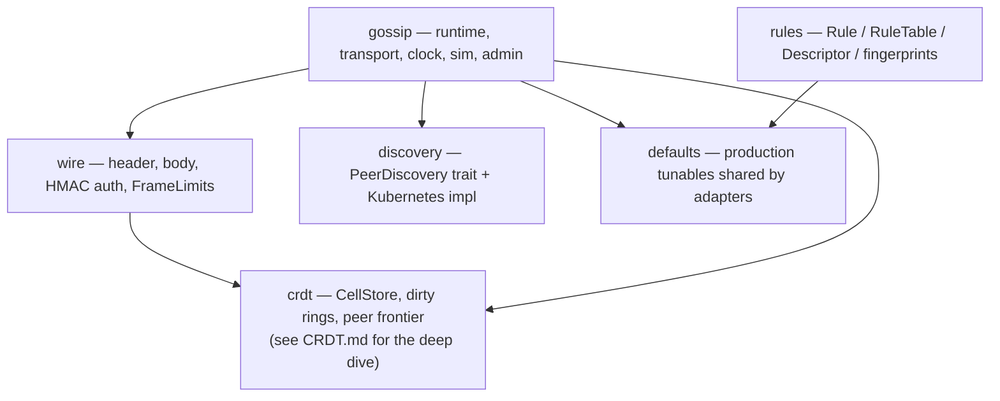
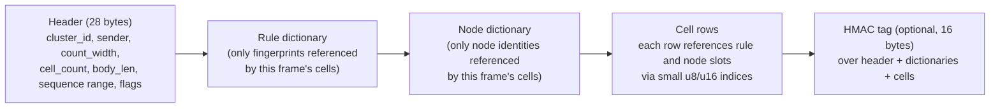
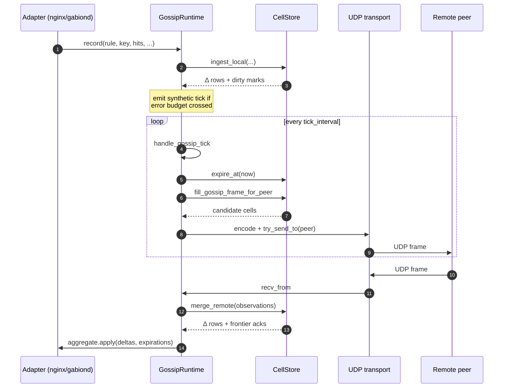
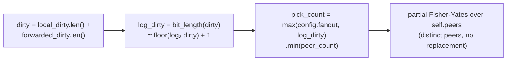
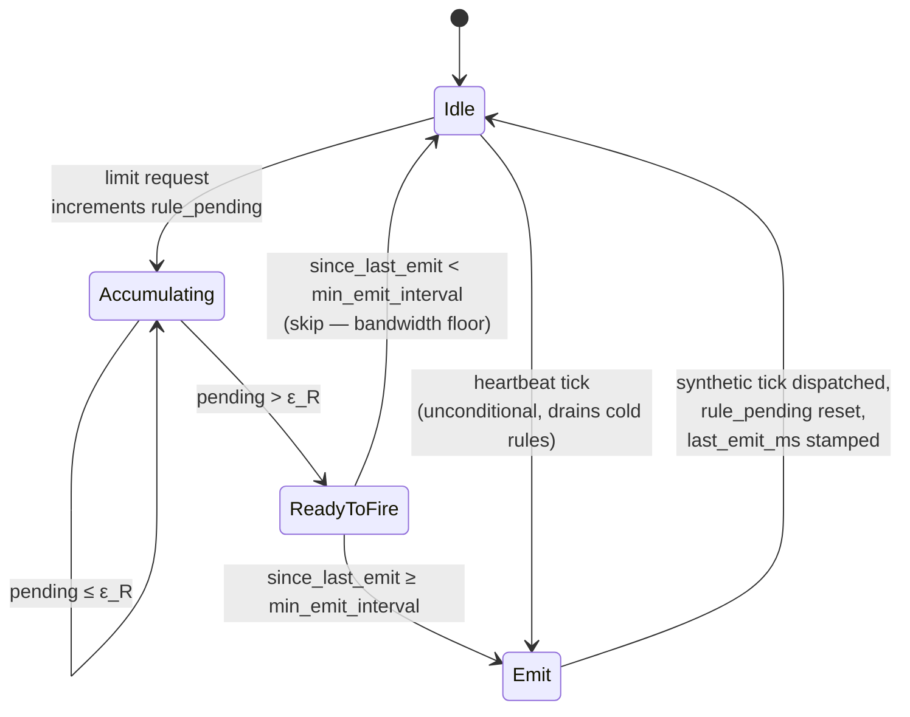
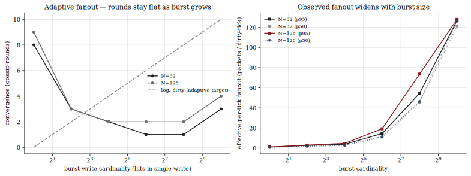

# gabion

The pure-Rust library at the heart of every gabion deployment. It owns
the CRDT, the gossip runtime, the wire codec, the rule machinery, and the
discovery interface — but knows nothing about YAML, gRPC, or nginx. Both
adapters in the workspace (`gabion-server` and `gabion-nginx`) build their
configuration on top of the same library types and call the same hot
paths.

This README is the canonical guide to the library. If you want to
understand how the cluster stays consistent, how a packet is shaped, or
which knob to turn when an operator asks, read this end-to-end. Code
references throughout point at `crates/gabion/src/` and exact line numbers
where helpful.

## Contents

- [Module map](#module-map)
- [How gossip works](#how-gossip-works)
  - [The wire frame](#the-wire-frame)
  - [The anti-entropy loop](#the-anti-entropy-loop)
  - [Adaptive fanout](#adaptive-fanout)
  - [Threshold-triggered emissions](#threshold-triggered-emissions)
  - [Dirty rings and the peer frontier](#dirty-rings-and-the-peer-frontier)
- [Operator knobs](#operator-knobs)
- [What we measured](#what-we-measured)
- [References](#references)

## Module map

Six modules. Every type that crosses an adapter boundary lives in
exactly one of them, and the dependency graph is a DAG (no module
imports from a module that imports it).

| Module       | Path                          | What it owns                                                                                                                              |
|--------------|-------------------------------|--------------------------------------------------------------------------------------------------------------------------------------------|
| `crdt`       | `src/crdt/*`                  | The per-origin counter store. Robin Hood hash table, structure-of-arrays columns, bounded dirty rings, per-peer frontier. Allocates only at construction. See [`CRDT.md`](CRDT.md). |
| `rules`      | `src/rules/*`                 | `Rule`, `RuleTable`, `Descriptor`, fingerprint hashing. Two nodes with the same rules produce identical `rule_fingerprint` values, which is what makes the CRDT addressable across the cluster. |
| `gossip`     | `src/gossip/*`                | `GossipRuntime`, `GossipClient`, `GossipTransport`, `Clock`, the `sim::SimTransport` used in tests, and the `AdminCommand` / `AdminSnapshot` observability surface. |
| `wire`       | `src/wire/*`                  | The on-the-wire codec. One UDP packet = header + rule dictionary + node dictionary + cell rows + optional HMAC tag. Each packet decodes independently. |
| `discovery`  | `src/discovery/*`             | `PeerDiscovery` trait and the Kubernetes EndpointSlice implementation. Adapters consume `PeerEvent` streams; the gossip runtime treats peer add/remove as a normal `select!` arm. |
| `defaults`   | `src/defaults.rs`             | Constants shared by both adapters: tick interval, fanout floor, payload caps, the per-rule error budget, and the min-emit floor. |

## How gossip works

Gossip is the protocol that turns N independent counter stores into one
*eventually consistent* counter store. Every node admits requests
against its local view of the cluster aggregate; gossip is what keeps
that view fresh.

Three things make gabion's flavour different from a textbook anti-entropy
loop:

1. The gossip runtime never allocates after construction. Every buffer
   is pre-sized; the `tokio::select!` body is branch-free.
2. Fanout *adapts* to the dirty set under burst — a single tick can
   pick up to `log₂(dirty)` peers instead of a fixed constant.
3. The cluster decouples convergence latency from heartbeat cadence
   with an operator-tunable per-rule error budget. The moment local
   unreplicated error would exceed the budget, the node fires a
   sub-heartbeat emit.

The rest of this section walks through each of those, then closes with
the data structures that make pruning cheap.

### The wire frame

Every gossip frame is one self-describing UDP packet. There is no
session state on either side: each frame decodes independently, even if
its predecessor was dropped.

The rule and node dictionaries are *per-frame* — they only carry the
identities the cell rows actually reference. That keeps small frames
small (one rule, one origin → header + 1 dict entry + 1 cell row), while
still supporting frames that span the full address space.

The codec lives in `src/wire/{header,body,auth}.rs`. `FrameLimits` (in
`src/wire.rs`) caps per-packet payload size at 1400 bytes — the safe
IPv4 MSS floor that avoids fragmentation across most network paths.
Frames bigger than the cap split into multiple packets at the sending
side; each packet is independently decodable, so loss of any one packet
just delays a few cells.

The HMAC authentication path is optional: when `gossip.auth_key` is set,
the codec adds a 16-byte tag derived from the cluster's pre-shared key
over the entire decoded body. Inbound packets that fail the tag check
are dropped on the floor. The whole cluster must agree on the key.

### The anti-entropy loop

The runtime ([`gossip::GossipRuntime`](src/gossip/runtime.rs)) is a
single-threaded event loop driven by one `tokio::select!` with six arms:
limit requests from the adapter, inbound packets, outbound writability,
peer membership churn, admin commands, and the heartbeat tick. After
each iteration it calls `aggregates.apply(...)` exactly once with the
deltas and expirations the arm produced — that's the contract with the
downstream rate-limit decision path.

The cell store's `merge_remote` does the CRDT join: max-merge per
`(origin, key, bucket)`, sum across origins. Every dirty row also goes
into a peer-frontier ring so the next outbound frame can prune anything
that peer has already acked.

### Adaptive fanout

A pure-push gossip protocol with a fixed fanout `f` converges in
`O(log_(1+f) N)` rounds with high probability — that's the Karp et al.
2000 bound. The catch is the constant: when the dirty set is small the
fixed `f` is fine, but when a burst lands and the dirty set jumps, the
same fixed `f` extends time-to-convergence linearly with burst size.

Gabion's runtime grows the per-tick fanout with the dirty-set bit length
([`runtime.rs:648`](src/gossip/runtime.rs#L648)):

The intuition: when one cell is dirty, fanout = `config.fanout`
(typically 3 or 6). When the burst arrives and 1024 cells are dirty,
`log_dirty` jumps to 11, so the runtime picks min(11, peer_count) peers
this single tick. The dirty set then drops back toward zero and fanout
narrows again on the next tick. The cluster pays the wide-fanout cost
only for the ticks it needs.

Verma & Ooi (ICDCS 2005) showed this scheme gives O(log N) burst
convergence at the cost of one extra tick of latency in the worst case.
The `adaptive_fanout` benchmark suite (see [What we measured](#what-we-measured))
confirms the rounds-to-converge stays flat as the burst size grows.

### Threshold-triggered emissions

The proactive heartbeat is bounded below by `tick_interval` (default
100 ms). That's fine for cold rules but pessimistic for hot rules under
load — a single saturating burst between two heartbeats could leak many
admissions past the limit before the next tick fires.

Gabion crosses this trade with an operator-tunable error budget. Each
matched rule R has a per-site safe zone ε_R = `max(1, L_R × bps /
(10_000 × N))`, where L_R is the rule's limit and N is the peer count
([`runtime.rs:393–453`](src/gossip/runtime.rs#L393)). When a request's
local unreplicated hits would push past ε_R, the runtime sets
`want_immediate_flush = true`; the top of the run loop reads that flag
on the next iteration and dispatches a *synthetic* gossip tick without
waiting for the heartbeat. A floor (`min_emit_interval`, default 5 ms)
prevents the emit rate from saturating even when ε saturates to 1 under
adversarial load.

What this buys the operator:

- **Bounded cluster-wide error.** Sharfman/Schuster/Keren (SIGMOD 2006)
  bound the global unreplicated error per rule by `N × ε_R`. With
  default `target_err_bps = 100` (1 % of the rule's limit), the global
  error is bounded by 1 % of the limit *regardless of request rate*.
- **Cold rules still propagate.** The proactive heartbeat is
  independent of the threshold path. A rule whose pending count never
  reaches ε_R still replicates every `tick_interval`.
- **A floor on bandwidth.** Under an adversarial rate ε saturates to 1
  and every hit would otherwise emit. `min_emit_interval` caps the
  worst-case emit rate, so a bad client can't pin the gossip plane.

The `error_budget` and `min_emit_clamp` benchmark suites measure both
sides of this trade.

### Dirty rings and the peer frontier

Anti-entropy boils down to: which cells should this tick send to which
peer? Three data structures decide:

1. **`local_dirty`** — every locally-observed hit pushes onto this
   bounded ring. Drained by the heartbeat tick.
2. **`forwarded_dirty`** — every cell merged from a peer pushes onto a
   separate ring, so we can decide to *forward* a remote delta even if
   our local origin column is quiet. Larger than `local_dirty` because
   forwarded cells fan out N-to-many.
3. **`peer_frontier`** — for each peer × each origin slot, the highest
   sequence number that peer has acked. The sender uses this to skip
   cells the recipient already has.

Together they keep `fill_gossip_frame_for_peer` allocation-free and
strictly bounded: the runtime walks at most `max_cells_per_tick` cells,
prunes against the peer's frontier, and stops when the dirty ring is
drained.

`CRDT.md` documents the data structures end-to-end with traces, slot
lifecycles, and invariant proofs. Read it once if you ever need to
debug the CRDT.

## Operator knobs

Most production deployments leave the defaults alone — they're chosen to
keep convergence well under a second at typical cluster sizes (≤ 256).
The table below is for the days you do need to tune.

| Knob                  | Default      | What it controls                                                                                                  | When to tune                                                                                                  |
|-----------------------|--------------|-------------------------------------------------------------------------------------------------------------------|----------------------------------------------------------------------------------------------------------------|
| `tick_interval`       | 100 ms       | Heartbeat cadence — period between proactive gossip ticks.                                                        | Bigger clusters tolerate longer intervals; lower it only if you need sub-100 ms convergence on cold rules.   |
| `fanout`              | 6            | Static fanout floor. The runtime widens above this under burst.                                                   | Lower for very small clusters (1–4) to cut bandwidth; rarely raise — adaptive fanout already handles bursts. |
| `target_err_bps`      | 100 (= 1 %)  | Per-rule error budget in basis points of the rule's limit. Tighter = more emits, looser = more local lag.         | Lower if your hot rule needs tighter convergence; higher if bandwidth is the bottleneck.                     |
| `min_emit_interval`   | 5 ms         | Floor between two threshold-fire emissions. Caps worst-case emit rate when ε saturates under adversarial load.    | Raise if a bad client is pinning the gossip plane; lower to chase microsecond convergence on tiny clusters.  |
| `max_cells_per_tick`  | 4096         | Frame composition cap — the maximum cells `fill_gossip_frame_for_peer` will emit per tick.                        | Raise when you have many rules and the dirty ring backlogs; the wire codec splits frames at the 1400-byte UDP cap. |
| `max_payload_bytes`   | 1400         | UDP datagram budget. The codec emits multiple packets per frame when the cell list overflows.                     | Lower if your network path has a tighter MTU; never raise past the IPv4 safe floor of 1400.                   |

`gabion::defaults` is the single source of truth for those constants.
Both adapters (`gabion-server`, `gabion-nginx`) read from it; if you
change a default, both adapters move together.

## What we measured

Every figure below is regenerated from current code by running
`python3 crates/gossip-bench/bench/plot.py all --publish`. The bench
itself lives in [`crates/gossip-bench/`](../gossip-bench/README.md) and
is documented from a "how to run it" perspective; this section is the
*results* perspective — the things we want every operator and reviewer
to come away knowing.

The suites split into four bundles. Steady-state convergence and scale
prove the protocol meets its asymptotic bounds. Resilience proves it
survives the failure modes operators see in practice. The adaptive
machinery suites prove the burst- and load-driven knobs work as
designed.

### Steady-state convergence

**Method.** Single write at node 0; measure rounds-to-converge as both
cluster size N and the static fanout floor sweep. Bandwidth is total
bytes sent across the run divided by `N · duration`.

**Takeaway.** Gabion sits at or below the Karp `log₂ N` lower bound at
every fanout above 1, because peer-frontier dedup lets the sender skip
cells the recipient already has. The empirical curve flattens at f=3 —
the production default — at well under one extra round compared to f=8.

**Method.** Fix N=32, sweep static `fanout` from 1 to 12, measure both
convergence rounds and bytes-per-node-per-second.

**Takeaway.** Convergence rounds drop sharply between f=1 and f=3, then
flatten. Bandwidth scales roughly linearly with `fanout`. The
"sweet spot" near f=3–4 is where bandwidth stays modest while
convergence is within a round of the asymptote.

### Scale

**Method.** Sweep N from 4 to 1024 at fixed `fanout=3`. Time-to-converge
should track `log₂ N`; bytes-per-node-per-second should stay roughly
constant (SWIM "constant load per node" property).

**Takeaway.** Rounds-to-converge sits at or below `log₂ N` all the way
through N=1024. Per-node bandwidth is flat in N — the curve is within
noise of a horizontal line.

### Resilience

**Method.** Three trials at each per-link drop probability from 0 % to
50 %. N=16, f=3, 20 s of virtual time.

**Takeaway.** Convergence rounds climb only a small constant as loss
rises; gabion converges in every trial including the 50 % loss row.
Bimodal Multicast (Birman et al. 1999) reports stable delivery to ~25 –
30 %; gabion's empirical tolerance is roughly twice that because of the
peer-frontier dedup plus the rotating repair lane.

**Method.** Two equally-sized partitions, single write inside one,
heal at t = 10 s. Time-to-reconverge measured from the heal.

**Takeaway.** Once the links open, the next tick after heal drains the
partition; reconvergence is bounded above by one `tick_interval`.

**Method.** Sustained writes from k sources concurrently; measure
per-hit p50 / p95 lag (Astrolabe-style staleness).

**Takeaway.** P50 and p95 lag both stay flat at a single tick interval
regardless of the number of concurrent writers — the dirty ring drains
in one round under steady state.

### Adaptive machinery

**Method.** Issue a `DistinctKeyBurst` of size `dirty ∈ {1, 4, 16, 64,
256, 1024}` at one node — every write lands in its own CellStore slot,
so `local_dirty.len()` jumps to `dirty` in one step. Static
`fanout=1`; N ∈ {32, 128}. Each scenario reports rounds-to-converge
and the observed effective fanout (packets emitted ÷ dirty-tick count).

**Takeaway.** With static fanout 1 and no adaptive widening, a 1024-cell
burst would take `~ dirty / 1 = 1024` rounds. In practice it converges
in 3–4. The right panel shows why: observed effective fanout climbs
from ~1 at `dirty=1` to ~126 at `dirty=1024` — the runtime is picking
the entire peer set every tick during the burst, then narrows back to
the static floor once the dirty set drains. The single-cell case (left
edge) is the only point where rounds tail upward, because there's
nothing for `log₂(dirty)` to widen.

**Method.** Sustained workload at N=16, rule_limit = 10 000, per_tick
= 5 hits / source / sample. Sweep `target_err_bps` across nearly three
decades. Each scenario reports bandwidth, threshold-fires/node, and
empirical `max_lag = max(ground_truth − min(per_node_total))` and quotes
the theoretical N × ε_R bound.

**Takeaway.** Two regimes show up cleanly. While ε_R is small enough
that per-sample accumulated hits cross the budget (left of bps ≈ 100
here), the runtime fires nearly every sample and bandwidth climbs to
~130 kB/node/s. Past that crossover, ε_R is comfortably above the
per-sample hit count and the proactive heartbeat carries the work
alone — bandwidth drops to ~73 kB/node/s and threshold fires go to
zero. Empirical max lag plateaus at ~65 hits across the entire sweep
because the heartbeat by itself keeps lag bounded by one
`tick_interval` × per-sample hit count — the budget only matters when
it would force gossip *faster* than that. Empirical max lag may briefly
exceed `N × ε_R` at the tight end of the sweep — that's hits in flight
between the bench's sample point and the next gossip apply, bounded by
one workload batch and absorbed by the following sample.

**Method.** Adversarial: drive 10 000 hits into 50 ms of virtual time
with `rule_limit = 1` (forces ε to saturate at 1, so every hit would
otherwise emit). Sweep `min_emit_interval ∈ {0, 1, 5, 10, 50} ms`.

**Takeaway.** Bandwidth scales inversely with the floor; the floor
caps worst-case emit rate. Threshold-fires-per-node drops by 50× across
the sweep (6.1 at floor=0/1 ms down to 0.1 at floor=50 ms). Final
divergence stays at zero in every configuration — the cluster still
converges after the burst, just at a different bandwidth budget.

**Method.** Two rules side by side. The hot rule receives a saturating
burst every tick (threshold path); the cold rule receives one hit per
second (heartbeat path). Both must converge.

**Takeaway.** The left panel shows the hot rule converging sub-heartbeat
through threshold fires. The right panel shows the cold rule riding the
proactive heartbeat. Cold-rule replication does not depend on the
threshold ever firing.

## References

In-tree primary sources:

- [`src/gossip/runtime.rs`](src/gossip/runtime.rs) — the event loop, the
  adaptive-fanout pick, and the threshold-fire / heartbeat split.
- [`src/wire.rs`](src/wire.rs) and [`src/wire/`](src/wire/) — packet
  shape, encoders, HMAC.
- [`src/crdt.rs`](src/crdt.rs) and [`src/crdt/`](src/crdt/) — the
  counter store, dirty rings, peer frontier, expiry.
- [`CRDT.md`](CRDT.md) — the data-structure deep dive.
- [`../gossip-bench/REFERENCES.md`](../gossip-bench/REFERENCES.md) — the
  literature survey behind the benchmark methodology (Demers 1987, Karp
  2000, SWIM 2002, HyParView / Plumtree 2007, Astrolabe 2003, Bimodal
  Multicast 1999, plus Sharfman/Schuster/Keren and Olston/Jiang/Widom
  for the error-budget machinery).
