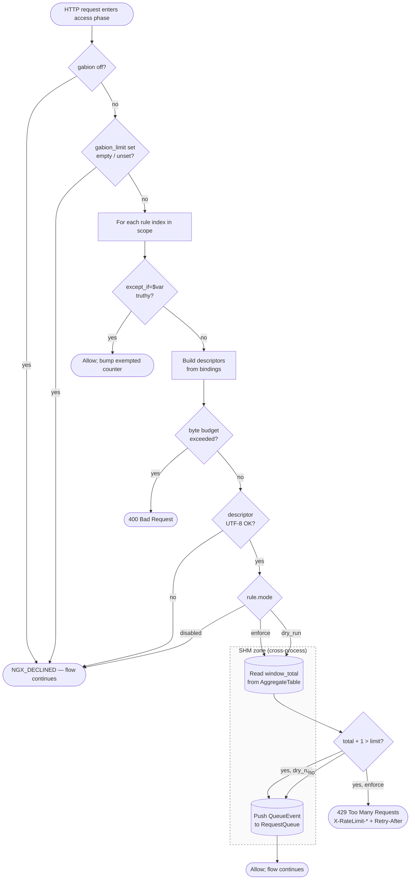
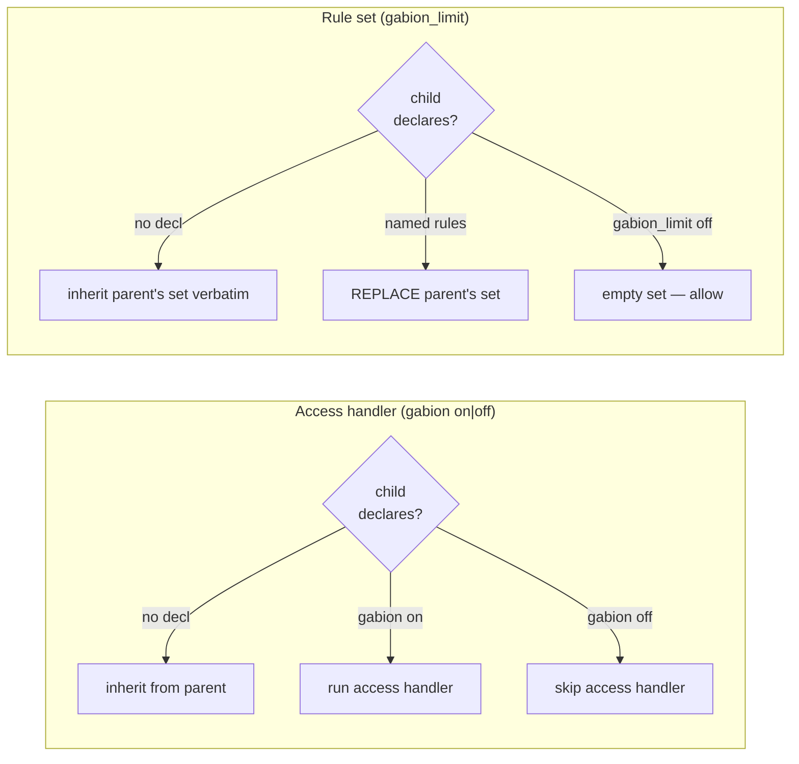

# gabion-nginx — gabion's NGINX module

`gabion-nginx` is gabion's in-process NGINX module: a dynamic `.so` that
loads into every worker, enforces rate limits at the access phase, and
(on the elected leader worker) drives the gossip runtime that keeps
counters in sync across replicas. Admission is decided against a
cluster-wide aggregate without ever leaving the worker process, so
each request costs neither an out-of-process call, a syscall, nor a
heap allocation.

If you're running Envoy sidecars instead of nginx, see
[`../server/README.md`](../server/README.md) for the gRPC adapter
that speaks the same gossip protocol over the same wire codec.

For the project-level overview, glossary, and the cross-adapter
explainer of rate / window / bucket, gossip, discovery, and the
fail-open invariant, see the [top-level README](../../README.md).

## Contents

- [Your first rule](#your-first-rule)
- [Common patterns](#common-patterns)
- [Per-request access flow](#per-request-access-flow)
- [Directive reference](#directive-reference)
- [Composition: rule layering](#composition-rule-layering)
- [Predicates: `except_if=$variable`](#predicates-except_ifvariable)
- [Dry-run mode](#dry-run-mode)
- [Running across a cluster](#running-across-a-cluster)
- [Configuration error messages](#configuration-error-messages)
- [Troubleshooting](#troubleshooting)
- [Unknown variable detection](#unknown-variable-detection)

## Your first rule

A minimal single-node nginx config that exercises gabion end-to-end:

```nginx
load_module /etc/nginx/modules/ngx_http_gabion_module.so;

worker_processes 2;
events {}

http {
    gabion_limit_zone zone=api:64m;
    gabion_limit_rule per_ip $remote_addr rate=100r/s;

    server {
        listen 8080;
        location / {
            gabion_limit per_ip;
            return 200 "ok\n";
        }
    }
}
```

A request under budget gets `200 OK`; hammering the same IP past 100
in one second gets `429 Too Many Requests` together with
`X-RateLimit-Limit`, `X-RateLimit-Remaining: 0`, `X-RateLimit-Reset`,
and `Retry-After`. Those four headers are pinned to the rule with
the longest window, so a client that just tripped a narrow rule is
not immediately re-rejected by a wider one.

Before flipping a new rule to enforcing, it is worth running it in
dry-run first by appending the `dry_run` flag. The rule evaluates
and records hits — metrics and gossip see real traffic — but never
rejects, which lets you watch the allow/reject ratio against
production load before you drop the flag.

To scale beyond one node, add `gabion_gossip_bind`, a non-zero
`gabion_gossip_cluster` id, and (under Kubernetes) the namespace
allowlist. See [Running across a cluster](#running-across-a-cluster).

<a id="fail-open-invariant"></a>

> **Fail-open in one paragraph.** Internal limits — matched-rule
> overflow, descriptor decode failures, a missing predicate variable —
> decline the request rather than reject it, so a bug or saturation in
> gabion never returns a spurious 429. The full statement of the
> invariant lives in the [root README](../../README.md#fail-open-invariant).

## Common patterns

Each subsection asks an operator's question first and then names the
recipe. You can stack as many as you need at one location; rules
compose left-to-right, and the first enforcing reject wins.

### How do you exempt internal traffic without measuring it?

```nginx
geo $trusted_ip {
    default 0;
    10.0.0.0/8 1;
    127.0.0.1/32 1;
}
gabion_limit_rule per_ip $remote_addr rate=100r/s except_if=$trusted_ip;

server {
    location /api/ { gabion_limit per_ip; }
}
```

`except_if=$trusted_ip` skips the rule when the variable resolves
truthy. An exempted request neither bumps the counter nor reaches
the aggregate, and it produces no gossip cell. See
[Predicates](#predicates-except_ifvariable) for the truthy/falsy set.

### How do you key off a tenant header instead of an IP?

```nginx
gabion_limit_rule per_tenant tenant:$arg_tenant rate=1000r/m;

server {
    location /api/ { gabion_limit per_tenant; }
}
```

`$arg_tenant` reads the `?tenant=` query argument and `tenant:` is
the descriptor key, so each distinct tenant gets its own counter.
A request without `?tenant=` produces an empty value, at which point
the rule declines without bumping a counter and the request flows
through.

### How do you roll out a new limit safely?

```nginx
# Step 1: ship in dry-run; observe the allow/reject ratio for a release window.
gabion_limit_rule new_route tenant:$arg_tenant path:$uri rate=50r/m dry_run;
gabion_limit new_route;

# Step 2: once the ratio looks right, drop `dry_run`.
gabion_limit_rule new_route tenant:$arg_tenant path:$uri rate=50r/m;
```

A dry-run rule still records hits into the SHM aggregate and
gossips them to peers, so capacity planning is truthful before you
flip the switch — you are sizing against real load rather than a
synthetic projection.

### How do you stack per-IP and per-tenant limits?

```nginx
gabion_limit_rule per_ip     $remote_addr        rate=100r/s;
gabion_limit_rule per_tenant tenant:$arg_tenant  rate=1000r/m;

location /api/ { gabion_limit per_ip per_tenant; }
```

Each rule is an independent gate, and a reject from either rejects
the request. Headers pin to the rule with the longer window so that
a 1s per-IP reject does not tell the client to retry after 1s when
the 1-minute per-tenant budget would also reject them.

### How do you exclude `/healthz` from rate limiting?

```nginx
location /healthz {
    gabion off;
    return 200;
}
```

`gabion off` skips the access handler entirely, so the request pays
zero per-request cost. It is the right choice for liveness probes
and static asset paths where you would rather not pay even a SHM
atomic load.

### How do you scale beyond one node?

```nginx
gabion_gossip_bind 0.0.0.0:9000;
gabion_gossip_cluster 0xc0ffee;
gabion_discovery_namespace_allow my-app-namespace;
```

Every gabion process that shares the cluster identifier and can
reach the others' gossip sockets exchanges counters with them. The
[Running across a cluster](#running-across-a-cluster) section names
the directives by role.

## Per-request access flow



A few things are worth reading off the picture. Both `gabion off`
and an empty `gabion_limit` set decline early without ever touching
SHM, which is why those branches are essentially free. The byte-budget
check is the only cardinality gate evaluated at request time; the
descriptor count and key length are bounded earlier, at config phase.
Finally, a dry-run rule still pushes its event onto the SHM queue, so
counters and gossip continue to see real traffic — only the reject
verdict itself is suppressed.

## Directive reference

The full directive surface is below. Every directive starts with
`gabion_` and is registered as an http-block directive unless noted.
Errors at `nginx -t` time use the shape *what happened, why it
likely happened, what to do next*; if you see one that doesn't end
with a concrete next step, please open an issue.

### Core

#### `gabion_limit_zone zone=NAME:SIZE` *(http)*

Allocates the shared-memory zone that holds the local-aggregate
counters, the SHM queue, and the per-zone `Stats`. Required exactly
once per `http {}` block. Mirrors nginx core's `limit_req_zone
zone=name:size`.

```nginx
gabion_limit_zone zone=api:128m;
```

#### `gabion_limit_rule NAME [$bindings...] rate=Nr/<unit> [...]` *(http)*

Declares a rate-limit rule. Positional arguments after the name are
descriptor bindings; named arguments and bare flags follow.

```nginx
gabion_limit_rule per_ip    $remote_addr                  rate=100r/s;
gabion_limit_rule per_uri   $uri                          rate=10r/s;
gabion_limit_rule per_route tenant:$arg_tenant path:$uri  rate=5r/s;

gabion_limit_rule by_asn    $geoip2_asn_number   rate=50r/s except_if=$trusted_ip;
gabion_limit_rule by_bot    class:$bot_class     rate=10r/s;
gabion_limit_rule shadow    $uri                 rate=1r/s  dry_run;

gabion_limit_rule slow_path $uri                 rate=5r/30s;
gabion_limit_rule daily_cap tenant:$arg_tenant   rate=10000r/d;
gabion_limit_rule sustained tenant:$arg_tenant   rate=10r/s window=5h bucket=1h;
```

**Descriptor bindings.** A binding pairs a descriptor key with a
variable expression evaluated at request time:

| Form                              | Effect                                                         |
|-----------------------------------|----------------------------------------------------------------|
| `$identifier`                     | Auto-keyed by the variable name (`$uri` → key `uri`).          |
| `name:$identifier`                | Explicit key; single-variable.                                 |
| `name:"prefix-$foo-$bar"`         | Explicit key; template — compiled to a complex value.          |

Single-variable bindings dispatch through nginx's indexed-variable
subsystem, which is an O(1) array lookup with no allocation per
request. The inline fast path for `$uri`, `$request_uri`, `$args`,
`$remote_addr`, and `$arg_*` skips even the FFI hop. Template
bindings compile via `ngx_http_compile_complex_value` once at config
phase and allocate a few tens of bytes per evaluation against the
request pool, which is fine for operator-meaningful compositions
since they only pay for what they use.

**Named arguments.**

| Argument                | Meaning                                                                                                                                    |
|-------------------------|--------------------------------------------------------------------------------------------------------------------------------------------|
| `rate=Nr/<unit>`        | **Required.** `N` requests per the period named by `<unit>`. `<unit>` is `s\|m\|h\|d` or any humantime duration like `30s`, `5m`, `2h30m`. |
| `window=DURATION`       | Time horizon the rate is enforced over (default: the rate's period). When set, the resolved limit scales to `floor(rate_count * window / period)`. |
| `bucket=DURATION`       | Bucket granularity inside the window (default: the resolved window — one fixed-window bucket).                                             |
| `mode=enforce`          | Default. Evaluate and reject on overflow.                                                                                                  |
| `mode=dry_run`          | Evaluate and record the hit; never reject.                                                                                                 |
| `mode=disabled`         | Skip the rule entirely.                                                                                                                    |
| `dry_run`               | Bare flag; alias for `mode=dry_run`.                                                                                                       |
| `except_if=$variable`   | Skip the rule when `$variable` resolves truthy. See [Predicates](#predicates-except_ifvariable).                                           |
| `domain=NAME`           | Domain bucket for the rule (defaults to `nginx`). Must match `[A-Za-z_][A-Za-z0-9_.-]*`.                                                   |

**Rate, window, and bucket.** A rule resolves internally to three
numbers — a `limit`, a `window`, and a `bucket` — controlled by
three directive-level knobs that are evaluated in order:

* `rate=Nr/<unit>` (mandatory) — sustained allowance and its natural
  period.
* `window=DURATION` (optional) — widens the time horizon. The resolved
  limit is `floor(rate_count * window_millis / period_millis)`.
  Omitted, the window equals the rate's period.
* `bucket=DURATION` (optional) — granularity inside the window.
  Omitted, the bucket equals the resolved window, which gives a
  single fixed-window bucket.

Worked example:

```nginx
gabion_limit_rule per_tenant tenant:$arg_tenant rate=10r/s window=5h bucket=1h;
```

resolves to `limit = 10 * 5 * 3600 = 180000`, `window = 5h`, and
`bucket = 1h`, leaving five live buckets. The same triple can be
written as `rate=180000r/5h bucket=1h` and the resolved enforcement
will be identical, but the original phrasing preserves the "10 r/s
applied over 5 hours" intent in the config text.

> **Rule of thumb.** If you set `window=` larger than the rate's
> period and don't also set `bucket=`, you get a *burstable* budget:
> clients can fire the whole window's allowance instantly and then
> sit empty for the rest of the window. For sustained-rate
> enforcement, set `bucket=` close to the rate's period — for
> example, `rate=10r/s window=5h bucket=1s` keeps the 180k 5-hour
> budget but smooths it to roughly 10 r/s.

A few related subtleties are worth knowing. `X-RateLimit-Limit`
reports the resolved number, so a rule written as
`rate=10r/s window=1h` returns `X-RateLimit-Limit: 36000`; clients
that see the header will read 36000, not 10. `Retry-After` scales
with the resolved window in the same way, which means that under
`window=5h` a rejected client may be told to wait up to five hours,
whereas without an explicit window the worst case is just the
rate's period. The floor in the limit calculation silently
under-budgets non-multiples — `rate=10r/m window=85s` resolves to
`limit=14` because the leftover 0.16 of a period vanishes — so if
you care about every last request, pick `window=` values that are
integer multiples of the rate's period. Finally, a `window=` shorter
than the rate's period is refused at `nginx -t` time, because the
resolved limit would be zero; to enforce "100 in 500ms", write
`rate=100r/500ms` rather than `rate=200r/s window=500ms`.

#### `gabion_limit NAME [NAME ...]` *(http, server, location)*

Applies one or more rules at the current scope. See
[Composition: rule layering](#composition-rule-layering) for the
inheritance shape.

```nginx
gabion_limit per_ip per_tenant by_asn;
```

`gabion_limit off` locally suppresses all rules at this level
without disabling the module entirely.

#### `gabion on | off` *(http, server, location)*

`gabion off` disables the access handler for this scope so that
the request never incurs a rule lookup or an SHM read, leaving its
per-request cost at zero. `gabion on` re-enables the handler where
a parent had it off.

The two `off` modes are deliberately distinct. Both reach the same
access-phase outcome (allow); the difference is which directive an
operator reads as the intent. `gabion_limit off` says "this location
is in scope for gabion but has no active rules at this level".
`gabion off` says "this location is not in scope for gabion at all".

### Discovery

Without discovery, every node has to be told the address of every
peer at startup, and a rolling deploy breaks the list. The
EndpointSlice watch makes membership self-healing: gabion picks up
peer pods as they come and go, and there is no static list to
maintain.

| Directive                                     | Description                                                                                  |
|-----------------------------------------------|----------------------------------------------------------------------------------------------|
| `gabion_discovery_namespace_allow NAMESPACE`  | Restrict Kubernetes EndpointSlice discovery to the listed namespace. Repeat for several. Empty = the pod's own namespace. |
| `gabion_discovery_service_allow SERVICE`      | Restrict discovery to the listed Service name. Repeat for several. Empty = all services in the allowed namespaces. |
| `gabion_discovery_self_addr ADDR`             | Local gossip address that should be excluded from discovered peers (avoid talking to yourself). |

Each name must be a Kubernetes DNS label (`[a-z0-9]([-a-z0-9]{0,61}[a-z0-9])?`).

### Gossip — the two adaptive aspects

Gabion's gossip protocol has **two adaptive aspects** that distinguish
it from a textbook anti-entropy loop. Both are operator-tunable; the
defaults are sized for production loads.

- **Coverage fanout** — per-tick peer count is sized to the coverage
  threshold `⌈ln(peers)+c⌉`, the fanout that reliably reaches every
  node, capped at the peer-set size. It scales with cluster size, not
  the dirty set. `gabion_gossip_fanout` sets the **floor**.
- **Adaptive emit rate** — the gossip cadence adapts to per-rule
  pressure. Heartbeats fire every `gabion_gossip_tick_interval`;
  between heartbeats, the runtime fires a synthetic "threshold" tick
  whenever a hot rule's unreplicated local hits would exceed its
  per-site error budget. `gabion_gossip_target_err_bps` sets the
  budget; `gabion_gossip_min_emit_interval` caps the emit rate.

The math behind both lives in
[`crates/gabion/README.md#how-gossip-works`](../gabion/README.md#how-gossip-works).
Defaults come from `gabion::defaults` and apply identically to both
adapters; the canonical knob table lives in
[`crates/gabion/README.md#operator-knobs`](../gabion/README.md#operator-knobs).

**Gossip directives controlling the two adaptive aspects.**

| Directive                                   | Default | Adapts                                                       |
|---------------------------------------------|---------|--------------------------------------------------------------|
| `gabion_gossip_fanout N`                    | `3`     | **Coverage fanout** — floor on peers selected per tick; the runtime scales the pick to `⌈ln(peers)+c⌉`. |
| `gabion_gossip_target_err_bps N`            | `100`   | **Adaptive emit rate** — per-rule unreplicated-error budget in basis points of the rule's limit (`100` = 1%). Lower = tighter accuracy, more emissions. |
| `gabion_gossip_min_emit_interval DURATION`  | `5ms`   | **Adaptive emit rate** — floor between threshold-fire emissions. Raise when the gossip channel itself is the bottleneck. |

**Gossip directives — transport plumbing.** These are not adaptive;
they bound resource use.

| Directive                                       | Default | Effect                                                                                |
|-------------------------------------------------|---------|---------------------------------------------------------------------------------------|
| `gabion_gossip_bind ADDR:PORT`                  | *(none)* | UDP bind for the gossip channel. Required for clustering.                            |
| `gabion_gossip_cluster ID`                      | *(none)* | Cluster identifier (any non-zero u128). Frames from peers with a mismatched id are dropped. |
| `gabion_gossip_tick_interval DURATION`          | `500ms` | Heartbeat period. Shorter = faster convergence, more UDP traffic.                     |
| `gabion_gossip_max_payload_bytes N`             | `1400`  | Cap on UDP payload size per gossip packet. Below ~64 the encoder refuses to fit even one cell. |
| `gabion_gossip_max_cells_per_frame N`           | `4096`  | Maximum cells encoded into one packet.                                                |
| `gabion_gossip_max_cells_per_tick N`            | `4096`  | Maximum cells emitted across all packets in one tick.                                 |
| `gabion_gossip_send_queue_capacity N`           | `128`   | Outbound UDP send queue depth (per-peer slots in the leader).                         |
| `gabion_gossip_limit_queue_capacity N`          | `8192`  | Capacity of the SHM queue the workers push QueueEvents into for the leader to drain.  |

### Storage — CRDT capacities

The CRDT cell store, dictionaries, dirty rings, and peer frontier
table allocate exactly once, at leader startup. These knobs size
that allocation, so raising one also raises the worker's RSS by
roughly the named slot count times the per-slot byte cost. The
defaults are sized for production clusters and you should only need
to touch them if your workload runs into the cap.

| Directive                                       | Default     | Effect                                                                                |
|-------------------------------------------------|-------------|---------------------------------------------------------------------------------------|
| `gabion_storage_max_cells N`                    | `131072`    | Total cell capacity in the CRDT.                                                      |
| `gabion_storage_rule_dictionary_capacity N`     | `64`        | Number of distinct rule slots (each unique `rule_fingerprint` interns into one slot). |
| `gabion_storage_node_dictionary_capacity N`     | `1024`      | Number of distinct (node_id, incarnation) slots.                                      |
| `gabion_storage_local_dirty_capacity N`         | `65536`     | Local dirty-ring capacity. Sized to absorb a burst between heartbeats.                |
| `gabion_storage_forwarded_dirty_capacity N`     | `524288`    | Forwarded dirty-ring capacity. Sized larger because it tracks peer-originated edits we still owe other peers. |
| `gabion_storage_peer_capacity N`                | `256`       | Peer slots in the peer-frontier table (one row per peer × node).                      |
| `gabion_storage_max_descriptor_count N`         | `16`        | Cap on descriptors a single rule may declare. Equal to `STORAGE_MAX_MATCHED_RULES`.   |
| `gabion_storage_max_descriptor_bytes N`         | `512`       | Per-request budget on `(key + value)` bytes summed across descriptors plus the domain. Exceeded ⇒ 400. |
| `gabion_storage_max_key_bytes N`                | `128`       | Cap on a single descriptor key's length (validated at config phase).                  |

### Runtime / identity

| Directive                          | Effect                                                                                                                                              |
|------------------------------------|-----------------------------------------------------------------------------------------------------------------------------------------------------|
| `gabion_runtime_rng_seed SEED`     | u64 seed for deterministic peer sampling. Omitted, gabion draws a cryptographic seed at boot. Use only when reproducing a bench scenario.            |
| `gabion_node_id_seed STRING`       | Non-empty string used to derive this node's stable identity (typically the pod name). Omitted, the identity is drawn fresh on each process start.    |

## Composition: rule layering

Each `gabion_limit` is an independent gate, so a request is allowed
only if **every** rule allows it and the first enforcing reject
wins. Reject headers pin to the rule with the longest window, which
prevents a client from seeing a short retry that puts it right back
into a 429 against a wider rule. Internal errors such as
matched-rule overflow or descriptor decode failures fall through to
allow, as described under the
[fail-open invariant](../../README.md#fail-open-invariant).

The inheritance shape mirrors nginx core's `limit_req`: **redeclaring
`gabion_limit` at a child level replaces the parent's set entirely**.
There is no append form, so a child that wants the parent's set plus
one more rule has to restate the parent's set explicitly.

A location's effective config is two independent axes — whether the
access handler runs at all (`gabion on|off`) and which rule set it
evaluates (`gabion_limit`). Each axis inherits from the enclosing
level when the child declares nothing, and each is resolved at the
child without consulting the other:



Both axes resolve independently. `gabion off` skips the access handler
regardless of any `gabion_limit` at the same level, and conversely
`gabion_limit off` empties the rule set without stopping the handler,
which is useful when a later directive (for example, a future header
writer) needs the handler to remain in the chain.

The picture in code:

```nginx
server {
    gabion_limit per_ip per_tenant;        # baseline at server level

    location /api/         { /* no decl → inherits per_ip + per_tenant */ }
    location /api/upload   { gabion_limit upload_throttle; }                # replaces baseline
    location /api/internal { gabion_limit per_ip; }                         # narrows baseline
    location /api/billing  { gabion_limit per_ip per_tenant billing_throttle; }  # parent + one more
    location /api/healthz  { gabion_limit off; }                            # local opt-out
    location /static/      { gabion off; }                                  # skip handler
}
```

Replace-rather-than-append is deliberate: if silent inheritance were
combined with override semantics, a remote `gabion_limit` in some
parent block could quietly change behaviour inside an apparently
self-contained sub-location, which is exactly the kind of action at a
distance the directive shape is designed to rule out.

### First-class ASN / UA / IP-range limits and bypasses

Variable lookup, `except_if=`, and multi-rule stacking together let
you treat trusted crawlers specially in a single location:

```nginx
geo $trusted_ip { default 0; 127.0.0.1/32 1; }
map $http_user_agent $bot_class {
    default      other;
    ~*Googlebot  google;
    ~*bingbot    ms;
    ~*facebook   fb;
}

gabion_limit_rule per_ip  ip:$remote_addr     rate=50r/s except_if=$trusted_ip;
gabion_limit_rule per_bot class:$bot_class    rate=10r/s;
gabion_limit_rule per_uri $uri                rate=10r/s;

server { location /api/ { gabion_limit per_ip per_bot per_uri; } }
```

Trusted IPs bypass `per_ip` but are still gated against `per_bot`
and `per_uri`, so a misbehaving Googlebot will trip the 10 r/s
`per_bot` cap, and anything else that hammers a single endpoint will
hit the `per_uri` floor.

**Cardinality safety.** Don't key directly on `$http_user_agent`,
because every unique UA string becomes a distinct counter and the
descriptor space explodes. Map UAs through a small `map` block first
(the `$bot_class` recipe above is the pattern) so that the
cardinality is bounded by the number of classes you care about.
`$geoip2_asn_number` is safe to bind directly because it is already
bucketed to ASN numbers; the human-readable `$geoip2_asn`
organisation name is not, and should be bound through a map before
it reaches a rule.

## Predicates: `except_if=$variable`

`except_if=` names a single nginx variable. When the variable
resolves to a truthy value at request time, the rule is skipped.

**Truthy ≡ non-empty AND not in the case-insensitive falsy set
`{ "0", "false", "off", "no" }`.** Anything else — `1`, `true`,
`yes`, or any arbitrary non-empty string — means "exempt this rule".

```nginx
geo $trusted_ip {
    default 0;
    10.0.0.0/8 1;
}
gabion_limit_rule public_traffic $remote_addr rate=100r/s except_if=$trusted_ip;
```

A few semantics are worth knowing. Only one `except_if=` is permitted
per rule, and a rule that repeats the argument quietly keeps the
last one — to compose multiple bypass conditions, pre-combine them
in a `map` or `geo` block. Predicates never bill the cardinality
budget, because a truthy predicate exempts the request before the
byte-budget check ever runs. A missing predicate variable falls
through, so the rule applies as if the predicate were not there,
which is the same fail-open shape as a missing descriptor variable;
operator-typo protection runs at startup, because `nginx -t` rejects
a predicate that names a variable no loaded module provides.
Finally, exempted requests bump a separate counter: the SHM stats
snapshot exposes `exempted` globally and `exempted_per_rule[]`
indexed by `rule_id - 1`, so a misconfigured always-true predicate
is visible against the global allow counter.

### Combining multiple bypass conditions

To exempt on **any** of several conditions (logical OR), fold the
source variables with `map`:

```nginx
map $trusted_ip$is_admin $exempt {
    default   0;
    "~.*1.*"  1;
}
gabion_limit_rule public_traffic $remote_addr rate=100r/s except_if=$exempt;
```

To exempt only when **all** conditions fire (logical AND):

```nginx
map $trusted_ip:$is_admin $exempt {
    default 0;
    "1:1"   1;
}
gabion_limit_rule sensitive_route $uri rate=10r/s except_if=$exempt;
```

The pattern generalises: build whatever boolean expression you need
in `map` or `geo`, then pass the final variable to `except_if=`.
Pushing the composition into nginx core keeps gabion's per-request
work to a single variable lookup.

## Dry-run mode

```nginx
gabion_limit_rule canary $uri rate=10r/s dry_run;
gabion_limit per_ip canary;     # canary stacks with per_ip but never rejects
```

A dry-run rule evaluates the descriptor, reads the aggregate, and
records the hit, but it never produces a reject verdict. Because
counters and gossip continue to see real traffic, capacity planning
remains truthful before you flip the rule to `enforce`.

## Running across a cluster

Once you move past a single nginx box, gabion's whole value is the
shared counters, and the three pieces of cluster plumbing involved
are the same across both adapters — the
[root README](../../README.md#running-across-a-cluster) carries the
narrative. The nginx directives that bind each piece are:

| Piece                  | Directive                                                    |
|------------------------|--------------------------------------------------------------|
| Gossip socket          | `gabion_gossip_bind ADDR:PORT`                               |
| Cluster identifier     | `gabion_gossip_cluster ID` (any non-zero u128)               |
| Discovery filter       | `gabion_discovery_namespace_allow`, `gabion_discovery_service_allow`, `gabion_discovery_self_addr` |

A complete cluster-side `http {}` block:

```nginx
http {
    gabion_limit_zone zone=api:128m;
    gabion_limit_rule per_ip $remote_addr rate=100r/s;

    gabion_gossip_bind 0.0.0.0:9000;
    gabion_gossip_cluster 0xc0ffee;

    gabion_discovery_namespace_allow my-app;
    gabion_discovery_service_allow   gabion-nginx;

    server { listen 8080; location / { gabion_limit per_ip; } }
}
```

Tuning the gossip cadence is rarely necessary, because the defaults
converge in under a second at production scale. When you do need to
tune,
[`crates/gabion/README.md#operator-knobs`](../gabion/README.md#operator-knobs)
has the canonical knob discussion and a table of effects, and the
matching nginx directives are listed under
[Gossip — the two adaptive aspects](#gossip--the-two-adaptive-aspects).

### Verifying convergence

There are two things worth checking after a deploy. The first is the
process logs: each worker logs the gossip bind, its node identity,
and the discovered-peer count. A line that reads
`gabion: worker did not win leader lease` means you are looking at a
follower, which is expected because only one worker drives gossip
per node; the absence of any peer-discovery logs at all means the
discovery filter doesn't match anything. The second check is the
counter delta under load: send traffic to one replica and watch the
counters on every other replica rise within a tick or two. If they
don't, the gossip channel is partitioned — typical causes are a UDP
firewall, a cluster-id mismatch, or `gabion_gossip_bind` being
unreachable between pods.

The nginx adapter does not currently expose an admin HTTP endpoint.
The SHM `Stats` snapshot (`requests`, `allowed`, `rejected`,
`rejected_cardinality`, `declines_invalid_descriptor`,
`matched_rule_overflows`, `exempted`, `exempted_per_rule[]`,
`queue_pushed`, `queue_drained`, `queue_dropped`) is the operator's
local readout; the server adapter exposes the same data via
`/snapshot` (see [`../server/README.md`](../server/README.md)).

## Configuration error messages

Every `gabion_*` directive emits an operator-readable error at
`nginx -t` time when something is wrong, with the offending value
quoted and the fix named. The shape from the shared `set_scalar`
helper is

```
gabion: `<directive>` rejected value `<offending>`: <expected>
```

Examples (verbatim, all from the current source):

```
gabion: `gabion_limit_zone` argument must start with `zone=` (e.g. `zone=api:128m`)
gabion: `gabion_limit_zone` zone name `nope!` must match `[A-Za-z0-9_]+` (matches nginx core's `limit_req_zone` grammar)
gabion: `gabion_limit_rule` rule `per_ip` is missing the required `rate=Nr/s` argument
gabion: `gabion_limit_rule` argument `key=$uri` is invalid: expected `$variable`, `name:$variable`, or one of `rate=`, `window=`, `bucket=`, `mode=`, `dry_run`, `except_if=`, `domain=`
gabion: `gabion_limit_rule` argument `rate=100r/fortnight` is invalid: rate period must be `s`, `m`, `h`, `d`, or a duration like `30s`, `5m`
gabion: `gabion_limit_rule` rule `inverted`: `window=` must be at least as long as the rate's period; a sub-period window would resolve to a zero limit. To enforce N requests in a shorter span, write the period into the rate itself (e.g. `rate=100r/500ms`).
gabion: `gabion_limit_rule` rule `per_ip` is declared more than once; rule names must be unique within an http {} block
gabion: `gabion_limit` references rule `tenant_api`, which is not declared via `gabion_limit_rule`
gabion: `gabion_gossip_cluster` rejected value `0`: expected a non-zero 128-bit cluster identifier shared by every peer (e.g. `1`, any u128 literal)
gabion: `gabion_gossip_tick_interval` rejected value `notaduration`: expected a duration like `100ms` or `1s`
```

## Troubleshooting

| Symptom                                                                       | What it means                                                                                                                                       | Fix                                                                                                                              |
|-------------------------------------------------------------------------------|-----------------------------------------------------------------------------------------------------------------------------------------------------|----------------------------------------------------------------------------------------------------------------------------------|
| `nginx -t` says `unknown 'foo' variable`                                      | A `gabion_limit_rule` references a variable no loaded module defines.                                                                               | Load the providing module (`geoip2`, `map`, `geo`) before the `gabion_limit_rule` that references it.                            |
| `gabion_limit references rule X, which is not declared`                       | A `gabion_limit X;` names a rule with no `gabion_limit_rule X` declaration in the same `http {}` block.                                             | Add the missing declaration or fix the name.                                                                                     |
| `gabion_limit_rule rule X is declared more than once`                         | Two `gabion_limit_rule X ...` directives with the same name. The grammar is unambiguous; almost always a copy-paste bug.                            | Pick distinct names.                                                                                                             |
| `gabion_limit_rule argument 'rate=0r/s' is invalid`                           | Zero rate; would deny all traffic.                                                                                                                  | Pick a non-zero positive integer. To temporarily disable a rule, use `mode=disabled`.                                            |
| `gabion_limit_rule rule X: window= must be at least as long as the rate's period` | `window=` was paired with a rate whose period is longer (e.g. `rate=200r/s window=500ms`); the resolved limit would be zero.                    | Move the period into the rate itself (e.g. `rate=100r/500ms`) instead of pairing a short window with a longer-period rate.       |
| `gabion_gossip_cluster rejected value 0`                                      | The cluster ID parsed to `0`, which is almost certainly unintended.                                                                                 | Pick any non-zero u128 value shared by every peer (`1`, `0xc0ffee`).                                                             |
| `gabion: <directive> rejected value 'X': expected a duration like '100ms'`    | A tuning directive received a value it couldn't parse.                                                                                              | The error names the directive and the expected format; supply a humantime duration (`100ms`, `5s`).                              |
| Responses include `X-RateLimit-Remaining: 0` and `429 Too Many Requests`      | A client crossed a rule's limit.                                                                                                                    | Expected. `Retry-After` says how long to back off; the rule with the longest window owns the header.                             |
| `400 Bad Request` from gabion                                                 | Pathological request: client supplied more descriptor bytes than `gabion_storage_max_descriptor_bytes` permits (`512` by default).                  | Either tighten the upstream client or raise `gabion_storage_max_descriptor_bytes` after sanity-checking why it's that large.     |
| SHM `matched_rule_overflows` counter rising                                   | A location stacked more rules than `STORAGE_MAX_MATCHED_RULES` permits (`16`). **The request was allowed** (allow-by-default); the count under-counts. *No log line — observed only via the SHM stats snapshot.* | Reduce the number of rules applied at this location, or split the location.                                                      |
| `gabion: leader thread panicked` in the error log                             | The leader-worker's gossip / drain / lease / admin task aborted. Cluster-wide convergence stops; admission still runs locally against the last-known aggregate. | Check earlier log lines for the underlying panic. Restart the worker (or the pod) to re-elect a leader.                          |
| `peer discovery error` (warn) in the error log                                | The Kubernetes discovery stream returned an error this tick. Membership is stale until the next successful tick.                                    | Usually transient (apiserver flap, transient watch reset). If persistent, check pod RBAC / network reachability to the API.      |
| `gabion: failed to draw gossip RNG seed` (error) in the error log             | `getrandom` failed at leader startup. The leader did not start; this worker is a follower until something restarts it.                              | Inspect the wrapped `error` field. Usually a sandboxed environment denying `/dev/urandom`; either lift the restriction or supply `gabion_runtime_rng_seed N` to bypass the entropy draw. |

Operator-facing errors are written to answer three questions: *what
happened*, *why it likely happened*, and *what to do next*. If you
see one that doesn't end with a concrete next step, please open an
issue.

## Unknown variable detection

A typo in a `gabion_limit_rule` binding source — `except_if=$tursted_ip`
when you meant `$trusted_ip` — fails `nginx -t` *before* any worker
accepts a single request. The detection happens inside nginx core:
when gabion encounters `$identifier` at config phase, it calls
`ngx_http_get_variable_index`, which declares the dependency. After
every module's `postconfiguration` callback, nginx walks the
declared dependencies and rejects the config if any variable has no
provider.

Gabion deliberately does not layer a second validator on top, because
the core check is already exhaustive and the resulting error message
(`unknown 'tursted_ip' variable`) is operator-clear on its own. Make
sure the module that provides the variable — `ngx_http_geoip2_module`,
or the `map` directive that defines `$bot_class`, or the `geo`
directive that defines `$trusted_ip` — is loaded before the
`gabion_limit_rule` that references it.
